# Documentação IoTDoc - Módulo 4 - Inteli

## DesTremidos - Lock-in

#### Nomes dos integrantes do grupo

Christian de Carvalho Lawrence
Vinícius Rangel Marques
Yan de Oliveira Ribeiro
Wendel Hebert Feitosa
Nicholas Millani
Matheus Henrique Scapolan Silva

<div align="center">
  <sub>Figura 1: Logo do Inteli.</sub><br>
  <br>
  <sup>Fonte: Inteli, 2025.</sup>
</div>

## Sumário

[1. Introdução](#c1)

[2. Metodologia](#c2)

[3. Desenvolvimento e Resultados](#c3)

[4. Conclusões e Recomendações](#c4)

[5. Anexos](#c5)

[6. Referências](#c6)

<br>

# <a name="c1"></a>1. Introdução

A **TIC Trens** é uma concessionária integrante do Grupo Comporte (holding brasileira composta por empresas que atuam nos segmentos de transporte rodoviário e urbano de passageiros, cargas e turismo) em parceria com a CRRC, empresa chinesa líder mundial na fabricação e fornecimento de equipamentos e soluções para ferrovias. A companhia será responsável pela implantação, operação e manutenção do **Trem Intercidades Eixo Norte**, projeto que conectará as cidades de São Paulo e Campinas. Por meio dessa iniciativa, a TIC Trens busca promover inovação, eficiência e integração no transporte ferroviário de passageiros, contribuindo para a modernização da mobilidade no Estado de São Paulo.

Atuando no setor de transporte ferroviário, a TIC Trens tem como foco a **inovação**, a **eficiência operacional** e a **segurança** em suas operações. Entretanto, a empresa enfrenta o desafio de **controlar e monitorar o acesso de funcionários às áreas operacionais**, que concentram sistemas e equipamentos críticos. A ausência de um controle automatizado e preciso dificulta a **rastreabilidade** das atividades e aumenta o **risco de acessos indevidos**, impactando diretamente a segurança e a gestão das operações internas.

## 1.1 Objetivos

A TIC Trens tem como **objetivo geral** garantir a eficiência, a confiabilidade e a segurança de suas operações ferroviárias, assegurando que todos os processos relacionados à gestão e manutenção da infraestrutura ocorram de forma controlada e rastreável.

Entre seus **objetivos específicos**, destacam-se:

- Aprimorar o controle de acesso a áreas restritas, como salas técnicas e subestações de energia, limitando a entrada apenas a profissionais devidamente autorizados;

- Promover a rastreabilidade das atividades internas, permitindo o registro e o acompanhamento de quem acessa cada local e em qual horário;

- Reduzir riscos e falhas humanas relacionadas a acessos indevidos ou não monitorados;

- Fortalecer a governança e a conformidade interna, garantindo que os procedimentos sigam normas de segurança e controle estabelecidas pela concessionária.

Esses objetivos refletem o compromisso da TIC Trens com a inovação e a excelência operacional, buscando consolidar-se como uma referência em segurança e gestão inteligente no setor ferroviário.

## 1.2 Proposta da solução

Para atender às necessidades identificadas pela TIC Trens, foi proposto o desenvolvimento de um **sistema de controle de acesso inteligente**, voltado à gestão e registro das entradas de colaboradores em áreas restritas, como salas técnicas e subestações de energia. O projeto busca oferecer um meio eficiente e seguro de autenticar usuários e monitorar suas movimentações internas, fortalecendo o controle operacional e a rastreabilidade das atividades realizadas.

A solução foi concebida para **otimizar os processos de segurança e conformidade interna**, permitindo que a empresa registre de forma precisa quem acessou cada ambiente, em qual horário e sob quais autorizações. Dessa forma, o sistema visa apoiar a TIC Trens no cumprimento de seus objetivos de segurança, eficiência e governança corporativa.

### 1.2.1 Autenticação de Acesso

A primeira funcionalidade da solução consiste em um **mecanismo de autenticação em duas etapas**, que combina o uso de um **cartão magnético corporativo** com a **validação de uma senha pessoal**. Esse processo garante que apenas colaboradores devidamente cadastrados e autorizados possam acessar determinadas áreas, respeitando regras de horário e nível de permissão definidos pela empresa.

### 1.2.2 Validação e Monitoramento de Entrada

Após a autenticação, o sistema realiza a **verificação física da entrada**, por meio de sensores responsáveis por detectar a passagem de indivíduos. Essa etapa assegura que o acesso seja feito apenas por uma pessoa por vez, evitando falhas ou tentativas de uso indevido de credenciais.

### 1.2.3 Registro e Rastreamento de Acessos

Cada evento de entrada ou tentativa de acesso é **registrado automaticamente no sistema**, compondo um histórico detalhado de movimentações. Esse registro permite à TIC Trens **monitorar as operações internas**, identificar padrões de uso e emitir relatórios de auditoria, reforçando a transparência e a responsabilidade sobre as atividades realizadas em ambientes críticos.

Com isso, a proposta visa oferecer uma **ferramenta integrada de segurança e gestão operacional**, alinhada aos objetivos estratégicos da TIC Trens de garantir controle, confiabilidade e eficiência em suas instalações ferroviárias.

## 1.3 Justificativa

A proposta de desenvolvimento de um sistema de controle de acesso inteligente apresenta **grande potencial para otimizar os processos de segurança e gestão interna da TIC Trens**. Ao integrar autenticação em duas etapas, monitoramento físico e registro automatizado de acessos, a solução se destaca por oferecer uma abordagem completa, segura e eficiente para o controle de entrada em áreas restritas.

Entre seus principais **benefícios**, destacam-se:

- Aumento da segurança operacional, por meio da validação de identidade e autorização antes do acesso;

- Rastreabilidade e transparência, com registros detalhados de todas as entradas e saídas realizadas;

- Redução de riscos de acesso indevido, assegurando que apenas profissionais qualificados e devidamente credenciados possam entrar em locais críticos;

- Apoio à tomada de decisão, com relatórios e históricos que permitem auditorias e análises de conformidade;

- Melhoria na eficiência administrativa, ao automatizar processos de controle e eliminar a necessidade de monitoramento manual;

- Praticidade e usabilidade, permitindo que o processo de autenticação e acesso seja realizado de forma rápida e intuitiva, sem comprometer o fluxo de trabalho dos colaboradores.

A proposta também se **diferencia** por unir **segurança física**, **controle operacional** e **facilidade de uso** em um único sistema, promovendo não apenas a proteção dos ambientes, mas também a **agilidade** e a **confiabilidade das operações internas**. Essa integração reforça o compromisso da TIC Trens com a inovação, a eficiência e a excelência operacional, alinhando o projeto às melhores práticas de segurança e gestão no setor ferroviário.

# <a name="c2"></a>2. Metodologia

## 2.1 Referencial Teórico (RM-ODP)

A metodologia **RM-ODP (Reference Model for Open Distributed Processing)**, padronizada pela **ISO/IEC 10746 (partes 1 a 4)**, fornece um modelo conceitual para especificação de sistemas distribuídos complexos.  
Ela organiza a modelagem em cinco visões complementares — **Enterprise, Information, Computational, Engineering** e **Technology** — permitindo descrever tanto aspectos organizacionais quanto técnicos de forma integrada.

De acordo com a norma **ISO/IEC 10746-1**, o RM-ODP promove uma **abordagem orientada a objetos** e define conceitos fundamentais para **interoperabilidade, modularidade e abstração** em sistemas distribuídos.  
Essa metodologia é amplamente aplicada em projetos de **Internet das Coisas (IoT)**, pois facilita a integração entre diferentes componentes físicos e lógicos de uma arquitetura distribuída  
(**ISO/IEC 10746-1:1998; ISO/IEC 10746-3:1998**).

No contexto deste projeto, o RM-ODP foi adotado como base teórica para organizar o desenvolvimento de um **sistema de controle de acesso inteligente**, utilizando **cartão RFID** e **teclado numérico** como métodos de autenticação, com **conectividade via ESP32**.  
Essa escolha possibilita estruturar o projeto em camadas conceituais, garantindo coerência entre requisitos funcionais, fluxo de dados e infraestrutura tecnológica.

---

## 2.2 Etapas Utilizadas

As visões selecionadas do modelo RM-ODP para o projeto foram as seguintes:

#### **Enterprise Viewpoint**

Define os objetivos do sistema, os papéis dos usuários (**administrador e usuário comum**) e as políticas de acesso, assegurando que o sistema cumpra sua função principal de **controle seguro de entrada em ambientes restritos**.

#### **Information Viewpoint**

Descreve a estrutura e o fluxo das informações, incluindo **dados do cartão RFID**, **senhas cadastradas**, **logs de acesso** e **status da fechadura**, além das relações entre esses elementos.

#### **Computational Viewpoint**

Trata da decomposição funcional do sistema em componentes (módulos), como:

- módulo de leitura RFID,
- módulo de teclado,
- módulo de controle da trava,
- módulo de comunicação com o servidor (ESP32).

Esses componentes são detalhados com foco nas interações e responsabilidades distribuídas.

#### **Engineering Viewpoint**

Aborda a infraestrutura de distribuição e comunicação, envolvendo:

- conexão sem fio do ESP32 à rede local,
- transmissão de dados para a nuvem ou sistemas externos,
- interoperabilidade entre sensores e atuadores.

#### **Technology Viewpoint**

Descreve as tecnologias concretas utilizadas, incluindo:

- **microcontrolador ESP32**,
- **sensor RFID RC522**,
- **teclado matricial 4x4**,
- **módulo de trava elétrica**,
- bibliotecas de software empregadas na implementação (**MFRC522.h**, **WiFi.h** no ambiente Arduino IDE).

---

## 2.3 Texto da Seção 2 (Redação Consolidada)

A metodologia **RM-ODP (Reference Model for Open Distributed Processing)**, conforme a norma **ISO/IEC 10746**, foi adotada como base conceitual para o desenvolvimento do **sistema de trava eletrônica** com autenticação por **RFID e teclado numérico**, conectado a um **microcontrolador ESP32**.  
Essa abordagem permitiu estruturar o projeto de forma modular, distribuindo as responsabilidades entre diferentes perspectivas de modelagem.

- **Enterprise Viewpoint:** define os objetivos do sistema e as políticas de acesso, garantindo que apenas usuários autorizados possam liberar a trava, respeitando as regras de autenticação.
- **Information Viewpoint:** organiza os dados e fluxos de informação entre sensores, microcontrolador e banco de dados.
- **Computational Viewpoint:** descreve os componentes funcionais e sua comunicação distribuída.
- **Engineering Viewpoint:** explica a infraestrutura física e lógica que conecta os módulos, com o ESP32 atuando como nó central da rede.
- **Technology Viewpoint:** detalha as tecnologias e bibliotecas empregadas na implementação.

---

## 2.4 Revisão e Padronização

O texto segue a estrutura recomendada pelo **IoTDoc**, com **linguagem técnica e acadêmica**, citações conforme a **norma ISO/IEC 10746 (partes 1-4)**, e terminologia padronizada segundo o modelo **RM-ODP**.  
Cada visão foi descrita de acordo com seu propósito teórico, mantendo **coerência e clareza conceitual**.

---

### **Referências**

- **ISO/IEC 10746-1:1998** – _Information technology – Open Distributed Processing – Reference Model: Overview_
- **ISO/IEC 10746-2:1996** – _Foundations_
- **ISO/IEC 10746-3:1998** – _Architecture_
- **ISO/IEC 10746-4:1998** – _Architectural Semantics_
- **FUGGETTA, A.; GROSS, T.** _Open Distributed Processing and its Application to Real Systems._ IEEE Communications Magazine, 1996.
- **GUERRA, E.** _Modelagem de Sistemas Distribuídos com RM-ODP._ 2020.

# <a name="c3"></a>3. Desenvolvimento e Resultados

## 3.1. Domínio de Fundamentos de Negócio

_Link para os templates de negócios: https://drive.google.com/drive/folders/1lTqisJ_gxxtc5J5aXM8ula2kQ4MsII_M?usp=sharing_

### 3.1.1. Contexto da Indústria

#### Introdução da seção terciária

O setor ferroviário brasileiro vive um período de renovação impulsionado por investimentos públicos recordes, políticas de inovação e avanços tecnológicos baseados na Internet das Coisas (IoT), Inteligência Artificial e digitalização dos processos operacionais. Nesse cenário, segundo o Ministério dos Transportes, somente em 2024 foram aplicados R$ 13,7 bilhões em infraestrutura ferroviária, o maior montante das últimas duas décadas, refletindo o fortalecimento do modal nos planos estratégicos do país. Nesse contexto, empresas como a TicTrens — responsável pela operação da Linha 7-Rubi e pela implantação do Trem Intercidades (Eixo Norte) entre São Paulo e Campinas — emergem como agentes centrais da chamada “mobilidade ferroviária inteligente”, que combina conectividade, sustentabilidade e automação. A seguir, apresenta-se uma análise abrangente do setor, abordando o panorama competitivo, os modelos de negócio predominantes, as tendências contemporâneas e a aplicação das Cinco Forças de Porter à TicTrens e ao seu setor de atuação.

##### 3.1.1.1 Concorrência

O mercado brasileiro de transporte ferroviário de passageiros é caracterizado pela presença de poucos e grandes operadores. A CCR Mobilidade, divisão do Grupo Motiva, destaca-se como o concorrente mais direto da TicTrens no estado de São Paulo. Nesse sentido, de acordo com o Relatório de Sustentabilidade e Operações 2024 do Grupo CCR, a empresa é a maior operadora privada de mobilidade urbana da América Latina, responsável pela gestão da Linha 4-Amarela (ViaQuatro) e das Linhas 5-Lilás, 8-Diamante e 9-Esmeralda (ViaMobilidade). Ademais, Segundo dados publicados pelo portal iNews BR em 2024, essas linhas transportam aproximadamente 3 milhões de passageiros por dia, em uma malha de 191 quilômetros. Assim, a CCR Mobilidade consolidou-se como referência em inovação, sendo pioneira na América Latina na adoção da tecnologia driverless (operação de trens sem condutor) e no uso de portas de plataforma na Linha 4-Amarela, elementos que aumentam significativamente a segurança e a regularidade do sistema — conforme informações oficiais disponibilizadas pela própria CCR Mobilidade.

Outro player relevante no cenário nacional é a MetrôRio, concessionária responsável pelas Linhas 1, 2 e 4 do sistema metroviário do Rio de Janeiro. Segundo reportagem publicada pelo portal Mobilidade 360 em outubro de 2025, a empresa é controlada pelo fundo soberano de Abu Dhabi, Mubadala Investment Company, e possui um contrato de concessão estendido até 2048. A MetrôRio se posiciona como uma operadora financeiramente estruturada e tecnicamente forte, com foco na modernização, na integração modal e na qualidade da experiência do usuário — fatores que a tornam um benchmark de gestão e um potencial concorrente em futuras licitações nacionais.

Por fim, a Companhia Paulista de Trens Metropolitanos (CPTM), empresa estatal incumbente, mantém papel central como referência operacional no estado de São Paulo. Mesmo após conceder a Linha 7-Rubi à TicTrens, a CPTM continua a operar uma extensa rede composta pelas Linhas 10, 11, 12 e 13, permanecendo como uma das maiores operadoras do mundo em volume transportado, de acordo com relatório do Banco Mundial (2024) sobre mobilidade urbana no Brasil. A empresa também passa por um processo interno de transformação digital, com projetos baseados em Big Data voltados à melhoria de desempenho operacional e segurança, conforme divulgado pelo Governo do Estado de São Paulo em 2024. A relação entre a TicTrens e a CPTM é, portanto, de “coopetição”: a estatal é simultaneamente uma parceira essencial para integração do sistema ferroviário paulista e uma referência comparativa para mensurar o desempenho e a eficiência da nova concessionária.

##### 3.1.1.2 Modelo de Negócio

O setor ferroviário brasileiro é estruturado predominantemente sob o regime de concessão, uma modalidade de Parceria Público-Privada (PPP) na qual o Estado delega à iniciativa privada a responsabilidade pela operação, manutenção e, em muitos casos, pela modernização e expansão da infraestrutura. Esse modelo busca aproveitar a capacidade de investimento e a expertise do setor privado para aprimorar um serviço público essencial, enquanto o Estado mantém as funções de planejamento e fiscalização. De acordo com o relatório “Rail 2025”, publicado pela empresa de certificação e consultoria DNV, o formato de concessões e PPPs tem sido o principal motor da expansão ferroviária no Brasil, garantindo estabilidade contratual e atraindo novos investimentos de longo prazo.

As concessões são firmadas por meio de contratos com duração média entre 20 e 30 anos, formalizados após processos de licitação pública. Nesses contratos, a empresa ou consórcio vencedor assume tanto o direito quanto a obrigação de prestar o serviço de transporte, em troca da receita proveniente das tarifas pagas pelos usuários e, em alguns casos, de receitas acessórias. Segundo a Oriti Solutions, em seu estudo sobre o cenário otimista para a indústria ferroviária de 2024, esse modelo tem permitido que operadores privados assumam papéis centrais na modernização e digitalização das linhas, ao mesmo tempo em que o Estado preserva seu papel regulador.

Dentro desse ecossistema, três atores principais exercem papéis complementares: o Poder Concedente, responsável pelo planejamento estratégico e condução das licitações; as Agências Reguladoras, como a Agência Nacional de Transportes Terrestres (ANTT), que monitoram o cumprimento das cláusulas contratuais e regulam as tarifas; e as Concessionárias Privadas, que executam a operação, manutenção e investimentos necessários à infraestrutura ferroviária. O modelo financeiro é concebido para ser autossustentável, tendo as tarifas de passageiros como principal fonte de receita. A revista Modal Connection, em sua matéria “A nova era das ferrovias: perspectivas e oportunidades em 2025”, destaca que a longevidade dos contratos é um fator essencial para viabilizar a amortização dos elevados custos de investimento em frota, sinalizando uma competição que se dá principalmente no momento das licitações, com base em critérios de desempenho, segurança e inovação.

Nesse contexto, a inovação tecnológica emerge como um vetor estratégico de diferenciação. Empresas como a TicTrens estruturam seus modelos de negócio sobre pilares de eficiência operacional, conectividade contínua, análise de dados e sustentabilidade ambiental. Conforme analisa o Guia da Telemetria (2025), a adoção de soluções baseadas em Internet das Coisas (IoT) e Machine-to-Machine (M2M) tem permitido a coleta e o processamento de dados em tempo real, viabilizando a manutenção preditiva, o controle inteligente de frotas e a otimização energética. Nesse viés, esses avanços tecnológicos impulsionam o movimento conhecido como “Ferrovia 4.0”, conceito abordado em artigo publicado pela Modal Connection sobre o uso de IoT e Big Data no setor ferroviário. Assim, essa nova fase é caracterizada pela digitalização de processos e pela integração entre os ativos físicos e plataformas em nuvem, o que transforma dados operacionais em inteligência e aumenta significativamente a segurança e a eficiência das operações.

Por fim, de acordo com a Associação Brasileira da Indústria Ferroviária (ABIFER), em seu relatório “Expectativas da Indústria Ferroviária e Mercado 2025”, as empresas que conseguem alinhar automação, conectividade e sustentabilidade tendem a consolidar posições de liderança, uma vez que esses fatores reduzem custos e ampliam a confiabilidade dos sistemas. Assim, o modelo de negócios ferroviário contemporâneo vai além da simples prestação de um serviço público eficiente: ele se baseia na criação de valor a partir da integração digital, sustentabilidade e experiência do usuário — fundamentos que orientam também a estratégia de atuação da TicTrens ao se preocupar com a garantia de integração de sistemas que utilizam IoT em suas operações.

##### 3.1.1.3 Tendências do Setor

O setor ferroviário está passando por uma profunda transformação impulsionada por vetores tecnológicos e de comportamento do consumidor. A tendência mais impactante é a transição para o modelo de “Ferrovias 4.0”, que se baseia na aplicação intensiva de tecnologias digitais. A convergência da Internet das Coisas (IoT), Big Data e Inteligência Artificial (IA) está permitindo um salto qualitativo na gestão de ativos, com sensores em trilhos e trens coletando dados em tempo real para alimentar algoritmos de manutenção preditiva, otimizar o fluxo de trens e automatizar a detecção de riscos, conforme aponta o Portal do Governo Federal, em matéria publicada em maio de 2025 intitulada “Brasil impulsiona política ferroviária para passageiros com metas de integração e sustentabilidade”.

Essa tendência já se manifesta no Brasil em diferentes frentes. A renovação da concessão da Ferrovia Centro-Atlântica (FCA), cujo novo contrato prevê cerca de R$ 28 bilhões em investimentos incluindo 4.138 km de trilhos modernizados e novas locomotivas, demonstra que a digitalização de maquinário é uma prioridade, segundo o jornal O Tempo, em reportagem publicada em 20 de agosto de 2025 intitulada “Acordo do governo para renovar concessão da ferrovia FCA prevê investimentos de R$ 28 bilhões”. Parcerias com empresas como a Wabtec Corporation e a Progress Rail, subsidiária da Caterpillar, que produzem todo o material rodante nacional em Minas Gerais, reforçam o investimento em equipamentos inteligentes e conectados, conforme divulgado pelo Sindicato da Indústria Ferroviária (Sindifer), em nota publicada em 2 de setembro de 2025.

Na esfera urbana, a Trensurb, que opera o metrô de Porto Alegre, exemplifica esse movimento ao substituir sistemas de alimentação elétrica dos trens e redes de controle por componentes digitais modernos, integrando retificadores e disjuntores fabricados na República Tcheca para oferecer supervisão em tempo real, automação e maior confiabilidade energética, segundo o Portal do Governo Federal, em matéria publicada em 26 de setembro de 2025 sob o título “Trensurb recebe eletrocentro com tecnologia internacional para modernizar sistema de energia”. A modernização inclui também sistemas de ar-condicionado automatizado, iluminação LED e autodiagnóstico de falhas em novos modelos de trens operados por consórcios internacionais, reduzindo em até 30% o consumo de energia e aumentando a disponibilidade operacional, conforme descrito pela empresa Alstom, em comunicado de imprensa de 3 de dezembro de 2012 intitulado “Alstom lidera consórcio que fornecerá à Trensurb 15 trens para a Linha 1 do metrô de Porto Alegre”.

Outro vetor de transformação é a crescente ênfase na sustentabilidade, que posiciona o trem como um dos pilares da mobilidade verde devido à sua eficiência energética. A eletrificação da malha ferroviária — capaz de reduzir as emissões de CO₂ em até 35% até 2050 — e a adoção de trens movidos a hidrogênio ampliam a eficiência energética do modal e reduzem impactos ambientais, segundo relatório publicado pela consultoria Motiva, em 27 de junho de 2025, sob o título “Eletrificação pode reduzir em 35% as emissões no transporte no Brasil até 2050”. Essa agenda verde é fortemente reforçada por políticas públicas: o Ministério dos Transportes destaca que o transporte ferroviário de passageiros em longa distância tem emissões até 3,5 vezes menores que outros modais, contribuindo para metas de descarbonização e resiliência urbana, conforme divulgado pelo Portal do Governo Federal, em maio de 2025, na reportagem “Brasil impulsiona política ferroviária para passageiros com metas de integração e sustentabilidade”.

Finalmente, o conceito de Mobilidade como Serviço (MaaS) representa uma mudança de paradigma no transporte urbano. Ao combinar diferentes modais em plataformas digitais integradas, o MaaS permite ao usuário planejar, reservar e pagar uma viagem multimodal, tendência que ainda está em estágio inicial no Brasil, mas cresce rapidamente. Embora enfrente desafios de integração e regulamentação, o MaaS intensifica a ameaça de serviços substitutos ao tornar mais fácil para o usuário escolher alternativas ao trem. Contudo, também cria uma oportunidade: um serviço ferroviário de alta confiabilidade pode se posicionar como uma referência da rede de mobilidade urbana, garantindo sua relevância no futuro ecossistema da mobilidade.

#### 3.1.1.4 Análise das 5 Forças de Porter

O setor ferroviário brasileiro em 2025 passa por uma profunda transformação impulsionada pela digitalização e pela convergência de tecnologias como Internet das Coisas (IoT), Big Data e Inteligência Artificial (IA). Essa revolução tecnológica marca a transição para o modelo de “Ferrovias 4.0”, no qual sensores, algoritmos preditivos e plataformas inteligentes de gestão operacional estão redefinindo a eficiência, a segurança e a experiência do usuário. De acordo com o Portal do Governo Federal, em sua publicação “Brasil impulsiona política ferroviária para passageiros com metas de integração e sustentabilidade” (Ministério dos Transportes, 5 de maio de 2025), essa agenda nacional visa promover integração entre modais, modernização tecnológica e expansão sustentável do transporte ferroviário, reforçando o papel estratégico do trem na mobilidade verde e inteligente. A aplicação do modelo das Cinco Forças de Michael Porter ao contexto brasileiro revela uma estrutura industrial de alta complexidade e forte regulação.

<br>
<div align="center">
<sub>Figura xx: 5 Forças de Porter.</sub>
</div>
<br>
<div align="center">
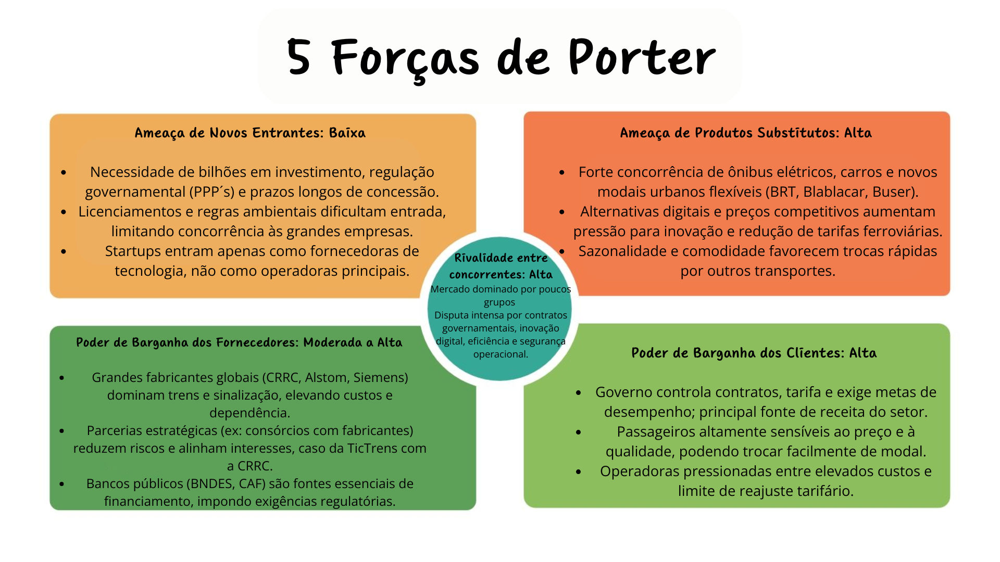
</div>
<br>
<div align="center">
<sub>Fonte: Material produzido pelo grupo DesTremidos, 2025.</sub>
</div>
<br>

##### 3.1.1.4.1 Rivalidade entre concorrentes: Classficado como Alta

A rivalidade no setor ferroviário nacional é extremamente elevada, em razão da concentração de poucos players e da sofisticação tecnológica das operações. O mercado é dominado por conglomerados como Rumo Logística, CCR Mobilidade, MRS Logística e MetrôRio que detêm grande parte das concessões e malhas ferroviárias de carga e passageiros. Bem como grande parte dessa rivalidade se manifesta na disputa por contratos de concessão, um jogo de alto risco em que poucos conglomerados competem por fluxos de receita de longo prazo. Esses editais, frequentemente acompanhados por órgãos como o CADE (Conselho Administrativo de Defesa Econômica) e o TCU (Tribunal de Contas da União), configuram verdadeiras “batalhas por monopólios”, nas quais consórcios — como a parceria Comporte-CRRC ou o C2 Mobilidade (TicTrens) — buscam demonstrar ao governo o projeto mais integrado e com menor risco.

Essas corporações têm ampliado investimentos em digitalização e automação, refletindo a corrida pela eficiência operacional e pela confiabilidade dos sistemas. Em 2024, o Ministério dos Transportes registrou investimento superior a R$ 13,7 bilhões no setor, valor histórico que reforça o caráter estratégico dessa indústria para a economia nacional. A concorrência, contudo, não se limita ao setor tradicional de transporte: empresas como a Globalsat Group e a Lyram2M ofertam tecnologias IoT e conectividade LTE híbrida com satélites, competindo indiretamente via soluções de automação e monitoramento preditivo. Nesse cenário, a TicTrens adota uma estratégia de diferenciação tecnológica, e com esse projeto em andamento com o INTELI está priorizando o uso de sensores inteligentes, controle de acesso automatizado e detecção de invasões por IoT — tecnologias que visam não apenas eficiência, mas também segurança operacional, um dos pilares da nova mobilidade ferroviária.

A rivalidade, portanto, é sustentada por inovação contínua e pressão de desempenho, fatores que exigem da empresa domínio tecnológico, gestão integrada de dados e aderência à regulação de desempenho contratual estatal.

##### 3.1.1.4.2 Ameaça de novos entrantes: Classificado como Baixa

As barreiras de entrada são altamente intransponíveis sob a ótica econômica e institucional, assim, a ameaça de novos entrantes é considerada baixa. O setor demanda grande escala de capital, longa maturação de contratos e conformidade regulatória rigorosa sob marcos como o Programa de Parcerias em Investimentos do Estado de São Paulo (PPI-SP). O edital do Trem Intercidades, modelado com apoio do Banco Interamericano de Desenvolvimento (BID), ilustra essa complexidade ao prever 30 anos de concessão e investimentos superiores a R$ 12,5 bilhões em infraestrutura, operação e manutenção.

Além disso, os processos de licenciamento ambiental, desapropriações territoriais e validação de projetos com órgãos públicos — conforme relatado por Pedro Moro, presidente da TicTrens — tornam o ingresso de novos operadores extremamente limitado. Ainda assim, nota-se o surgimento de entrantes tecnológicos, como startups que oferecem sistemas de comunicação embarcada e plataformas de manutenção preditiva, que embora não concorram diretamente com operadoras, influenciam a cadeia de valor ferroviária. Para a TicTrens, que integra expertise internacional (CRRC) e capital nacional (Comporte), essa estrutura representa proteção natural frente à concorrência direta, mas requer abertura à inovação colaborativa para preservar a liderança tecnológica ante novos agentes digitais.

##### 3.1.1.4.3 Poder de barganha dos fornecedores: Classificado como Moderado a Alto

O mercado global para a fabricação de trens é um oligopólio consolidado, dominado por empresas como Alstom, Siemens e a chinesa CRRC, como apontam relatórios de mercado da Mordor Intelligence e Spherical Insights. O mercado foi avaliado em mais de US$ 184 bilhões em 2023, refletindo o alto custo dos produtos. Qualquer operador é obrigado a negociar com um desses gigantes. A estrutura do consórcio TIC Trens, no entanto, demonstra uma manobra para neutralizar essa força. Ao incluir a CRRC, a maior fabricante de material rodante do mundo, como parceira direta, o consórcio internalizou seu fornecedor mais crítico, transformando uma relação cliente-fornecedor em uma parceria com interesses alinhados.

Se o mercado de material rodante é concentrado, o de sistemas de sinalização, como o Communications-Based Train Control (CBTC) e o European Train Control System (ETCS), é ainda mais. Este nicho é dominado por um grupo restrito de empresas globais, com Siemens, Thales Group e Alstom sendo consistentemente citadas como líderes, segundo análises da Global Growth Insights e Straits Research. A decisão da ViaMobilidade de investir R$ 77 milhões na implantação do sistema ETCS em suas linhas, noticiada pela Revista Ferroviária, ilustra a criticidade e o alto custo dessa tecnologia. Os operadores possuem pouquíssimas alternativas, o que concede a esses fornecedores um poder de barganha imenso. Contudo, a escala dos projetos brasileiros força esses gigantes a competirem ferozmente entre si por contratos emblemáticos, o que modera parcialmente seu poder.

Dada a natureza intensiva em capital do setor, as grandes instituições financeiras atuam como "fornecedores" de capital. A participação do BNDES (Banco Nacional de Desenvolvimento) com um financiamento de R$ 6,4 bilhões para o projeto TIC Eixo Norte e o empréstimo de US$ 550 milhões do CAF (Banco de Desenvolvimento da América Latina e Caribe) para a expansão da Linha 2-Verde do Metrô de São Paulo são exemplos dessa dependência. As exigências e taxas impostas por esses financiadores representam uma forma significativa de poder de barganha.

##### 3.1.1.4.4 Poder de barganha dos clientes: Classificado como Alto

O poder de barganha dos compradores neste mercado é uma força dual, manifestando-se através do governo como contratante e dos passageiros como usuários finais.

O comprador mais poderoso é a entidade governamental que outorga o contrato. O poder concedente define as regras, estabelecendo termos de serviço, métricas de desempenho e a estrutura tarifária, conforme detalhado nos editais de concessão e na regulamentação da ANTT. O reajuste das tarifas não é uma decisão de mercado do operador; ele é submetido à aprovação regulatória, como demonstra a homologação da tarifa de R$ 7,50 do MetrôRio pela AGETRANSP. Portanto, o modelo de receita da concessionária é fortemente limitado pelas exigências de seu principal comprador.

Individualmente, um passageiro não tem poder para negociar o preço. Coletivamente, no entanto, seu comportamento exerce uma forte pressão . A principal fonte desse poder é a alta sensibilidade ao preço e os custos de troca praticamente nulos. A tarifa média projetada de R$ 50 para o serviço expresso do TIC será inevitavelmente comparada com os preços das passagens de ônibus e o custo de uma viagem de carro. As dificuldades financeiras enfrentadas pelo MetrôRio, analisadas pela S&P Global e XP Investimentos, ilustram essa dinâmica: a empresa sofreu uma queda permanente na demanda de passageiros após um aumento tarifário que tornou os modais substitutos mais competitivos, levando a um rebaixamento de seu rating de crédito. Esta estrutura coloca os operadores em um "efeito de pinça", espremidos entre as exigências de altos investimentos do governo e a demanda por tarifas baixas dos passageiros.

##### 3.1.1.4.5 Ameaça de produtos substitutos: Classificado como Alta

Embora o modal ferroviário ofereça vantagens consideráveis em termos de eficiência energética, capacidade de transporte e sustentabilidade ambiental, a ameaça de produtos substitutos no contexto da mobilidade brasileira contemporânea pode ser classificada como alta, devido à intensificação dos avanços tecnológicos e à diversificação dos meios alternativos de transporte. Como descreve o Ministério dos Transportes (2025), o Brasil vive um momento de reestruturação logística em que diferentes modais competem por relevância dentro de um ecossistema cada vez mais digitalizado e verde. Nesse cenário, o transporte rodoviário eletrificado desponta como um concorrente direto.

Grandes empresas de ônibus — inclusive o próprio Grupo Comporte, controlador da TicTrens — vêm investindo na eletrificação de suas frotas e em serviços de mobilidade sob demanda, oferecendo maior flexibilidade operacional e preços competitivos, enfraquecendo o diferencial ecológico que tradicionalmente favorecia o transporte ferroviário (Modal Connection, 2025; NT Expo 2025).

Outro fator que eleva a pressão substitutiva é o avanço dos veículos elétricos individuais e coletivos, incentivado pelas políticas de descarbonização alinhadas à Política Nacional de Mobilidade Urbana Sustentável e aos compromissos climáticos firmados pelo Brasil até 2030. O acesso crescente a veículos híbridos, elétricos e a sistemas de caronas eletrônicas compartilhadas (por exemplo o Blablacar) torna o transporte particular mais limpo, acessível e personalizável.

Paralelamente, a integração dos modais urbanos e intermunicipais amplia as opções dos usuários: a expansão de BRTs, vans autônomas e micro-ônibus inteligentes, já vinculados a sistemas digitais de bilhetagem e plataformas de planejamento urbano preditivo, oferece maior conveniência e respostas à demanda (G1 Campinas, 2025; Ministério dos Transportes, 2025). Em contraste, o trem intermunicipal ainda depende de infraestrutura fixa e horários rigidamente programados, o que o torna menos flexível em relação às novas alternativas móveis e eletrificadas (CNA Brasil, 2025).

Em síntese, apesar das vantagens estruturais, ambientais e logísticas do sistema ferroviário, a adoção massiva de tecnologias verdes em modais concorrentes — somada à digitalização das plataformas de mobilidade e à crescente busca por conveniência, flexibilidade e baixo custo — torna a exclusividade do modal ferroviário progressivamente menos expressiva.

#### Conclusão da seção terciária

Diante do panorama apresentado, é possível concluir que o setor ferroviário brasileiro encontra-se em um momento decisivo de transformação estrutural, caracterizado por um ambiente concorrencial acirrado, modelos de negócio baseados em concessões de longo prazo e um avanço tecnológico acelerado impulsionado pela agenda de “Ferrovias 4.0”. A presença de poucos e grande operadores privados, somada à forte regulação estatal, molda um mercado de alta rivalidade e barreiras significativas à entrada, ao mesmo tempo em que reforça a necessidade de eficiência, inovação e excelência na prestação do serviço. Nesse cenário, a digitalização, a integração modal, a sustentabilidade e a adoção de tecnologias inteligentes — como IoT, IA, Big Data e manutenção preditiva — emergem como pilares essenciais para aumentar a competitividade e responder às pressões de clientes cada vez mais exigentes e com múltiplas alternativas de mobilidade. Para a TicTrens, parceira deste projeto, tais movimentos representam não apenas desafios operacionais e estratégicos, mas sobretudo oportunidades para consolidar-se como referência nacional em mobilidade ferroviária inteligente.

### 3.1.2. Análise SWOT

A análise SWOT (ou FOFA, em português) é uma ferramenta de planejamento estratégico que mapeia os fatores internos (forças e fraquezas) e os fatores externos (oportunidades e ameaças) de uma empresa ou projeto.
Essa ferramenta é essencial em qualquer processo de planejamento, pois oferece maior conhecimento sobre a organização, facilita a tomada de decisões e apoia o desenvolvimento de estratégias mais eficazes.

**Abaixo está a análise feita para o contexto da empresa parceira:**

### FORÇAS:

- Possui integração com a CPTM; isso garante estabilidade contratual e acesso a projetos estratégicos.

- Por ser uma holding, a empresa pode criar ou adquirir novas subsidiárias rapidamente, ampliando sua atuação em diferentes setores, trazendo flexibilidade de expansão.

- A empresa possui mão de obra altamente qualificada; ela conta com profissionais especializados em engenharia, tecnologia da informação e automação.

### FRAQUEZAS:

- A empresa depende de contratos públicos, o que a torna vulnerável a mudanças políticas e orçamentárias.

- Baixa visibilidade no mercado privado: a empresa ainda possui pouco reconhecimento fora do setor público, o que reduz oportunidades de parcerias.

### OPORTUNIDADES:

- Expansão do transporte ferroviário no Brasil: surgimento de novos projetos de mobilidade urbana e transporte regional.

- Indústria 4.0: adoção de IoT, big data e inteligência artificial para melhoria de processos, manutenção preditiva e operações mais inteligentes.

### AMEAÇAS:

- Mudanças políticas e regulatórias: podem impactar contratos e financiamentos públicos.

- Obsolescência tecnológica gera risco de perda de competitividade se não houver atualização contínua das soluções.

<br>
<div align="center">
<sub>Figura xx: Análise SWOT.</sub>
</div>
<br>
<div align="center">

</div>
<br>
<div align="center">
<sub>Fonte: Material produzido pelo grupo DesTremidos, 2025.</sub>
</div>
<br>

Com base na análise apresentada, é possível observar que a TIC Trens possui uma estrutura sólida e estratégica, destacando-se pela integração com a CPTM, pela qualificação técnica de seus profissionais e pela flexibilidade proporcionada por sua configuração como holding. No entanto, a empresa ainda enfrenta desafios relacionados à dependência de contratos públicos e à baixa visibilidade no mercado privado.

As oportunidades de expansão do transporte ferroviário no Brasil e o avanço das tecnologias da Indústria 4.0 representam caminhos promissores para o fortalecimento da TIC Trens, desde que haja investimentos contínuos em inovação e atualização tecnológica. Assim, conclui-se que o aproveitamento das forças e oportunidades identificadas, aliado à mitigação de suas fraquezas e ameaças, pode contribuir significativamente para a consolidação e o crescimento sustentável da empresa no setor metroferroviário.

### 3.1.3. Descrição da Solução a ser Desenvolvida

#### 3.1.3.1 Qual é o problema a ser resolvido

Essa seção tem como objetivo apresentar a análise dos problemas enfrentados pela empresa parceira em relação ao controle de acesso físico em áreas técnicas, bem como a proposta de uma solução tecnológica integrada para sanar essas dificuldades. A abordagem desenvolvida busca otimizar a gestão de autorizações, aumentar a segurança operacional e assegurar a rastreabilidade dos acessos realizados. A partir dessa necessidade, foram detalhados o funcionamento do sistema proposto, sua aplicação prática e os critérios de sucesso que servirão como referência para avaliar sua eficácia e impacto após a implementação.

Os principais problemas identificados são:

- 1 - Garantia de que o acesso é realizado por pessoas devidamente capacitadas:

Mesmo quando o acesso é autorizado, não há mecanismos eficientes de verificação em tempo real para garantir que quem entrou na área técnica é realmente o colaborador autorizado e treinado para aquela tarefa. Isso gera vulnerabilidades operacionais, riscos trabalhistas e dificuldades de rastreabilidade, já que o sistema atual não assegura que o acesso físico corresponda ao registro administrativo de autorização.

- 2- Gestão das demandas de acesso às áreas técnicas:

Atualmente, o controle de solicitações, agendamentos e priorizações é realizado de forma manual ou pouco integrada, o que dificulta a coordenação entre diferentes equipes e atividades. Essa limitação resulta em sobreposição de tarefas, conflitos de agenda e falta de visibilidade sobre a disponibilidade das áreas. Além disso, a ausência de integração com bases de dados de capacitação e análise de risco compromete a verificação da aptidão dos colaboradores para as atividades planejadas.

Dessa forma, observa-se que os desafios enfrentados pela TIC Trens exigem uma abordagem tecnológica integrada, capaz de automatizar e monitorar todo o processo de acesso às áreas técnicas, desde o agendamento e validação da capacitação até a confirmação do contato físico efetivo.

A superação dessas limitações é fundamental para promover maior segurança operacional, redução de riscos trabalhistas e melhoria na eficiência da gestão das atividades técnicas.

#### 3.1.3.2 Qual a solução proposta (visão de negócios)

Para atender às necessidades apresentadas pelo parceiro, propõe-se o desenvolvimento de um sistema inteligente de controle de acessos, voltado à gestão e monitoramento das entradas e saídas em áreas controladas, como subestações de energia e salas técnicas.
A solução tem como objetivo principal otimizar os processos internos de segurança, garantindo que apenas colaboradores devidamente autorizados e capacitados possam acessar os ambientes técnicos. Para isso, o sistema adota um mecanismo de autenticação em duas etapas, combinando o uso de um cartão magnético corporativo com a validação de uma senha pessoal. Essa autenticação dupla assegura que o acesso seja concedido apenas a indivíduos previamente cadastrados, respeitando regras de horário e níveis de permissão definidos pela empresa.

Após a autenticação, o sistema realiza a validação física da entrada por meio de sensores responsáveis por detectar a passagem de indivíduos. Essa verificação impede a entrada simultânea de mais de uma pessoa com a mesma credencial, eliminando tentativas de uso indevido e reforçando o controle de acesso individual.
Além disso, cada evento de entrada, saída ou tentativa de acesso é registrado automaticamente no sistema, compondo um histórico completo de movimentações. Esses registros permitem à TIC Trens monitorar em tempo real as operações internas, identificar padrões de uso, gerar relatórios de auditoria e garantir rastreabilidade total sobre quem acessou determinada área e em que momento.

Com isso, a proposta visa oferecer uma ferramenta integrada de segurança e gestão operacional, alinhada aos objetivos estratégicos da TIC Trens, promovendo controle, confiabilidade e eficiência nas operações realizadas em áreas críticas de sua infraestrutura ferroviária.

#### 3.1.3.3 Como a solução proposta deverá ser utilizada

A solução proposta deverá ser utilizada como um sistema integrado de controle de acessos e monitoramento operacional, instalado nas entradas de áreas técnicas e de acesso controlado da TIC Trens. Seu uso envolve a interação entre dispositivos físicos, módulos de autenticação e plataformas de gestão centralizada, de modo a assegurar a rastreabilidade e a conformidade de todas as movimentações realizadas.
O processo de utilização inicia-se quando o colaborador aproxima o cartão corporativo do leitor instalado no ponto de acesso. Em seguida, o sistema solicita a inserção da senha pessoal para validar a identidade do usuário. Após a autenticação bem-sucedida, os sensores de presença e passagem verificam o ingresso do indivíduo, garantindo que apenas uma pessoa entre por vez e que a entrada ocorra dentro do período autorizado.

Informações como hora de entrada e de saída são enviadas para o banco de dados, para posteriormente serem consultadas/mostradas em um dashboard.

#### 3.1.3.4 Quais os benefícios trazidos pela solução proposta

O projeto foi desenvolvido com o propósito de sanar os problemas identificados anteriormente, oferecendo uma solução tecnológica voltada ao controle sagaz de acessos em ambientes técnicos. Seu uso adequado possibilita o registro e armazenamento automatizado dos eventos de entrada e saída, garantindo que todos os acessos sejam rastreáveis, auditáveis e vinculados aos respectivos usuários autorizados.

Além disso, a solução contribui para o aumento da segurança operacional, reduzindo riscos de acessos indevidos e facilitando a identificação de incidentes. O sistema também permite a gestão centralizada de permissões, possibilitando o controle dos horários liberados para cada colaborador e o monitoramento em tempo real das atividades dentro das áreas restritas.

#### 3.1.3.5 Qual será o critério de sucesso e qual medida será utilizada para o avaliar

Os critérios de sucesso são parâmetros definidos para avaliar se os objetivos do projeto foram alcançados de forma satisfatória. Eles funcionam como indicadores claros e mensuráveis, permitindo verificar a efetividade, o impacto e a qualidade da solução implementada.

1. Aumento da segurança operacional

- Critério de sucesso: O sistema deve impedir que pessoas não capacitadas ou não autorizadas acessem áreas técnicas.

- Medida de avaliação: número de tentativas de acesso não autorizado detectadas pelo sistema. Sucesso será considerado se houver redução significativa (≥80%) em comparação com a situação antes da implementação.

2. Rastreabilidade dos acessos

- Critério de sucesso: todos os acessos às áreas controladas devem ser registrados automaticamente.

- Medida de avaliação: Percentual de eventos de entrada e saída corretamente registrados no sistema. Sucesso será atingido quando 100% das entradas e saídas forem rastreáveis e auditáveis.

3. Integração com bases de dados

- Critério de sucesso: O sistema deve ser integrável com a base de dados do parceiro, permitindo atualização e verificação de permissões em tempo real.

- Medida de avaliação: Teste de integração com a base de dados, verificando se informações de usuários, permissões e horários são corretamente sincronizadas. Sucesso será atingido quando todas as operações de leitura e atualização forem executadas sem falhas.

4.  Velocidade de verificação

- Critério de sucesso: O sistema deve autenticar e liberar o acesso de forma rápida.

- Medida de avaliação: tempo médio entre a inserção da senha e a liberação do acesso. Sucesso será atingido se o tempo médio for ≤3 segundos.

5.  Segurança dos dados

- Critério de sucesso: os dados do sistema devem ser protegidos durante o transporte e armazenamento.

- Medida de avaliação: verificação de que todas as informações transmitidas e armazenadas estejam criptografadas. Sucesso será atingido quando não houver registro de dados não criptografados em testes de auditoria.

Em síntese, o projeto visa fornecer à TIC Trens uma solução robusta, segura e eficiente para o controle de acessos em áreas restritas, integrando tecnologia e gestão operacional. A aplicação adequada do sistema contribuirá para maior confiabilidade nos processos internos, redução de riscos trabalhistas e aprimoramento da segurança das operações. Com base nos critérios de sucesso definidos, será possível mensurar objetivamente o desempenho do sistema e assegurar que os resultados esperados estejam alinhados aos objetivos estratégicos da empresa parceira.

### 3.1.4. Value Proposition Canvas

O Canvas de Proposta de Valor, uma ferramenta de gestão estratégica desenvolvida por Alexander Osterwalder e Yves Pigneur, é empregado nesta subseção para realizar uma análise sistemática e aprofundada da solução de Internet das Coisas (IoT) proposta para a TicTrens. Nesse sentido, este framework não é utilizado somente como um modelo descritivo, mas como um instrumento analítico para garantir o alinhamento preciso entre as necessidades operacionais e estratégicas da empresa e os atributos de valor intrínsecos à solução tecnológica a ser desenvolvida. Nesse viés, o objetivo central desta análise é demonstrar o "Product-Market Fit", ou seja, a correspondência exata entre os desafios enfrentados pelo cliente e o valor gerado pelo produto. Sendo assim, a análise subsequente está estruturada em duas seções interdependentes: uma investigação do Perfil do Cliente, que disseca os imperativos da TicTrens, seguida por um mapeamento do Mapa de Valor da solução IoT, que articula como suas funcionalidades endereçam diretamente tais imperativos.

<br>
<div align="center">
<sub>Figura xx: Value Proposition Canvas.</sub>
</div>
<br>
<div align="center">
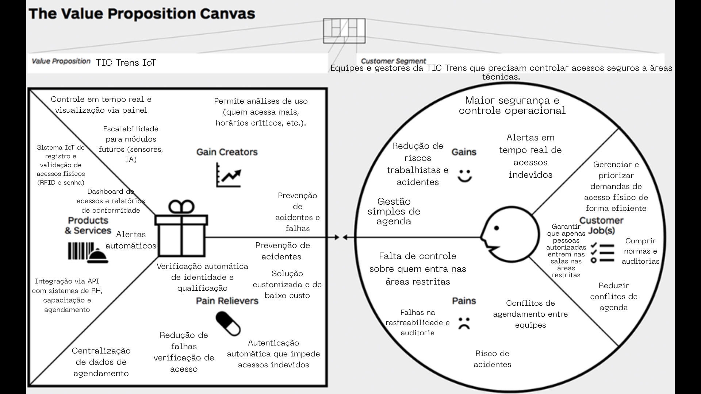
</div>
<br>
<div align="center">
<sub>Fonte: Material produzido pelo grupo DesTremidos, 2025.</sub>
</div>
<br>

#### 3.1.4.1. O Perfil do Cliente: Tarefas do Cliente, Dores e Ganhos

O perfil do cliente, conforme definido por Osterwalder (2014), abrange as tarefas, dores e ganhos do público-alvo. No caso da TicTrens, seus clientes internos e principais usuários são engenheiros, operadores e gestores de segurança operacional responsáveis pela manutenção da integridade de linhas, estações e subestações ferroviárias.

##### 3.1.4.1.1. Tarefas do Cliente (Customer Jobs)

As tarefas do cliente representam os objetivos fundamentais que a TicTrens, como uma concessionária de infraestrutura de transporte, deve executar para cumprir sua missão. Estas tarefas são categorizadas em dimensões funcionais, sociais e de segurança.

A principal tarefa funcional da TicTrens é garantir a continuidade e a eficiência do serviço de transporte ferroviário. Isso abrange a operação ininterrupta da Linha 7-Rubi e, futuramente, dos serviços do Trem Intercidades (TIC) e do Trem Intermunicipal (TIM), exigindo máxima disponibilidade e confiabilidade. Nesse cenário, a execução desta tarefa implica a gestão de cronogramas complexos de manutenção, a coordenação de múltiplas equipes técnicas (manutenção, implantação, TI, segurança do trabalho) e a prevenção de interrupções de serviço que podem ser causadas por falhas técnicas, acidentes ou acessos não autorizados a áreas restritas. Adicionalmente, a empresa tem a tarefa de proteger ativos de infraestrutura, como subestações de energia, salas de controle e centros de dados, que são vitais para a operação contínua e segura da malha ferroviária. Outra tarefa central é o gerenciamento eficaz da mão de obra técnica, o que envolve o agendamento e a alocação de pessoal especializado para garantir que as equipes corretas estejam no local apropriado e no momento certo, sem que ocorram conflitos de agenda ou sobreposição de atividades.

É importante citar que como a TicTrens é uma nova concessionária formada por uma holding brasileira de grande porte (Grupo Comporte) e um líder global em tecnologia ferroviária (CRRC), a TicTrens possui a tarefa de construir e consolidar uma marca associada à confiança, segurança e inovação. Nesse sentido, a percepção pública de sua competência operacional e de seu compromisso com a segurança é um ativo intangível de valor imensurável, especialmente em um serviço de transporte de passageiros de alta visibilidade. Ademais, a empresa também busca demonstrar liderança na adoção de tecnologias da Indústria 4.0, como IoT e análise de dados, para se alinhar às tendências globais de "ferrovias inteligentes" (smart railways). Este projeto, portanto, não é apenas uma solução para um problema operacional, mas parte de uma narrativa maior sobre modernização e vanguarda tecnológica.

A última e não menos importante tarefa é a mitigação de riscos trabalhistas e legais. A empresa deve assegurar, de forma auditável, que apenas colaboradores com a certificação e a qualificação técnica adequadas executem tarefas de alto risco em ambientes controlados, minimizando a exposição a acidentes de trabalho e litígios subsequentes. Além disso, a TicTrens é obrigada a cumprir com as rigorosas normas regulatórias do setor de transporte ferroviário, impostas por agências como a Agência Nacional de Transportes Terrestres (ANTT), que fiscalizam a segurança da circulação, a proteção ao usuário e a adequada prestação do serviço. Finalmente, como operadora de uma artéria de transporte vital para a economia e a mobilidade de São Paulo, a TicTrens tem a tarefa implícita de proteger sua infraestrutura contra ameaças físicas e cibernéticas, contribuindo para a estabilidade econômica e social da região.

##### 3.1.4.1.2. Dores (Pains)

As dores representam os resultados negativos, os riscos e os obstáculos que a TicTrens enfrenta atualmente ou busca ativamente evitar. A análise a seguir explora as consequências de primeira, segunda e terceira ordem dessas dores.

A dor central e mais aguda é a vulnerabilidade sistêmica na verificação de acesso físico. A empresa não possui um mecanismo eficiente para garantir, em tempo real e de forma automatizada, que o indivíduo que adentra uma área restrita é, de fato, o mesmo colaborador que foi administrativamente autorizado e que possui as qualificações técnicas exigidas para a tarefa programada. Outra dor significativa é a ineficiência na gestão de agendamentos e demandas de acesso. Os processos atuais, pouco integrados, resultam em conflitos de agenda, sobreposição de atividades e dificuldades na priorização entre equipes de manutenção e implantação, o que gera atrasos operacionais e alocação subótima de recursos. Consequentemente, há uma ausência de rastreabilidade e visibilidade centralizada, tornando complexa a realização de auditorias, a investigação de incidentes e a obtenção de uma visão operacional em tempo real sobre a localização e as atividades das equipes em campo.

Além disso, a busca por soluções prontas no mercado (Commercial Off-The-Shelf - COTS) apresenta uma dor dos custos e prazos proibitivos. Softwares comerciais com o nível de customização e integração necessários são frequentemente associados a altos custos de licenciamento, longos prazos de implementação e dependência de fornecedores (vendor lock-in), o que contraria a diretriz do projeto de desenvolver uma solução ágil e de baixo custo. Assim, um incidente de segurança ou uma falha operacional decorrente de um acesso indevido pode levar à paralisação dos serviços, resultando em perdas financeiras diretas, multas contratuais e um severo dano à confiança pública. Adicionalmente, a empresa enfrenta a exposição a riscos trabalhistas e litígios onerosos, pois um acidente envolvendo um colaborador não qualificado em uma área de risco cria uma responsabilidade legal e financeira para a concessionária.

Pontos de acesso físico não controlados representam uma ameaça dual à segurança física e cibernética. Eles são vetores potenciais tanto para sabotagem física de equipamentos quanto para ataques ciberfísicos direcionados aos sistemas de controle industrial (ICS) e de automação localizados nas salas técnicas. Uma dor distinta e de alto impacto é o risco de acidentes graves por invasão da via férrea. A presença não autorizada de pessoas nos trilhos constitui uma ameaça direta à vida e à integridade dos trens e passageiros, exigindo sistemas de detecção e alerta imediatos para uma resposta rápida do maquinista ou do Centro de Controle Operacional (CCO).

A dor explícita da falta de verificação em tempo real mascara uma dor de segunda ordem. Em um cenário pós-incidente, a incapacidade da TicTrens de provar, com dados, quem estava presente em uma área restrita cria uma lacuna em sua estrutura de governança e conformidade. Nesse sentido, esta não é apenas uma ausência de dados, mas a presença de uma vulnerabilidade auditável que compromete a capacidade da empresa de se defender contra ações judiciais, de satisfazer inquéritos regulatórios e de implementar melhorias baseadas em análises de causa raiz de alguns problemas. A solução proposta, portanto, não visa apenas instalar um sistema IoT de acesso, mas fechar resolver essa brecha de governança corporativa.

##### 3.1.4.1.3. Ganhos (Gains)

Os ganhos articulam os resultados e benefícios que a TicTrens busca alcançar. Eles são diferenciados em ganhos requeridos, esperados, desejados e inesperados para fornecer uma compreensão multifacetada das aspirações da empresa.

Primeiramente, o ganho mais fundamental é o aumento da segurança operacional, que deve ser mensurável por meio da redução de incidentes de segurança relacionados a acessos não autorizados. Intimamente ligado a isso está a garantia de conformidade (compliance), ou seja, a capacidade de gerar trilhas de auditoria automáticas para todos os eventos de acesso, satisfazendo de forma proativa os requisitos regulatórios e as políticas de governança interna da empresa. Sendo assim, um ganho esperado de grande importância é a redução efetiva de riscos trabalhistas, obtida por meio de um sistema que impede ativamente o acesso de pessoal não qualificado a zonas de perigo, mitigando uma fonte primária de responsabilidade corporativa.

Ademais, a TicTrens deseja uma melhora na eficiência da gestão operacional. Nesse contexto, um painel de controle centralizado e um sistema de registro automatizado são desejados para otimizar a coordenação entre equipes técnicas, reduzir conflitos de agendamento e aprimorar o fluxo de trabalho geral. Além disso, outro ganho desejado é a obtenção de inteligência operacional em tempo real, permitindo que o CCO monitore eventos de acesso e invasões de via à medida que ocorrem, o que possibilita respostas mais rápidas e eficazes. Assim, a capacidade de alcançar esses resultados por meio de uma solução de baixo custo e alta agilidade é um ganho muito importante, pois um MVP desenvolvido por alunos de uma instituição de ensino como o INTELI (Instituto de Tecnologia e Liderança) oferece uma alternativa customizada, econômica e escalável em comparação com sistemas comerciais.

Outrossim, a implementação desta solução pode gerar um ganho inesperado ao estabelecer a fundação para uma plataforma integrada de "Smart Railway". Os dados gerados pelo sistema (padrões de acesso, frequência, duração por localidade) podem se tornar um ativo para futuras aplicações de análise de dados, como planejamento de manutenção preditiva, otimização de alocação de recursos e análise de fluxos de trabalho. Neste viés, este MVP pode, portanto, ser o alicerce de uma iniciativa de transformação digital mais ampla. Adicionalmente, a adoção de tal tecnologia promove o fortalecimento de uma cultura organizacional de segurança e inovação, reforçando o compromisso da empresa com a excelência, o que pode melhorar o engajamento dos colaboradores e a capacidade de atrair talentos qualificados.

Por fim, o valor da solução transcende a gestão de risco e a eficiência operacional. Enquanto o ganho imediato (primeira ordem) é o aprimoramento da segurança e o ganho subsequente (segunda ordem) é a otimização de processos, o ganho final (terceira ordem) reside na transformação de um centro de custo (segurança) em um motor de criação de valor. Os dados coletados, inicialmente para fins de auditoria, constituem um dataset com dados que podem ser utilizados para fazer outras implementações de soluções digitais e tecnológicas. Nesse contexto, ao aplicar modelos de machine learning, uma tendência crescente no setor , a TicTrens pode evoluir de um monitoramento reativo para uma análise preditiva. Seria possível, por exemplo, prever gargalos de acesso em salas técnicas com base em padrões históricos ou correlacionar a frequência de acesso a determinados equipamentos com a necessidade iminente de manutenção. Mas é imperativo deixar destacado que esse ganho de terceira ordem não se encaixa no escopo deste presente projeto, seria somente uma possível melhoria de implementação de tecnologia para otimizar os processos e criar mais valor para a empresa.

#### Conclusão:

A análise do perfil da TicTrens mostra que sua atuação exige alta eficiência, segurança e conformidade. As tarefas envolvem garantir a operação contínua e segura da malha ferroviária; as dores revelam falhas na gestão de acessos, rastreabilidade e integração de processos; e os ganhos apontam para maior segurança, eficiência e inteligência operacional. Assim, o presente projeto IoT alinha-se diretamente a essas necessidades, oferecendo uma solução que tem a missão de fortalecer a governança, reduzir riscos e impulsionar a transformação digital da TicTrens.

##### 3.1.4.2. Mapa de Valor: Produtos e Serviços, Analgésicos e Criadores de Ganho:

O mapa de valor representa a proposta específica da solução desenvolvida para atender às dores, tarefas e expectativas identificadas no perfil do cliente.

##### 3.1.4.2.1. Produtos e Serviços (Products & Services)

Esta subseção oferece uma descrição funcional dos componentes que estão presentes no TAPI do projeto e no desenvolvimento prévio da solução desta equipe, que constituem a oferta de valor tangível da solução.

Este é um sistema ciberfísico a ser instalado nos pontos de entrada de áreas restritas. Seu serviço fundamental é atuar como um "gatekeeper" digital que valida não apenas a identidade do colaborador, mas também sua autorização de acesso e, crucialmente, sua qualificação técnica para a tarefa em questão. O sistema incorpora um mecanismo de autenticação dupla (dispositivo físico como cartão RFID somado a uma senha digital individualizada) e se integra em tempo real com a base de dados de capacitação de colaboradores da TicTrens. Esta abordagem está alinhada com as melhores práticas de autenticação multifator para a proteção de infraestruturas importantes.

Além disso, haverá um sistema que irá gerar um dashboard com as informações mais pertinentes dos dados coletados pelo sistema IoT. Seu serviço é agregar valor, processar e visualizar os dados provenientes de ambos os módulos em tempo real. Assim, a plataforma oferecerá serviços essenciais como o registro de eventos (logging) em um banco de dados seguro, a geração de relatórios de conformidade e auditoria, e a administração centralizada das permissões de acesso para a integração com o sistema digital da TicTrens.

##### 3.1.4.2.2. Analgésicos (Pain Relievers)

Esta subseção estabelece a conexão explícita entre as funcionalidades da solução e as dores identificadas no perfil da TicTrens, demonstrando como o produto alivia os problemas existentes.
Primeiramente, o sistema de autenticação dupla, integrado à base de dados de qualificações, alivia diretamente esta dor. Ele estabelece um ponto de controle que realiza uma verificação cruzada entre "quem você é" (identidade), "o que você tem" (credencial física/digital) e "o que você está autorizado e capacitado a fazer" (qualificação) antes de conceder o acesso físico. Isso elimina a incerteza e a vulnerabilidade do processo atual.

O dashboard centralizado, ao fornecer um registro em tempo real de todos os acessos (check-in e check-out), oferece aos gestores a visibilidade necessária para identificar e resolver conflitos de agendamento de forma proativa. Isso alivia a dor da sobreposição de atividades e melhora a coordenação entre as equipes.

A abordagem de desenvolver um Produto Mínimo Viável (MVP) customizado é um analgésico direto para a dor financeira. Ela proporciona uma solução direcionada e escalável, evitando os altos custos de licenciamento, as taxas de manutenção e o ganho de tempo.

##### 3.1.4.2.3. Criadores de Ganhos (Gain Creators)

Esta seção demonstra como a solução não apenas resolve problemas, mas também habilita a TicTrens a alcançar seus ganhos desejados.

O dashboard transcende a função de um simples registro de eventos; ele é uma ferramenta de inteligência. A solução cria ganhos ao permitir a visualização de padrões de acesso, a identificação de anomalias (por exemplo, tentativas de acesso recorrentes e não autorizadas) e a geração de relatórios analíticos que subsidiam a tomada de decisão gerencial. Ele transforma dados brutos de acesso em insights acionáveis sobre a operação. Assim, o sistema cria o ganho de uma "auditoria com cliques". Ao registrar automaticamente todos os eventos de acesso em logs criptografados, o processo de demonstrar conformidade com normas regulatórias e políticas internas de segurança é drasticamente simplificado, agilizado e fortalecido. Isso reduz o esforço administrativo e aumenta a segurança da governança.

Por fim, a arquitetura da solução, baseada em microcontroladores, gateways IoT e APIs, é intrinsecamente projetada para ser modular e escalável. Isso cria o ganho estratégico de permitir a integração futura de novos módulos (por exemplo, monitoramento de condições de ativos, sensores ambientais em salas técnicas) sobre a mesma plataforma. A solução, portanto, pavimenta o caminho para uma gestão de infraestrutura verdadeiramente inteligente e conectada, espelhando as iniciativas de operadores ferroviários globais.

#### Conclusão:

A solução proposta oferece um sistema IoT integrado que responde diretamente às dores e aspirações da TicTrens. Por meio da autenticação dupla, do dashboard centralizado e da integração com bases de dados corporativas, o projeto garante maior segurança, rastreabilidade e eficiência operacional. Além de eliminar vulnerabilidades e reduzir custos, a solução cria valor ao ter como missão transformar dados em inteligência gerencial e abrir caminho para futuras expansões tecnológicas, consolidando-se como um passo concreto rumo a uma operação ferroviária mais segura, moderna e inteligente.

#### Conclusão da seção:

A análise do Value Proposition Canvas demonstra o alinhamento entre as necessidades da TicTrens e o valor gerado pela solução IoT proposta pelo grupo. O perfil do cliente revela desafios como falhas na gestão de acessos, riscos de segurança, falta de rastreabilidade e baixa integração operacional. Já o mapa de valor mostrou que a solução responde diretamente a essas dores por meio da autenticação multifator, do dashboard centralizado e da integração com bases de dados corporativas, garantindo segurança, eficiência e conformidade. Além de resolver problemas imediatos, o projeto estabelece a base para uma gestão inteligente e orientada a dados, fortalecendo a governança e impulsionando a transformação digital da TicTrens rumo ao conceito de ferrovias inteligentes.

### 3.1.5. Matriz de Riscos

&nbsp;&nbsp;&nbsp;&nbsp; A presente análise tem como objetivo identificar e avaliar as principais ameaças e oportunidades relacionadas ao projeto de solução IoT para controle de acesso físico a áreas técnicas, desenvolvido em parceria com a TIC Trens. A elaboração da matriz de risco foi realizada com base no TAPI fornecido pela empresa, contemplando aspectos técnicos, operacionais e organizacionais do projeto. Cada risco foi classificado segundo duas dimensões: probabilidade de ocorrência (10%, 30%, 50%, 70% e 90%) e nível de impacto (Nenhum, Baixo, Moderado, Alto e Muito Alto), considerando tanto o desenvolvimento do MVP quanto o uso da solução em longo prazo. Essa estrutura permite compreender de forma clara os possíveis eventos que podem comprometer ou potencializar os resultados do projeto.

<br>
<div align="center">
<sub>Figura 5: Matriz de Risco.</sub>
</div>
<br>
<div align="center">

</div>
<br>
<div align="center">
<sub>Fonte: Material produzido pelo grupo DesTremidos, 2025.</sub>
</div>
<br>

### 3.5.1.1 Especificação de Riscos (Ameaças)

**A1 – Pequenos atrasos na comunicação entre equipes durante o desenvolvimento inicial**  
A falha na comunicação entre os membros da equipe durante as fases iniciais do projeto pode gerar pequenos atrasos no cronograma e retrabalhos em etapas subsequentes. Este risco apresenta **impacto baixo** e **probabilidade moderada**.

> **Plano de mitigação:**  
> Implementar reuniões semanais de acompanhamento e utilização de ferramentas colaborativas como Trello e Slack para assegurar alinhamento contínuo entre as equipes.

---

**A2 – Pequenas inconsistências nos registros de acesso durante testes iniciais**  
Durante os testes iniciais, inconsistências no registro de entradas e saídas podem comprometer a confiabilidade dos dados de acesso. Este risco foi classificado com **impacto moderado** e **alta probabilidade**.

> **Plano de mitigação:**  
> Realizar testes unitários e integrados com dados simulados e revisar os logs de acesso para garantir a correção dos registros antes da implantação.

---

**A3 – Mau funcionamento de sensores RFID ou biometria**  
Falhas ocasionais nos sensores podem comprometer a leitura correta de credenciais e o controle de entrada e saída em áreas restritas. O risco apresenta **impacto alto** e **probabilidade média**.

> **Plano de mitigação:**  
> Garantir manutenção preventiva dos sensores e aquisição de dispositivos certificados, além de prever redundância por meio de múltiplos métodos de autenticação.

---

**A4 – Resistência de colaboradores à adoção do novo sistema**  
A resistência ao uso de novas tecnologias pode reduzir a eficiência operacional e comprometer a adesão ao sistema. O risco possui **impacto moderado** e **baixa probabilidade**.

> **Plano de mitigação:**  
> Promover treinamentos de capacitação e campanhas de comunicação interna para demonstrar os benefícios do sistema e facilitar sua adoção.

---

**A5 – Falha na integração entre sensores e sistema web**  
Problemas de compatibilidade ou comunicação entre os sensores e a plataforma web podem interromper a coleta de dados em tempo real. Esse risco é de **impacto alto** e **probabilidade moderada**.

> **Plano de mitigação:**  
> Adotar protocolos padronizados de comunicação (como MQTT ou HTTP REST) e realizar testes de integração contínuos entre hardware e software.

---

**A6 – Falta de conectividade nas salas técnicas**  
A ausência de conexão estável em determinados ambientes pode prejudicar a transmissão de dados dos sensores. O risco apresenta **impacto alto** e **probabilidade média**.

> **Plano de mitigação:**  
> Implementar redundância de rede com links de backup e monitorar a conectividade com alertas automáticos de falha.

---

**A7 – Falha de comunicação entre sensores e servidor**  
Instabilidades na comunicação podem acarretar perda de dados e atraso nas atualizações em tempo real. Esse risco possui **impacto alto** e **probabilidade média**.

> **Plano de mitigação:**  
> Utilizar protocolos de comunicação confiáveis e sistemas de buffer que armazenem temporariamente os dados em caso de falha na rede.

---

**A8 – Atrasos no desenvolvimento do MVP**  
Imprevistos técnicos ou dificuldades na integração de componentes podem comprometer o cronograma do MVP. O risco é de **impacto alto** e **probabilidade moderada**.

> **Plano de mitigação:**  
> Estabelecer marcos de entrega parciais (sprints) com monitoramento constante e priorizar as funcionalidades essenciais para o MVP.

---

**A9 – Vazamento de dados de colaboradores (capacitação e acesso)**  
A exposição indevida de informações sensíveis representa risco significativo à segurança e à conformidade com políticas de proteção de dados. Este risco apresenta **impacto muito alto** e **probabilidade baixa**.

> **Plano de mitigação:**  
> Aplicar criptografia nos dados armazenados e em trânsito, implementar controle de acesso baseado em papéis e adotar auditorias de segurança periódicas.

---

### 3.5.1.2 Especificação de Oportunidades

**O1 – Feedback positivo espontâneo de usuários sobre a interface inicial do sistema**  
A boa aceitação da interface inicial pode gerar engajamento orgânico e melhorar a percepção de valor do produto. Oportunidade classificada com **impacto baixo** e **alta probabilidade**.

> **Plano de potencialização:**  
> Coletar depoimentos e sugestões dos usuários e incorporá-los nas melhorias de design e usabilidade.

---

**O2 – Engajamento da equipe técnica interna da TIC Trens durante os testes do MVP**  
O envolvimento ativo da equipe técnica favorece o refinamento das funcionalidades e o alinhamento com as necessidades operacionais. Possui **impacto alto** e **probabilidade média**.

> **Plano de potencialização:**  
> Promover workshops colaborativos e documentar os feedbacks para ajustes iterativos do MVP.

---

**O3 – Melhoria da imagem corporativa da TIC Trens**  
O sucesso do sistema contribui para a reputação da empresa como inovadora e comprometida com segurança tecnológica. Essa oportunidade tem **impacto alto** e **probabilidade moderada**.

> **Plano de potencialização:**  
> Divulgar resultados positivos em canais institucionais e eventos corporativos, fortalecendo o posicionamento de marca.

---

**O4 – Integração com sistemas de RH e segurança**  
A integração com sistemas corporativos permite automação de processos e maior controle sobre acessos e perfis. Classificada como **impacto alto** e **probabilidade média**.

> **Plano de potencialização:**  
> Desenvolver APIs compatíveis e assegurar conformidade com políticas internas de TI e segurança.

---

**O5 – Identificação de novos usos da tecnologia IoT em outras unidades da empresa**  
A implementação bem-sucedida pode abrir caminho para expansão da solução em outras áreas. Oportunidade de **impacto moderado** e **probabilidade alta**.

> **Plano de potencialização:**  
> Registrar aprendizados do projeto e elaborar relatórios técnicos que possam servir de base para replicação em novas unidades.

---

**O6 – Redução de riscos trabalhistas**  
O controle automatizado de acessos e horários pode diminuir inconsistências e melhorar a gestão de ponto. Oportunidade com **impacto alto** e **probabilidade alta**.

> **Plano de potencialização:**  
> Integrar o sistema com plataformas de RH e garantir relatórios confiáveis para auditorias trabalhistas.

---

**O7 – Redução de riscos operacionais e de segurança**  
A rastreabilidade e o monitoramento contínuo dos acessos aumentam a segurança das operações. Oportunidade com **impacto alto** e **probabilidade moderada**.

> **Plano de potencialização:**  
> Manter auditorias regulares e integrar o sistema a mecanismos de alerta em tempo real.

---

**O8 – Geração de relatórios para auditoria**  
A geração automática de relatórios de acesso contribui para a transparência e rastreabilidade das operações. Oportunidade com **impacto alto** e **probabilidade moderada**.

> **Plano de potencialização:**  
> Implementar dashboards e filtros de exportação que facilitem a análise e a auditoria de dados.

---

**O9 – Aumento da segurança operacional**  
A implementação de tecnologias IoT e autenticação biométrica eleva o nível de segurança das instalações. Oportunidade com **impacto muito alto** e **probabilidade alta**.

> **Plano de potencialização:**  
> Expandir o uso dos dispositivos de autenticação e realizar capacitações periódicas sobre boas práticas de segurança.

---

**O10 – Expansão do sistema IoT para toda a rede de empresas do grupo TIC Trens**  
O sucesso do projeto piloto pode permitir a adoção da solução em escala corporativa. Oportunidade de **impacto muito alto** e **probabilidade moderada**.

> **Plano de potencialização:**  
> Criar um plano de expansão progressivo com base em métricas de desempenho e retorno obtidas no MVP.

<br>

&nbsp;&nbsp;&nbsp;&nbsp; De forma conclusiva, a matriz de risco se estabelece como um instrumento essencial para o entendimento do negócio e o planejamento estratégico inicial, oferecendo uma visão preventiva e orientada à tomada de decisão. Ao antecipar incertezas e reconhecer oportunidades, a equipe assegura maior alinhamento entre os objetivos técnicos e as necessidades reais da TIC Trens, contribuindo para um desenvolvimento mais seguro, eficiente e sustentável da solução IoT proposta.

_A Matriz de Risco deve ser desenhada considerando o projeto que os alunos estão criando. Deve ser entregue no template disponível no drive da turma. Os alunos devem enumerar os riscos, distribuí-los na matriz e justificar suas decisões._

### 3.1.6. Política de Privacidade de acordo com a LGPD

A presente Política de Privacidade tem como objetivo informar de forma clara, transparente e segura como a **TIC Trens** realiza o tratamento dos dados pessoais coletados no contexto do **projeto de Desenvolvimento de Solução IoT para Gestão Inteligente de Acesso Físico a Áreas Técnicas**, em conformidade com a **Lei nº 13.709/2018 – Lei Geral de Proteção de Dados Pessoais (LGPD)**.

---

### 3.1.6.1. Informações gerais sobre a empresa / organização

- **Nome da empresa:** TIC Trens;
- **Natureza jurídica:** Holding brasileira;
- **Segmento:** Transporte rodoviário e urbano de passageiros, cargas, ônibus e turismo;
- **Sede:** [Inserir endereço da sede, caso aplicável];
- **Responsável legal:** [Inserir nome do responsável legal, se aplicável];
- **Site institucional:** [Inserir site, se houver];

A TIC Trens é uma holding nacional que integra empresas do setor de mobilidade e logística, com foco em inovação, eficiência e segurança operacional.

---

### 3.1.6.2. Informações sobre o tratamento de dados

O tratamento de dados pessoais é realizado com base em **finalidades legítimas** relacionadas à segurança, controle de acesso e gestão operacional das áreas técnicas da empresa.  
As operações incluem **coleta, registro, armazenamento, uso, compartilhamento e eliminação** de dados conforme os princípios da LGPD: finalidade, necessidade, transparência e segurança.

---

### 3.1.6.3. Quais são os dados coletados

Os dados coletados podem incluir:

- Nome completo e CPF do colaborador ou visitante autorizado;
- Identificação funcional (matrícula, cargo, departamento);
- Registro de acesso físico (data, hora, local de entrada e saída);
- Dados de autenticação no sistema (usuário, senha, email, cartão RFID);
- Dados do dispositivo IoT (ID do sensor, logs e eventos de acesso).

---

### 3.1.6.4. Onde os dados são coletados

Os dados são coletados por meio de:

- Dispositivos IoT instalados nas áreas técnicas (sensores, leitores de cartão, câmeras);
- Aplicativo ou painel web de gestão de acessos;
- Cadastro interno de colaboradores e visitantes;
- Logs gerados automaticamente pelos sistemas de monitoramento e controle.

---

### 3.1.6.5. Para quais finalidades os dados serão utilizados

Os dados são utilizados para:

- Controlar e registrar o acesso físico às áreas técnicas;
- Garantir a segurança patrimonial e operacional da empresa;
- Monitorar eventos em tempo real para prevenção de riscos e incidentes;
- Gerar relatórios de auditoria e conformidade;
- Atender exigências legais e regulatórias de segurança do trabalho.

---

### 3.1.6.6. Onde os dados ficam armazenados

Os dados são armazenados em **servidores seguros**, hospedados em **ambiente em nuvem** e/ou **infraestrutura interna da TIC Trens**, com controle de acesso restrito a usuários autorizados.  
Todos os dados são protegidos por criptografia e mecanismos de autenticação robustos.

---

### 3.1.6.7. Qual o período de armazenamento dos dados (retenção)

Os dados pessoais serão mantidos **pelo tempo necessário para o cumprimento das finalidades** descritas nesta política e de eventuais obrigações legais.  
Após esse período, os dados serão **anonimizados ou excluídos de forma segura**, conforme determina a LGPD.

---

### 3.1.6.8. Uso de cookies e/ou tecnologias semelhantes

O sistema poderá utilizar **cookies técnicos e de sessão** no painel web para garantir o correto funcionamento e autenticação dos usuários.  
Não são utilizados cookies de rastreamento, marketing ou perfilamento.

---

### 3.1.6.9. Com quem esses dados são compartilhados

Os dados poderão ser compartilhados com:

- **Empresas parceiras** envolvidas na manutenção e suporte do sistema IoT;
- **Fornecedores de serviços de nuvem** (como AWS, Azure ou Google Cloud);
- **Autoridades públicas** mediante requisição legal;
- **Empresas do grupo TIC Trens**, para fins de auditoria e conformidade.

Todo compartilhamento é realizado de forma segura e dentro dos limites legais.

---

### 3.1.6.10. Informações sobre medidas de segurança adotadas pela empresa

A TIC Trens adota medidas técnicas e administrativas para proteger os dados pessoais, incluindo:

- Criptografia de dados em trânsito e em repouso;
- Controle de acesso baseado em função (RBAC);
- Monitoramento contínuo de segurança da infraestrutura IoT;
- Políticas internas de backup e recuperação de desastres;
- Treinamento de colaboradores sobre boas práticas de proteção de dados.

---

### 3.1.6.11. Orientações sobre como a empresa atende aos direitos dos usuários

A TIC Trens assegura aos titulares de dados todos os **direitos previstos no art. 18 da LGPD**, incluindo:

- Confirmação da existência de tratamento;
- Acesso aos dados;
- Correção de dados incompletos, inexatos ou desatualizados;
- Anonimização, bloqueio ou eliminação de dados desnecessários;
- Portabilidade e eliminação de dados, quando aplicável;
- Revogação do consentimento.

Esses direitos podem ser exercidos mediante solicitação formal ao encarregado de proteção de dados.

---

### 3.1.6.12. Informações sobre como o titular de dados pode solicitar e exercer os seus direitos

O titular poderá solicitar informações, correções ou exclusão de seus dados por meio dos seguintes canais:

- **E-mail:** privacidade@tictrens.com.br;
- **Formulário online:** [inserir link, se existir]
- **Endereço físico:** [inserir endereço da sede ou setor responsável]

As solicitações serão respondidas em até **15 dias úteis**, conforme a legislação vigente.

---

#### Observação

Esta Política de Privacidade poderá ser atualizada periodicamente para refletir mudanças nas práticas de tratamento de dados ou em conformidade com novas exigências legais.  
A versão mais recente será sempre disponibilizada nos canais oficiais da TIC Trens.

### 3.1.7. Bill of Material (BOM)

Link para **BOM** no Sheets: [Acesse o Google Sheets](https://docs.google.com/spreadsheets/d/1yo2N4qfTemBziPZjPzDWCZgV9j4PxksHNLw_WvWg1H4/edit?usp=sharing)

| **Categoria**                           | **Quantidade** | **Referência na PCI** | **Código do Componente (Fabricante)**   | **Valor Unitário (R$)** |
| --------------------------------------- | -------------- | --------------------- | --------------------------------------- | ----------------------- |
| **Microcontrolador**                    |                |                       |                                         |                         |
| Microcontrolador                        | 1              | U1                    | ESP32-WROOM-32D                         | 35,00                   |
| **Subtotal — Microcontrolador**         |                |                       |                                         | **R$ 35,00**            |
| **Circuitos Integrados**                |                |                       |                                         |                         |
| Regulador de Tensão Linear              | 1              | U3                    | L7910CV                                 | 100,00                  |
| Transistor MOSFET Canal N               | 1              | Q1                    | IRF640NPBF                              | 200,00                  |
| Transistor NPN de Uso Geral             | 1              | Q2                    | BC817-16-7-F                            | 200,00                  |
| **Subtotal — Circuitos Integrados**     |                |                       |                                         | **R$ 500,00**           |
| **Expansão de Entradas/Saídas**         |                |                       |                                         |                         |
| Expansor I/O Digital                    | 1              | U2                    | PCF8574 DIP-16 (Módulo não I2C)         | 5,00                    |
| **Subtotal — Expansão I/O**             |                |                       |                                         | **R$ 5,00**             |
| **Módulos e Periféricos**               |                |                       |                                         |                         |
| Sensor de Identificação RFID            | 1              | M-RFID1               | MFRC522 (Módulo RFID)                   | 15,00                   |
| Interface de Exibição                   | 1              | M-LCD1                | LCD 16x2 + I2C (PCF8574 integrado)      | 18,00                   |
| Interface de Entrada                    | 1              | T1                    | Teclado Matricial 4x4 Membrana          | 8,00                    |
| Módulo de Comutação                     | 1              | M-REL1                | Módulo Relé 1 Canal 5V                  | 7,00                    |
| Atuador Eletromecânico                  | 1              | T-E1                  | Solenoide Lock 12V / Fechadura Elétrica | 30,00                   |
| **Subtotal — Módulos/Periféricos**      |                |                       |                                         | **R$ 48,00**            |
| **Componentes Discretos e Sinalização** |                |                       |                                         |                         |
| LED Vermelho                            | 1              | D-VERM1               | LED 5mm Difuso Vermelho                 | 0,50                    |
| LED Verde                               | 1              | D-VERD1               | LED 5mm Difuso Verde                    | 0,50                    |
| LED Azul                                | 1              | D-AZUL1               | LED 5mm Difuso Azul                     | 0,50                    |
| Resistores de Limitação                 | 5              | R1–R5                 | Resistor 220 Ω (1/4W)                   | 0,60                    |
| Indicador Luminoso Vermelho             | 1              | L-VERM1               | Sinalizador Painel 12V (LED)            | 5,00                    |
| Indicador Luminoso Verde                | 1              | L-VERD1               | Sinalizador Painel 12V (LED)            | 5,00                    |
| **Subtotal — Discretos/Sinalização**    |                |                       |                                         | **R$ 22,10**            |
| **Custos Diversos**                     |                |                       |                                         |                         |
| Fonte de Alimentação                    | 1              | F1                    | Fonte 12V DC 1A                         | 15,00                   |
| Cabos e Jumpers                         | 1              | J-KIT                 | Kit de Jumpers Macho-Fêmea / M-M        | 10,00                   |
| **Subtotal — Custos Diversos**          |                |                       |                                         | **R$ 25,00**            |

---

**Custo Total Estimado do Protótipo**
**R$ 265,20**

---

## Descrição Técnica dos Componentes

- **ESP32-WROOM-32D:** Microcontrolador de 32 bits com conectividade Wi-Fi e Bluetooth, responsável pelo processamento central do sistema, comunicação com periféricos e execução da lógica de controle.
- **L7910CV:** Regulador de tensão linear negativo, utilizado para estabilização e fornecimento de tensão regulada aos subsistemas.
- **IRF640NPBF:** MOSFET de potência canal N, empregado na comutação de cargas indutivas (como relés ou solenoides).
- **BC817-16-7-F:** Transistor NPN de uso geral para amplificação de sinal e acionamento de circuitos de baixa corrente.
- **PCF8574:** Expansor de portas digitais via barramento I2C, responsável por ampliar a capacidade de interface do microcontrolador com o teclado matricial.
- **MFRC522:** Módulo RFID 13,56 MHz que realiza leitura de UIDs (Unique Identifier) para autenticação e controle de acesso.
- **LCD 16x2 (I2C):** Módulo de exibição alfanumérica para feedback ao usuário, reduzindo o número de pinos necessários por meio do protocolo I2C.
- **Teclado Matricial 4x4:** Interface de entrada de dados para inserção de senhas e comandos de controle.
- **Módulo Relé 1 Canal:** Dispositivo eletromecânico de isolamento que permite o controle de cargas de maior tensão a partir de sinais lógicos.
- **Tranca Elétrica 12V:** Atuador eletromecânico responsável pelo travamento e destravamento físico do sistema.
- **LEDs e Resistores:** Conjunto de indicadores de status e resistores de limitação de corrente para proteção dos LEDs.
- **Sinalizadores de Painel:** Indicadores visuais de alto brilho utilizados para sinalização externa de estado do sistema.
- **Fonte de Alimentação 12V / Jumpers:** Elementos de infraestrutura elétrica para alimentação estável do circuito e interconexão modular dos componentes.

---

> O sistema foi projetado para operação autônoma e modular, com o **ESP32** atuando como unidade de controle principal, integrando **periféricos digitais e analógicos** por meio de comunicação **I2C e GPIOs dedicados**. A seleção dos componentes prioriza **compatibilidade elétrica, robustez na comutação de cargas** e **baixo consumo de energia**.

## 3.2. Domínio de Fundamentos de Experiência de Usuário

### 3.2.1. Personas

## Desenvolvimento das Personas

Para obter uma compreensão mais precisa dos diversos perfis de usuários que interagem com o sistema, foram elaboradas **personas** que realçam de forma autêntica os públicos-alvo do projeto. Essas representações são essenciais para guiar as escolhas relacionadas ao **design**, **funcionalidades** e **estratégias de comunicação**, assegurando que o sistema satisfaça as demandas e expectativas de seus principais usuários. Esse método é amplamente aceito nas práticas de **Design de Experiência do Usuário (UX)** e **desenvolvimento de produtos**, conforme discutido por fontes como o **Nielsen Norman Group (NNG, 2020)** e normas de qualidade de software, como a **ISO 9241-210**, que aborda a ergonomia na interação humano-sistema.

Embora a **TIC Trens** ainda não tenha iniciado oficialmente suas atividades, foram consideradas, para fins de desenvolvimento e análise, situações em que a empresa já opera plenamente. Desta forma, as dificuldades e desafios descritos nas personas refletem **cenários viáveis e realistas de operação**, possibilitando uma compreensão mais clara do contexto no qual o sistema será utilizado. Essa abordagem, fundamentada em **referências teóricas e práticas reconhecidas**, ajuda a assegurar maior **robustez, legitimidade e rigor metodológico** na criação das personas e na documentação do projeto.

A seguir, são apresentadas as personas desenvolvidas para o projeto.

#### 3.2.1.1 Técnico de manutenção

<br>
<div align="center">
<sub>Figura xx: Persona Pedro.</sub>
</div>
<br>
<div align="center">
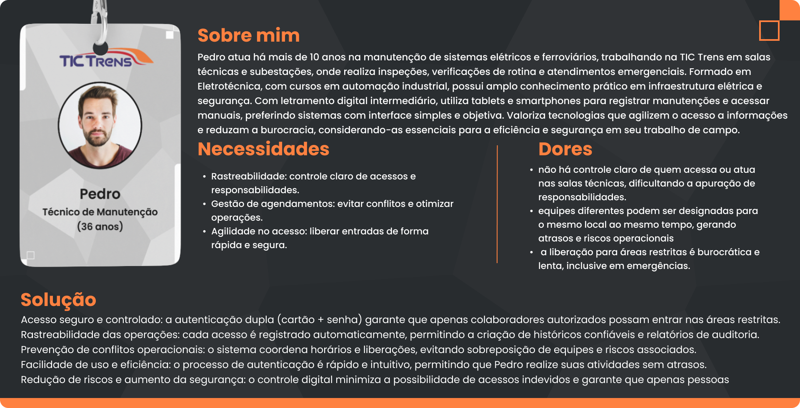
</div>
<br>
<div align="center">
<sub>Fonte: Material produzido pelo grupo DesTremidos, 2025.</sub>
</div>
<br>

Pedro representa o elo mais próximo das operações técnicas da TIC Trens. Como técnico de manutenção com mais de uma década de experiência, ele atua diretamente nas salas técnicas e subestações, onde a precisão e a segurança são indispensáveis. Sua rotina envolve lidar com sistemas elétricos sensíveis e situações de emergência, exigindo acesso rápido e controlado a ambientes restritos.

A escolha de Pedro como persona é essencial porque ele simboliza o público que mais se beneficia da automação no controle de acessos e agendamentos. Suas dores (falta de rastreabilidade operacional, os conflitos de agendamento e a demora em liberações) refletem exatamente os desafios que o sistema proposto busca solucionar. Ao considerar suas necessidades, a solução garante eficiência, segurança e praticidade para quem está na linha de frente das operações.

#### 3.2.1.2 Analista de Tecnologia da Informação

<br>
<div align="center">
<sub>Figura xx: Persona Samuel.</sub>
</div>
<br>
<div align="center">

</div>
<br>
<div align="center">
<sub>Fonte: Material produzido pelo grupo DesTremidos, 2025.</sub>
</div>
<br>

Samuel representa o perfil técnico responsável por integrar e manter o sistema funcionando corretamente dentro da infraestrutura da TIC Trens. Como analista de TI, ele é o elo entre as áreas administrativas e operacionais, garantindo que o controle de acesso e a gestão de permissões estejam centralizados, seguros e bem monitorados.

Sua presença como persona é estratégica, pois reflete o ponto de vista de quem assegura a continuidade e confiabilidade da solução. Suas dores (fragmentação de processos de permissão, alta demanda de suporte e falta de integração entre sistemas) destacam a importância de uma plataforma robusta, automatizada e de fácil manutenção. A partir de sua perspectiva, o projeto pode evoluir para uma ferramenta mais inteligente, escalável e integrada ao ecossistema digital da empresa.

#### 3.2.1.3 Auditora Interna

<br>
<div align="center">
<sub>Figura xx: Persona Janete.</sub>
</div>
<br>
<div align="center">

</div>
<br>
<div align="center">
<sub>Fonte: Material produzido pelo grupo DesTremidos, 2025.</sub>
</div>
<br>

Janete foi escolhida como persona por representar o olhar fiscalizador e estratégico sobre a operação. Como auditora interna, ela tem o papel de garantir conformidade, rastreabilidade e segurança nas atividades realizadas nas salas técnicas e subestações. Sua rotina depende de dados confiáveis e bem estruturados para validar acessos e elaborar relatórios de auditoria com precisão.

As dores de Janete (dificuldade em consolidar informações, falta de transparência e tempo excessivo gasto em auditorias manuais) evidenciam a necessidade de uma solução que automatize a coleta e o cruzamento de dados. O sistema proposto atende diretamente a essas demandas, oferecendo relatórios rastreáveis, alertas automáticos e total visibilidade sobre os acessos realizados. Dessa forma, a solução não apenas otimiza o trabalho de auditoria, mas também reforça a governança e a conformidade da TIC Trens.

#### 3.2.1.4 Análise Comparativa das Personas

**Pedro**, **Samuel** e **Janete** compartilham o objetivo comum de garantir **segurança**, **rastreabilidade** e **eficiência operacional** ao utilizar o sistema de controle de acessos da **TIC Trens**. Essa convergência demonstra que, apesar de atuarem em diferentes níveis dentro da organização, todos necessitam de **processos confiáveis e integrados** para assegurar operações técnicas seguras e transparentes. Nesse contexto, **automatizar e centralizar informações** surge como um alicerce indispensável para atender às expectativas individuais, minimizando **erros humanos**, **atrasos** e **retrabalhos**.

Contudo, suas demandas se distinguem pelo **foco** e pela **maneira como interagem com a solução**. **Pedro** prioriza uma experiência **ágil e descomplicada** para acessar os espaços técnicos, valorizando uma **interface prática e responsiva**. **Samuel**, por sua vez, se preocupa com a **estabilidade da plataforma**, sua **capacidade de integração** e as **opções de controle administrativo**, exigindo funcionalidades diretamente relacionadas à **gestão e manutenção**. Já **Janete** busca sobretudo **visibilidade**, **rastreabilidade** e **relatórios confiáveis**, voltando seu interesse para a **análise e validação dos dados gerados**.

Essas particularidades influenciam diretamente o **design da experiência** e o **desenvolvimento das funcionalidades**. Enquanto **Pedro** requer uma **interface simples e funcional**, **Samuel** demanda **ferramentas mais robustas e administrativas**, e **Janete** depende de **módulos detalhados de análise e auditoria**. Assim, identificar tanto as **similaridades** quanto as **diferenças** entre as personas é fundamental para criar uma solução **equilibrada**, que combine **usabilidade**, **controle** e **conformidade**. Dessa forma, cada perfil pode extrair **valor** e **eficiência** na utilização do sistema integrado ao ecossistema da **TIC Trens**.

#### 3.2.1.5 Conclusão

As três personas apresentadas representam de forma complementar os principais atores envolvidos na operação, manutenção e controle das áreas técnicas da TIC Trens. Cada uma reflete uma perspectiva essencial para o sucesso da solução: Pedro simboliza o usuário operacional, que necessita de acesso ágil e seguro; Samuel representa o suporte tecnológico, responsável pela integração e estabilidade do sistema; e Janete personifica o olhar fiscalizador, que garante transparência e conformidade. Juntas, essas personas oferecem uma visão holística dos desafios enfrentados e das melhorias esperadas, assegurando que o projeto atenda às necessidades reais da empresa e contribua para a eficiência, segurança e governança das operações.

**Link para plataforma de desenvolvimento**: http://figma.com/design/J3IW7aYG45cdgSur0irRo0/Sem-t%C3%ADtulo?node-id=4-64&p=f&t=lk3vTznX7uLeFfRV-0

### 3.2.2. Jornada do Usuário e Storyboard

Nesta etapa da Sprint 2, o foco esteve voltado para a compreensão aprofundada das necessidades, dores e expectativas dos principais usuários do sistema, representados por suas respectivas personas. A construção da Jornada do Usuário e do Storyboard permitiu mapear de forma visual e descritiva o caminho percorrido por cada persona diante das soluções propostas, identificando pontos críticos da experiência, oportunidades de melhoria e interações essenciais com o sistema IoT da TIC Trens.
Esse processo foi fundamental para garantir que o desenvolvimento das funcionalidades esteja alinhado com a realidade operacional dos usuários, proporcionando eficiência, rastreabilidade e integração entre os sistemas corporativos.

---

### Jornada do Usuário – Pedro Costa

#### Cenário:

Realizar manutenção corretiva em sala técnica de subestação no início do expediente, utilizando o sistema automatizado de controle de acesso.

---

#### Expectativas:

- Conseguir entrada rápida, segura e sem falhas ao local restrito.
- Garantir registro preciso de suas movimentações, com rastreabilidade completa.
- Evitar conflitos de acesso com outras equipes e atrasos no início do serviço.
- Assegurar fluidez no processo de autenticação e execução da manutenção.

---

#### Oportunidades:

- Automatizar o controle de entrada e saída de técnicos, reduzindo o tempo de autenticação e eliminando etapas manuais.
- Integrar o sistema de validação de identidade (cartão RFID e senha) com o registro automático de logs no dashboard da auditoria.
- Fornecer feedbacks sonoros e visuais claros, garantindo uma experiência mais intuitiva e segura.
- Centralizar os dados de entrada, tempo de permanência e saída em um único sistema conectado à nuvem.

---

#### Responsabilidades:

- Realizar manutenções corretivas de acordo com as normas de segurança.
- Seguir os protocolos de autenticação dupla (cartão e senha pessoal) para acessar áreas restritas.
- Garantir o registro correto de entrada, permanência e saída no sistema.
- Reportar eventuais falhas de acesso ou inconsistências detectadas durante o processo.

---

#### Fases da Jornada

- **Fase 01 – Preparação para entrada:**  
  Pedro verifica sua escala de serviço do dia, confere os dados da manutenção e desloca-se até o ponto de acesso da subestação, portando o cartão de identificação e senha pessoal.  
  `Pensamento do usuário: "Preciso realizar essa manutenção com urgência, espero não encontrar nenhum problema na entrada."`

- **Fase 02 – Autenticação e identificação:**  
  Pedro aproxima o cartão do leitor RFID, insere sua senha pessoal no teclado e aguarda a validação dupla de identidade pelo sistema.  
  `Pensamento do usuário: "Tomara que não haja conflito de agendamentos e que o sistema funcione sem atrasos."`

- **Fase 03 – Acesso autorizado:**  
  O sistema emite sinal sonoro e visual de liberação; a porta destrava automaticamente e o registro de entrada é enviado ao dashboard e ao setor de auditoria.  
  `Pensamento do usuário: "Abriu rápido, agora posso começar o serviço sem atrasos."`

- **Fase 04 – Execução do serviço:**  
  Pedro realiza a manutenção conforme as normas estabelecidas, enquanto o sistema registra o tempo de permanência no local.  
  `Pensamento do usuário: "Preciso me concentrar na execução correta, já que o acesso fluiu bem."`

- **Fase 05 – Encerramento e saída:**  
  Após concluir o trabalho, Pedro efetua o registro de saída no terminal e recebe a confirmação automática no aplicativo. Os dados são atualizados instantaneamente no histórico do sistema.  
  `Pensamento do usuário: "Serviço concluído e tudo ficou registrado corretamente."`

---

**Abaixo segue a imagem com o fluxo da jornada:**

<div align="center">
  <sub>Figura X: Jornada do Usuário – Pedro Costa.</sub><br>
  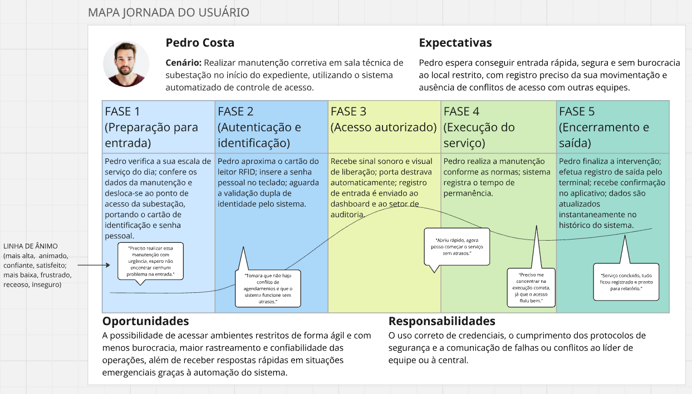<br>
  <sup>Fonte: Material produzido pelo grupo DesTremidos, 2025.</sup>
</div>

---

### Jornada do usuário - Samuel, Analista de Tecnologia da Informação da TIC Trens

#### Cenário:

Samuel é responsável pela implantação e manutenção dos sistemas digitais da TIC Trens. Antes, o controle de acessos era descentralizado e exigia processos manuais de autorização, o que gerava erros, falhas de segurança e retrabalho. Agora, com a implementação de um sistema centralizado, Samuel consegue administrar todas as permissões de forma integrada, com autenticação simplificada e relatórios automatizados em tempo real.

---

#### Expectativas:

- Centralizar e automatizar a gestão de acessos e permissões.
- Garantir autenticação segura e simplificada (SSO ou MFA).
- Obter rastreabilidade completa e relatórios de auditoria em tempo real.
- Reduzir falhas manuais e o volume de chamados técnicos.
- Integrar sistemas corporativos para unificar dados e otimizar a infraestrutura tecnológica.

---

#### Oportunidades:

- Automatizar a configuração e atualização de permissões em um ambiente centralizado.
- Implementar autenticação automatizada e segura para reduzir falhas e retrabalho.
- Integrar sistemas distintos em uma única plataforma corporativa.
- Disponibilizar alertas e relatórios em tempo real para auditorias rápidas e seguras.
- Simplificar a gestão de acessos e o controle de infraestrutura tecnológica.

---

#### Responsabilidades:

- Administrar e manter os sistemas de controle de acesso e autenticação da TIC Trens.
- Garantir a segurança e o funcionamento integrado das soluções tecnológicas.
- Monitorar alertas e relatórios para auditoria contínua e prevenção de falhas.
- Suportar equipes técnicas e administrativas na configuração de acessos.
- Promover integração entre sistemas para unificação de dados e otimização de processos.

---

#### Fases da Jornada

- **Fase 01 – Identificação do Problema:**  
  Samuel percebe que os processos de autorização de acesso são descentralizados e inconsistentes. As permissões são configuradas manualmente, aumentando o risco de falhas, senhas esquecidas e retrabalho.  
  `Pensamento do usuário: "Estamos perdendo tempo com processos manuais e inseguros."`

- **Fase 02 – Procura por Soluções:**  
  Diante dos problemas recorrentes e do alto volume de chamados técnicos, Samuel busca soluções tecnológicas que unifiquem os sistemas de controle de acesso e autenticação. Ele identifica a necessidade de um sistema centralizado com autenticação automatizada e integração entre plataformas.  
  `Pensamento do usuário: "Preciso de uma solução que centralize tudo e reduza falhas."`

- **Fase 03 – Implementação da Solução:**  
  Samuel coordena a implantação do novo sistema centralizado, configurando autenticação segura e integrando diferentes módulos corporativos. Ele realiza testes para garantir que as permissões sejam gerenciadas corretamente e que os relatórios de auditoria estejam funcionando.  
  `Pensamento do usuário: "Agora consigo visualizar e controlar tudo de um só lugar."`

- **Fase 04 – Uso e Validação:**  
  Com o sistema em operação, Samuel percebe a redução significativa de erros e de chamados técnicos. Os relatórios e alertas automáticos permitem detectar falhas em tempo real, tornando a gestão mais eficiente.  
  `Pensamento do usuário: "O sistema está mais estável, e os acessos muito mais seguros."`

- **Fase 05 – Resultados e Melhoria Contínua:**  
  Samuel monitora constantemente o desempenho do sistema e propõe melhorias para aumentar a automação e a integração com outras plataformas corporativas. O processo se torna mais ágil, confiável e transparente.  
  `Pensamento do usuário: "Agora tenho controle total sobre a infraestrutura e posso antecipar problemas antes que ocorram."`

---

**Abaixo segue a imagem com o fluxo da jornada:**

<div align="center">
  <sub>Figura X: Jornada do Usuário – Samuel Oliveira.</sub><br>
  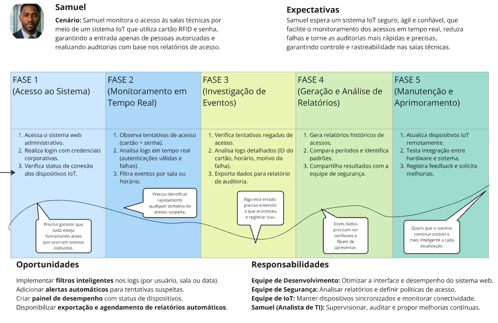<br>
  <sup>Fonte: Material produzido pelo grupo DesTremidos, 2025.</sup>
</div>

----

### Jornada do usuário - Janete, auditora da tictrens.

#### Cenário:

Janete inicia uma nova auditoria mensal. Antes, era necessário analisar manualmente documentos físicos para registrar as entradas e saídas de colaboradores, um processo demorado e sujeito a erros. Agora, com o dispositivo IoT, ela recebe relatórios automatizados em tempo real, que consolidam todas as informações de acesso de forma precisa e rastreável.

#### Expectativas:

- Dados organizados e totalmente rastreáveis.

- Relatórios claros, precisos e confiáveis.

- Uma ferramenta que otimiza o tempo de auditoria e garante maior eficiência e transparência nos processos.

#### Oportunidades:

- Automatizar a coleta e o registro de dados de acesso, eliminando processos manuais e reduzindo falhas humanas.

- Implementar um sistema centralizado que consolide todas as fontes de informação em uma única plataforma segura e integrada.

- Disponibilizar dashboards interativos e em tempo real, permitindo o acompanhamento contínuo do status das auditorias e a rápida identificação de inconsistências.

#### Responsabilidades:

- Verificar a conformidade dos acessos às áreas restritas, assegurando que apenas pessoas devidamente autorizadas tenham permissão de entrada.

- Realizar auditorias periódicas nos registros de acesso das áreas críticas, avaliando possíveis desvios ou irregularidades.

- Identificar e corrigir inconsistências nos dados de controle de acesso, garantindo a integridade e a rastreabilidade das informações.

#### Fases da jornada

- Fase 01 - **Identificação do Problema:** Janete percebe que o processo de auditoria é extremamente demorado e ineficiente. Os registros de acesso são provenientes de diversas fontes, o que dificulta a rastreabilidade e aumenta o risco de falhas humanas. O trabalho manual, além de consumir tempo, torna o processo suscetível a erros e inconsistências.
  `Pensamento da usuária: "Estou sobrecarregada, o trabalho é muito manual."`

- Fase 02 - **Procura por Soluções:** Diante das dificuldades, Janete inicia uma pesquisa por ferramentas que possam facilitar a visualização e o controle dos logs de acesso. Ela busca soluções tecnológicas que simplifiquem o processo de auditoria e reduzam o tempo gasto com tarefas manuais. Nesse momento, começa a conhecer alternativas com dispositivos IoT.
  `Pensamento da usuária: "Consigo simplificar o processo de auditoria!"`

- Fase 03 - **Implementação da Solução:** Janete participa dos testes iniciais do novo sistema IoT, aprendendo a utilizar o painel de logs e compreendendo como ele pode otimizar seu trabalho. Gradualmente, ela migra do processo manual para um modelo automatizado, percebendo ganhos de tempo e confiabilidade.
  `Pensamento da usuária: "Estou entendendo como o sistema funciona... isso pode realmente economizar meu tempo."`

- Fase 04 - **Uso e Validação:** Com o sistema já implementado, Janete realiza sua primeira auditoria completa utilizando os relatórios automatizados. Ela compara os resultados com o método anterior e identifica uma melhoria significativa em clareza, rastreabilidade e tempo de execução. `Pensamento da usuária: "Os dados estão claros e rastreáveis! Finalmente consigo ver tudo de forma organizada."`

- Fase 5 – **Resultados e Melhoria Contínua**
  Com o novo sistema consolidado, Janete passa a utilizar os dados gerados pelo IoT para auditorias preventivas e investigações internas. O processo tornou-se mais estratégico, com relatórios em tempo real e total confiabilidade das informações. `Pensamento da usuária: "Agora sim consigo enxergar tudo com clareza, o sistema me dá controle e segurança."`

---

**Abaixo segue a imagem com o fluxo da jornada:**

<br>
<div align="center">
<sub>Figura 9: Jornada do usuário Janete.</sub>
</div>
<br>
<div align="center">

</div>
<br>
<div align="center">
<sub>Fonte: Material produzido pelo grupo DesTremidos, 2025.</sub>
</div>
<br>

----

A análise das jornadas e storyboards possibilitou uma visão clara sobre como as soluções tecnológicas impactam diretamente as rotinas dos profissionais da TIC Trens, desde o controle de acessos até a auditoria dos registros. A documentação desses fluxos trouxe insights valiosos para o aprimoramento das interfaces e da automação dos processos, fortalecendo o objetivo principal do projeto: otimizar a gestão de acessos e promover a segurança e transparência operacional.
Com base nesses resultados, as próximas sprints poderão direcionar o desenvolvimento para funcionalidades que consolidem uma experiência do usuário mais fluida, segura e integrada, garantindo valor contínuo à organização e seus colaboradores.

## 3.3. Solução Técnica

_Nesta seção, detalhe a especificação da solução, de acordo com o disposto nas subseções._

### 3.3.1. Requisitos Funcionais

#### Introdução

A presente seção tem como objetivo detalhar os requisitos funcionais do projeto de sistema IoT para controle de acesso físico em áreas técnicas em parceria com a empresa TIC Trens, desenvolvido no contexto da primeira sprint. Estes requisitos traduzem as necessidades operacionais e de segurança do parceiro em funcionalidades tecnológicas, garantindo que o sistema atenda aos padrões exigidos de conectividade, rastreabilidade e controle inteligente de acesso. Cada requisito foi elaborado considerando as demandas do negócio, priorizando a integração eficiente entre dispositivos IoT (RFID, sensores e gateways), a proteção das informações trafegadas e o gerenciamento centralizado dos dispositivos e usuários — pilares essenciais para a gestão segura e digitalizada das operações de manutenção e inspeção da concessionária ferroviária.

---

| **RF#** | **Descrição**                                                                                                                                                                                                                                                                                                                                                                                                                                   | **Regra de negócio**                                                                                                                                                                                                                                                                                                                                                                                           |
| ------- | ----------------------------------------------------------------------------------------------------------------------------------------------------------------------------------------------------------------------------------------------------------------------------------------------------------------------------------------------------------------------------------------------------------------------------------------------- | -------------------------------------------------------------------------------------------------------------------------------------------------------------------------------------------------------------------------------------------------------------------------------------------------------------------------------------------------------------------------------------------------------------- |
| RF01    | O sistema deve registrar e validar o acesso físico de colaboradores da TIC Trens e Terceirizados a áreas técnicas, usando dispositivos de RFID.                                                                                                                                                                                                                                                                                                 | O acesso só será permitido a colaboradores previamente autorizados e capacitados para a atividade programada.                                                                                                                                                                                                                                                                                                  |
| RF02    | O dispositivo IoT deve validar em tempo real se o usuário possui autorização ativa e se o momento do acesso está dentro da janela de permissão configurada no sistema de agendamentos.                                                                                                                                                                                                                                                          | O acesso será permitido exclusivamente aos colaboradores autorizados e dentro do período previamente estabelecido pela administração.                                                                                                                                                                                                                                                                          |
| RF03    | O dispositivo IoT deve coletar dados do acesso (data, hora, usuário, local, tipo de autenticação e status da capacitação “função de exercício do trabalho” e da agenda).                                                                                                                                                                                                                                                                        | Todo acesso deve ser auditável, cumprindo normas de segurança e rastreabilidade.                                                                                                                                                                                                                                                                                                                               |
| RF04    | O sistema deve permitir conexão Wi-Fi para envio dos dados de acesso coletados à plataforma central.                                                                                                                                                                                                                                                                                                                                            | O envio de dados deve ocorrer em tempo real, sempre que houver conectividade disponível.                                                                                                                                                                                                                                                                                                                       |
| RF05    | O sistema deve formatar e enviar os dados coletados no padrão do protocolo MQTT, permitindo integração com APIs de sistemas internos.                                                                                                                                                                                                                                                                                                           | Os dados precisam estar estruturados conforme definição da equipe de TI e normas da empresa parceira.                                                                                                                                                                                                                                                                                                          |
| RF06    | O sistema deve emitir alertas em tempo real para usuários e supervisores em caso de risco, tentativa de acesso negado ou eventos fora do previsto pela agenda (ex: colaborador sem capacitação adequada).                                                                                                                                                                                                                                       | Alertas seguirão fluxos pré-determinados por política interna de segurança do trabalho do parceiro.                                                                                                                                                                                                                                                                                                            |
| RF07    | O sistema deve permitir o cadastro, identificação e gerenciamento centralizado de todos os dispositivos IoT integrados à plataforma (leitores RFID, módulos de controle de acesso e atuadores). Cada dispositivo deve possuir um identificador único associado à sua área técnica e categoria funcional, permitindo rastreabilidade, monitoramento de estado (ativo/inativo), atualizações e integração segura via rede Wi-Fi e protocolo MQTT. | Somente dispositivos devidamente cadastrados, autenticados e vinculados a áreas específicas poderão operar no sistema de controle de acesso. A inclusão, reconfiguração ou remoção de dispositivos deve ser autorizada exclusivamente pela equipe de TI ou segurança do trabalho, garantindo que as políticas de autenticação, firmware e manutenção sejam aplicadas conforme as normas internas da TIC Trens. |
| RF08    | O sistema deve permitir acesso à plataforma de dashboard para visualização gráfica dos dados, emissão de relatórios e exportação de logs apenas para pessoas habilitadas.                                                                                                                                                                                                                                                                       | O acesso ao dashboard será restrito a perfis autorizados, definidos pela gestão de segurança do trabalho e TI.                                                                                                                                                                                                                                                                                                 |
| RF09    | O sistema IoT deve exigir autenticação de dois fatores (2FA) para todos os colaboradores autorizados a acessar as áreas técnicas. O processo de validação deve combinar um fator de posse (cartão magnetizado) e um fator de conhecimento (senha pessoal individual). Essa dupla verificação deve ocorrer antes da liberação do acesso físico.                                                                                                  | Cada colaborador deve possuir uma credencial única e intransferível, registrada no banco de dados central da TIC Trens e ligada a seu ID único. Se qualquer uma das etapas de autenticação falhar, o acesso será automaticamente negado, um alerta será gerado no painel administrativo e o evento será registrado para auditoria.                                                                             |
| RF10    | O sistema IoT deve criptografar todas as informações coletadas pelos dispositivos (como identificações de usuários, horários de acesso, status de capacitação e registros de autenticação) antes do envio ao banco de dados central. A criptografia deve ser aplicada aos dados em trânsito, garantindo a confidencialidade e integridade das informações trafegadas via rede Wi-Fi e protocolo MQTT.                                           | Nenhum dado sensível poderá ser transmitido em texto legível ou armazenado sem criptografia ativa. O sistema deve autenticar a integridade da mensagem ao recebê-la e descriptografá-la apenas dentro de ambientes seguros e autorizados.                                                                                                                                                                      |

---

#### Conclusão

Os requisitos funcionais descritos nesta seção compõem a base estrutural para o desenvolvimento da solução IoT proposta, assegurando aderência total ao escopo do projeto e aos indicadores de desempenho esperados pela TIC Trens. A implementação das regras de negócio apresentadas garante que cada funcionalidade do sistema opere de forma integrada, segura e rastreável, promovendo confiabilidade operacional, conformidade com normas internas e mitigação de riscos de acesso não autorizado. Dessa forma, o conjunto de requisitos aqui documentado alcança os critérios de qualidade avançados (100%), ao abranger todos os aspectos necessários para uma boa estruturação da solução: coleta de dados via sensor, formatação por protocolo MQTT, conexão Wi-Fi, autenticação dupla, criptografia, gerenciamento de dispositivos, dashboards e representação gráfica das informações.

### 3.3.2. Requisitos Não Funcionais

#### Introdução

A presente seção tem como finalidade descrever os requisitos não funcionais do sistema IoT LockIn, desenvolvido em parceria com a TIC Trens, com o objetivo de estabelecer os parâmetros de qualidade que garantem o funcionamento eficiente, seguro e confiável da solução. Diferentemente dos requisitos funcionais, que determinam as ações executadas pelo sistema, os requisitos não funcionais abordam as condições sob as quais essas ações devem ocorrer, assegurando que o desempenho, a segurança da informação, a disponibilidade, a usabilidade, a manutenibilidade e a portabilidade estejam em conformidade com os padrões da norma internacional ISO/IEC 25010.

A definição desses requisitos foi orientada pelas demandas do negócio identificadas nas etapas de diagnóstico e análise de negócios do projeto, da empresa parceira e do setor em que a empresa parceira está inserida, em consonância com os desafios operacionais enfrentados pela TIC Trens no controle de acesso a áreas técnicas críticas. Considerando que o ambiente ferroviário exige respostas rápidas, funcionamento contínuo e proteção rigorosa dos dados de autenticação, cada requisito foi planejado para assegurar que a solução IoT mantenha sua performance mesmo sob condições adversas, promovendo eficiência operacional, resiliência tecnológica e experiência de uso aprimorada. Assim, foram contemplados aspectos de qualidade como desempenho e eficiência (autenticação em até sete segundos), segurança da informação, confiabilidade e disponibilidade (uptime superior a 99%), manutenibilidade e portabilidade (atualização de firmware sem interrupção e adaptação a diferentes contextos de rede), além de usabilidade e auditabilidade.

| **RNF#** | **Descrição**                                                                                                                                                                                                                                                                                                  | **Aspecto de qualidade**         |
| -------- | -------------------------------------------------------------------------------------------------------------------------------------------------------------------------------------------------------------------------------------------------------------------------------------------------------------- | -------------------------------- |
| RNF01    | O sistema deve autenticar colaboradores e liberar acesso em até 7 segundos após inserção de senha ou cartão RFID, mesmo em condições de pico de uso.                                                                                                                                                           | Desempenho                       |
| RNF02    | Todas as informações sensíveis (login, horários, registros de acesso) devem ser criptografadas em trânsito, utilizando por exemplo: AES-256.                                                                                                                                                                   | Segurança da Informação          |
| RNF03    | O sistema deverá manter o seu funcionamento com taxa de operação contínua, superior ou igual 99% do tempo e tolerância máxima de 40 minutos de inatividade não planejada por mês.                                                                                                                              | Confiabilidade                   |
| RNF04    | O sistema deve permitir atualização de firmware dos dispositivos IoT, inclusão de novos sensores e ajustes funcionais sem necessidade de paradas prolongadas.                                                                                                                                                  | Manutenibilidade                 |
| RNF05    | O sistema deverá ser compatível para instalação em diferentes ambientes técnicos críticos, com configuração flexível (Rede Wi-Fi adaptável e integração com diferentes dispositivos de tranca e Sistema de Combate à Incêndio).                                                                                | Portabilidade                    |
| RNF06    | A interface do dashboard deve ser acessível e intuitiva, permitindo operação fácil por supervisores e colaboradores autorizados de TI e Auditoria, conforme testes internos de usabilidade.                                                                                                                    | Usabilidade                      |
| RNF07    | O sistema deve emitir sinais visuais (piscar luzes LED) e sonoros (buzzer) para indicar seu pleno funcionamento, estados de operação (inicialização, autenticação bem-sucedida, falha de acesso, conexão perdida, etc.), garantindo feedback imediato ao usuário e facilitando diagnósticos locais.            | Usabilidade                      |
| RNF08    | Todas as operações críticas (registro de acesso, inclusão ou atualização de dispositivos) devem ser auditáveis, gerando logs detalhados, protegidos contra modificações, e acessíveis apenas por perfis autorizados.                                                                                           | Auditabilidade/Confidencialidade |
| RNF09    | O sistema deve ser capaz de identificar e se recuperar automaticamente de falhas de conectividade ou comunicação, restabelecendo o envio de dados assim que possível, sem perda de registros importantes, mantendo uma persistência local de 500 logs.                                                         | Confiabilidade/Disponibilidade   |
| RNF10    | O visor LCD do dispositivo IoT deve exibir imediatamente uma mensagem (como por exemplo: acesso autorizado, acesso negado, insira a senha, senha incorreta e acesso liberado) e após identificação e análise do cartão RFID e senha, garantindo feedback instantâneo ao usuário sobre a autorização do acesso. | Usabilidade/Desempenho           |

#### Conclusão

Os requisitos não funcionais apresentados nesta seção compõem o núcleo de qualidade da solução IoT LockIn, assegurando que o sistema atenda aos parâmetros de desempenho, segurança, confiabilidade, usabilidade e manutenibilidade estabelecidos pela norma ISO/IEC 25010. A partir deles, garante-se que a solução opere com estabilidade e eficiência, oferecendo respostas rápidas, alta disponibilidade e resistência a falhas, além de manter a integridade e a confidencialidade das informações em todas as etapas do processo de autenticação e comunicação.

O cumprimento desses requisitos possibilita a manutenção contínua e segura do sistema, reduzindo custos operacionais e garantindo escalabilidade futura. Dessa forma, consolida-se uma arquitetura compatível com o conceito de Ferrovias 4.0, baseada na automação, rastreabilidade e governança digital, assegurando que o LockIn não apenas cumpra suas funções básicas, mas o faça com excelência técnica, confiabilidade e aderência às normas internacionais de qualidade, fortalecendo o compromisso do projeto com a inovação, a segurança e a transformação digital da TIC Trens.

### 3.3.3. Arquitetura da Solução

O desenvolvimento da arquitetura da solução foi guiado pelos pilares de Escalabilidade, Segurança e Usabilidade, fundamentando uma arquitetura Edge-First. Este modelo visa garantir a autonomia operacional em cenários de conectividade intermitente, enquanto a centralização na Cloud assegura a rastreabilidade corporativa e a gestão global. O detalhamento a seguir confirma o atendimento aos requisitos técnicos estabelecidos na seção 3.3.1. Requisitos Funcionais e 3.3.2. Requisitos Não Funcionais, sendo referenciados especificamente em cada subseção.

Link para Vídeo de Explicação da Arquitetura e Fluxos de Uso: [Google Drive](https://drive.google.com/drive/folders/1RWhCf2X0ANtUY8XvRLMVtGhxlmOAjDB4?usp=drive_link)

#### 3.3.3.1. Pilares de Desenvolvimento e Justificativas Arquiteturais

O design do sistema prioriza a resiliência e a adaptação ao ambiente ferroviário, onde a inconsistência de rede é uma condição de contorno.

**Escalabilidade**

A Escalabilidade é inerente à arquitetura de Brokers Locais Autônomos (Edge-First). A replicação do Broker Service em cada estação define nodes independentes que processam a autenticação localmente. . Essa abordagem distribui a carga de processamento, permitindo que o sistema cresça para N estações (Expansão Horizontal) sem sobrecarregar a infraestrutura central na Cloud.

**Segurança**

A Segurança é implementada em múltiplas camadas de proteção, desde o dispositivo até a Cloud. O sistema utiliza Autenticação Bi-fator (RFID + PIN), Hashing SHA-256 imediato na ESP32 (evitando a circulação do UID em texto puro) e Criptografia de Transporte via MQTT/TLS (na LAN) e HTTPS/TLS (na WAN). O uso futuro de um Secure Element (Ex: ATECC608A) é previsto para armazenamento inalterável de chaves, otimizando a segurança para a fase de produção.

**Usabilidade**

A Usabilidade é garantida pela separação de interfaces (Dashboard Local e Dashboard Cloud) e pelo design resiliente (Edge-First). O técnico de campo possui uma ferramenta simples e acessível (Dashboard Local) para diagnóstico e manutenção, não dependendo da conectividade WAN. O gestor, por sua vez, acessa uma visão consolidada e completa para auditoria e gestão de permissões (Dashboard Cloud).

#### 3.3.3.2. Arquitetura de Software e Fluxos

**Arquitetura de Software e Conexões**

O sistema opera em uma arquitetura em camadas, com o Broker Service (Microserviços em Node.js) executando a lógica crítica localmente, em conjunto com o Mosquitto Broker (MQTT).

<br>
<div align="center">
<sub>Figura xx: Diagrama de Arquitetura de Software</sub>
</div>
<br>
<div align="center">
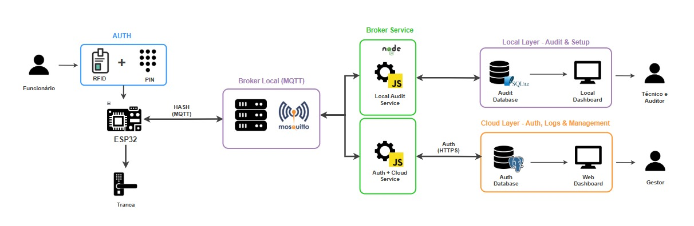
</div>
<br>
<div align="center">
<sub>Fonte: Material produzido pelo grupo DesTremidos, 2025.</sub>
</div>
<br>

**Fluxo de Criptografia**

A criptografia é iniciada na ponta para proteger a identidade do funcionário:

<br>
<div align="center">
<sub>Figura xx: Fluxo de Criptografia</sub>
</div>
<br>
<div align="center">
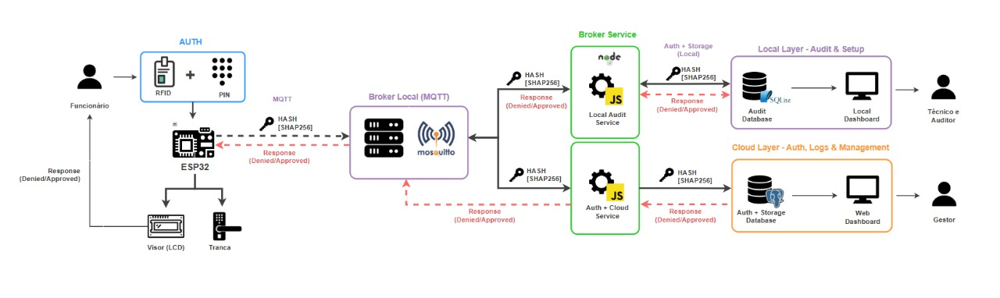
</div>
<br>
<div align="center">
<sub>Fonte: Material produzido pelo grupo DesTremidos, 2025.</sub>
</div>
<br>

O hashing do RFID + PIN é executado pela ESP32 para gerar uma string criptograficamente segura (SHA-256), transmitida via MQTT/TLS. O Broker Service compara este hash com o armazenado (localmente ou na Cloud), e não com o dado em texto puro.

**Diagrama de Rede**

<br>
<div align="center">
<sub>Figura xx: Diagrama de Rede</sub>
</div>
<br>
<div align="center">
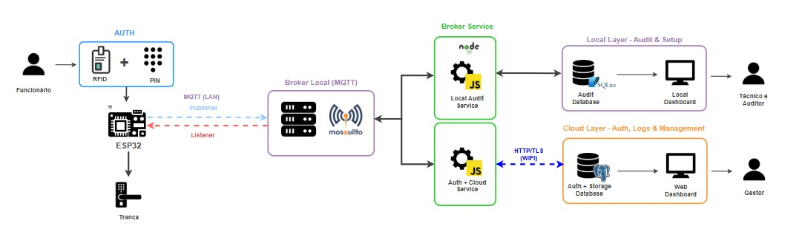
</div>
<br>
<div align="center">
<sub>Fonte: Material produzido pelo grupo DesTremidos, 2025.</sub>
</div>
<br>

#### 3.3.3.3. Arquitetura de Hardware

**Microcontroladores (MCU's)**

Devido aos requisitos de performance e isolamento de funções críticas (cálculo criptográfico vs. acionamento de emergência), o protótipo utiliza duas ESP32, em vez de uma, para a separação de responsabilidades. Em um cenário piloto, uma MCU mais robusta (Ex: STM32) poderia consolidar essas funções.

|     Componentes      |                              Função no Sistema                               |                Especificação Técnica                |
| :------------------: | :--------------------------------------------------------------------------: | :-------------------------------------------------: |
| **ESP32 (Leitura)**  |       Processa RFID, PIN, executa SHA-256, gerencia display e teclado.       | Chip: ESP32-WROOM-32. Comunicação: Wi-Fi, MQTT/TLS. |
| **ESP32 (Controle)** | Recebe comando ALLOW/DENY, aciona atuador e monitora Dry Contact (Incêndio). |  Chip: ESP32-WROOM-32. Saídas: GPIO para Relé/PWM.  |

**Sensores e Atuadores**

| Componente      | Tipo    | Função                        | Especificação Técnica                  | Tipo de Informação Coletada/Ação                               |
| :-------------- | :------ | :---------------------------- | :------------------------------------- | :------------------------------------------------------------- |
| **MFRC522**     | Sensor  | Leitura RFID                  | 13.56 MHz, protocolo ISO/IEC 14443     | UID (4 ou 7 bytes), lido a cada aproximação.                   |
| **Dry Contact** | Sensor  | Leitura de alarme de incêndio | Nível lógico isolado via optoacoplador | Sinal digital (0V/3.3V): Alarme Ativo.                         |
| **Relé NO/NC**  | Atuador | Acionamento da Tranca         | Aplicação direta de corrente           | Destravar/Travar Trancas eletromagnéticas.                     |
| **Ponte H**     | Atuador | Motores da Tranca             | Controle PWM                           | Movimentação (Destravar/Travar) de motores de passo/atuadores. |

**Arquitetura de Hardware**

<br>
<div align="center">
<sub>Figura xx: Diagrama de Hardware</sub>
</div>
<br>
<div align="center">

</div>
<br>
<div align="center">
<sub>Fonte: Material produzido pelo grupo DesTremidos, 2025.</sub>
</div>
<br>

#### 3.3.3.4. Fluxos Operacionais e Dashboards

**Fluxo de Uso (User Flow)**

<br>
<div align="center">
<sub>Figura xx: Fluxo de Uso</sub>
</div>
<br>
<div align="center">
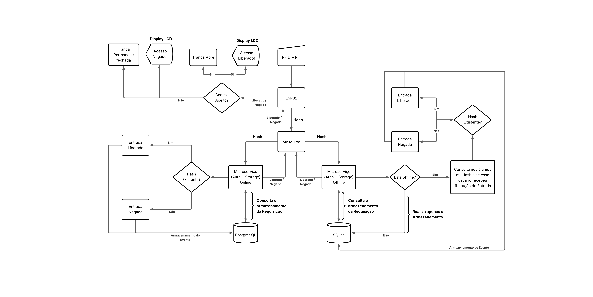
</div>
<br>
<div align="center">
<sub>Fonte: Material produzido pelo grupo DesTremidos, 2025.</sub>
</div>
<br>

Este fluxo demonstra a operação ponta a ponta, desde a interação do funcionário até o registro final na Cloud, passando pelo Broker Service para validação.

**Fluxograma de Autenticação (Permissões)**

O sistema suporta tipos complexos de acesso (Padrão, Mestre, Grupo), gerenciando a autenticação bi-fator e contadores de ocupação.

<br>
<div align="center">
<sub>Figura xx: Fluxograma de Permissões</sub>
</div>
<br>
<div align="center">
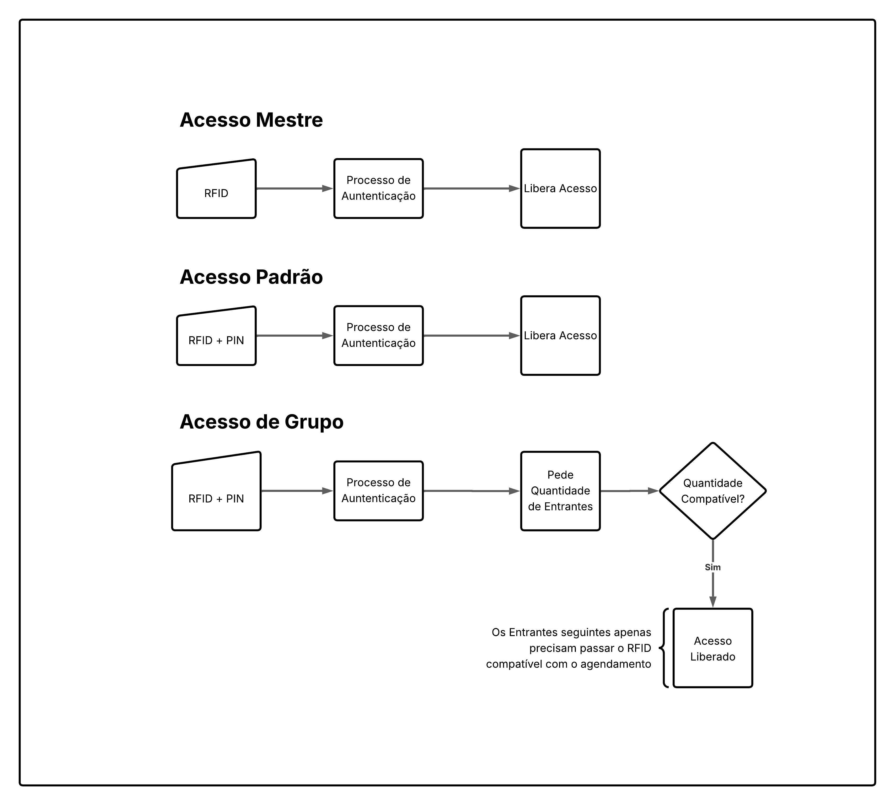
</div>
<br>
<div align="center">
<sub>Fonte: Material produzido pelo grupo DesTremidos, 2025.</sub>
</div>
<br>

**Dashboard Local**

Otimizado para o Técnico (Manutenibilidade/Usabilidade).

- **Arquitetura:** Aplicação Web extremamente simplificada, servida via API HTTP do Broker Service (acesso local).
- **Funções:** Configuração do Broker, visualização de Logs Locais (SQLite) e status de conexão das trancas.

**Dashboard CLoud (Web)**

Otimizado para o Gestor (Escalabilidade/Auditoria).

- **Arquitetura:** MVC Simplificado (API REST + PostgreSQL).
- **Funções:** Visão consolidada de todos os Brokers (Estações), Auditoria Global (tabelas de logs por Broker/mês), e Gestão Centralizada de Permissões (CRUD de usuários e tipos de acesso).

#### 3.3.3.5. Suporte aos Requisitos Funcionais e Não Funcionais

**Requisitos Funcionais (RF)**

| Requisito                                     | Arquitetura e Componente de Suporte                     | Detalhamento do Suporte                                                                                                                                                  |
| :-------------------------------------------- | :------------------------------------------------------ | :----------------------------------------------------------------------------------------------------------------------------------------------------------------------- |
| **RF-01, RF-02** (Validação/Agendamento)      | Broker Service (Auth Service) + Cache SQLite/Cloud API. | A validação do acesso e agendamento é processada pelo Auth Service (**RF-02**) utilizando o **Cache Local (Offline)** ou a **API Cloud (Online)** (**RF-01**).           |
| **RF-03, RF-09** (2FA e Rastreabilidade)      | ESP32 (Hashing) + Broker Service (Log) + SQLCipher.     | O ESP32 impõe o **2FA (RFID+PIN)** (**RF-09**). Todos os dados coletados são registrados no **SQLite (Auditabilidade/Rastreabilidade)** (**RF-03**).                     |
| **RF-04, RF-05, RF-07** (Conexão/MQTT/Gestão) | MQTT/TLS, Broker Service (Node.js), Rede Wi-Fi.         | O Broker Service (**RF-07**) estrutura e envia os dados no padrão **MQTT** (**RF-05**). A **Rede Wi-Fi** e a lógica de Sync gerenciam o envio em tempo real (**RF-04**). |
| **RF-06** (Alertas)                           | Broker Service (Node.js) + Web Dashboard.               | O **Broker Service** processa eventos críticos (Ex: acesso negado) e envia alertas em tempo real para o **Web Dashboard** (**RF-06**).                                   |
| **RF-08** (Dashboard)                         | Web Dashboard (Cloud) e Local Dashboard (Edge).         | O **Web Dashboard** fornece a interface para visualização gráfica e exportação de relatórios, com restrição de acesso por perfil (**RF-08**).                            |
| **RF-10** (Criptografia)                      | ESP32 (Hashing) + MQTT/TLS + HTTPS/TLS + SQLCipher.     | A **ESP32** criptografa (hashing) as credenciais antes do envio. **MQTT/TLS** e **HTTPS/TLS** garantem a criptografia dos dados em trânsito (**RF-10**).                 |

**Requisitos Não Funcionais**

| Requisito                                           | Arquitetura e Componente de Suporte               | Detalhamento do Suporte                                                                                                                                                           |
| :-------------------------------------------------- | :------------------------------------------------ | :-------------------------------------------------------------------------------------------------------------------------------------------------------------------------------- |
| **RNF-01, RNF-10** (Desempenho)                     | Arquitetura Dual-ESP32 + Edge-First.              | O processamento e a validação são feitos localmente no Edge Server (**latência mínima**). O Display LCD exibe o feedback imediato (**RNF-10**).                                   |
| **RNF-02** (Segurança da Informação)                | MQTT/TLS, HTTPS/TLS, SHA-256 e SQLCipher.         | A **criptografia em Trânsito (TLS)** e em Repouso (**SQLCipher no Cache Local**) garante a segurança das informações sensíveis.                                                   |
| **RNF-03, RNF-09** (Confiabilidade/Disponibilidade) | Edge-First (Cache Local) + Fila de Sincronização. | O **Cache SQLite** e o **Auth Service** garantem a operação contínua e a persistência de logs (500 logs) mesmo offline (**RNF-09**), suportando alta Confiabilidade.              |
| **RNF-04** (Manutenibilidade)                       | Broker Service (OTA) + Arquitetura Modular.       | O **Broker Service** pode gerenciar a atualização de _firmware_ (**OTA**) das ESP32. A **modularidade** facilita a inclusão de novos sensores.                                    |
| **RNF-05** (Portabilidade)                          | Rede Wi-Fi Adaptável + Optoacoplador.             | A comunicação via **Wi-Fi é flexível**. O **Optoacoplador** isola o circuito do ESP32 do Sistema de Combate a Incêndio (SCI), garantindo a compatibilidade em ambientes críticos. |
| **RNF-06, RNF-07** (Usabilidade)                    | Dashboards Dedicados + LEDs/Display.              | O **Local Dashboard** é intuitivo para o técnico. Os **LEDs/Buzzer e o Display** fornecem _feedback_ imediato e diagnóstico visual do estado do sistema.                          |
| **RNF-08** (Auditabilidade/Confidencialidade)       | Logs Detalhados + PostgreSQL Cloud + Perfis.      | O **PostgreSQL Cloud** centraliza logs detalhados, auditáveis e protegidos contra modificação, acessíveis apenas por **perfis autorizados** (**RF-08**).                          |

Por fim, a arquitetura do protótipo, desenvolvida com foco nos pilares de Escalabilidade, Segurança e Usabilidade, demonstra ser uma solução altamente resiliente para o ambiente ferroviário. O uso do Edge-First garante a Continuidade Operacional, enquanto a criptografia em múltiplas camadas satisfaz o os tópicos de segurança da informação. O sistema atende integralmente os requisitos de avaliação, fornecendo documentação detalhada sobre componentes, fluxos e o mecanismo de suporte a todos os requisitos funcionais e não funcionais. A solução está preparada para transicionar da fase de protótipo para uma implantação em um ambiente de piloto.

**Glossário Técnico**

## 7 GLOSSÁRIO TÉCNICO

| Termo                        | Definição                                                                                                                                                              |
| :--------------------------- | :--------------------------------------------------------------------------------------------------------------------------------------------------------------------- |
| **Edge-First**               | Paradigma arquitetural que prioriza a computação e o processamento de dados na **"borda"** (servidor local/estação) em vez da nuvem central, garantindo **autonomia**. |
| **Broker Service (Node.js)** | Programa local executado no **Edge Server**, implementado como **microsserviços**. Gerencia MQTT, autenticação e sincronização.                                        |
| **MQTT/TLS**                 | **Protocolo de mensagens leve (MQTT)** combinado com a **camada de segurança TLS (criptografia)** na rede local (LAN).                                                 |
| **SQLCipher**                | Extensão do **SQLite** que fornece **criptografia transparente de banco de dados**, protegendo o _cache_ de _logs_ e permissões.                                       |
| **Dry Contact (SCI)**        | Circuito de acionamento sem tensão, usado para monitorar sinais de segurança (**Ex: alarme de incêndio**), garantindo **isolamento via optoacoplador**.                |
| **SHA-256**                  | Algoritmo de **Hashing** criptográfico. Usado para gerar um _hash_ irreversível do identificador **RFID + PIN**, protegendo a identidade do usuário.                   |

### 3.3.3.6. Arquitetura do Protótipo

Vídeo de explicação sobre a arquitetura do protótipo físico:[Google Drive](https://drive.google.com/drive/folders/1lzuKWou83Q8Hd3gZpSgg_WXw5Rejt-em?usp=drive_link)

Para complementação desta seção leia as seções: "[3.3.3. Arquitetura da Solução](#333-arquitetura-da-solução)", "[3.4.4. Protótipo Físico do Projeto (online)](#344-protótipo-físico-do-projeto-online)" e "[3.5. Desenvolvimento de Software](#35-desenvolvimento-de-software)". Estas são seções que abordam de forma mais aprofundada tanto o processo de desenvolvimento das tecnologias de Hardware, aqui apresentadas, quanto o desenvolvimento de Banco de Dados, Broker e Microserviços e a intereção entre essas diferentes frentes.

Fundamentada no framework RM-ODP (Reference Model of Open Distributed Processing - ISO/IEC 10746), esta seção aborda especificamente a Visão de Tecnologia (Technology Viewpoint). Enquanto as visões anteriores (Computacional e de Engenharia) definiram a lógica funcional e a distribuição de processos, a Visão de Tecnologia foca na materialização destas abstrações em componentes tangíveis de hardware e software. Descrevemos aqui a seleção de tecnologias, desde a arquitetura do SoC (System on Chip) e os transdutores físicos, até os protocolos de transporte de telemetria e padrões de persistência, escolhidas para satisfazer os requisitos de interoperabilidade, segurança e latência estipulados para a operação em ambientes críticos.

A arquitetura do protótipo físico foi concebida sob o paradigma de Edge Computing (Computação de Borda), estabelecendo uma topologia distribuída onde o processamento crítico, incluindo a criptografia de credenciais e o controle direto de hardware, é executado localmente no dispositivo IoT. Esta estratégia visa reduzir a latência de atuação e garantir a segurança dos dados antes mesmo que eles deixem a camada física. A solução integra um microcontrolador de alto desempenho com periféricos industriais e protocolos de comunicação assíncronos, conforme detalhado nas subseções a seguir.

<br>
<div align="center">
<sub>Figura xx: Diagrama da Arquitetura do Protótipo </sub>
</div>
<br>
<div align="center">
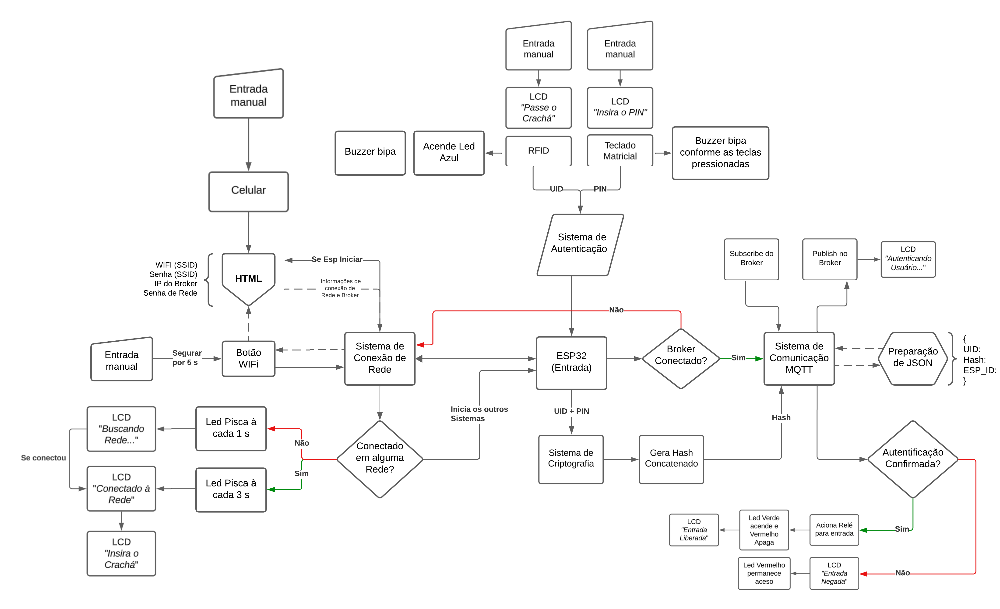
</div>
<br>
<div align="center">
<sub>Fonte: Material produzido pelo grupo DesTremidos, 2025.</sub>
</div>
<br>

**Unidade de Processamento Central (Microcontrolador)**

O núcleo computacional do sistema é o SoC (System on Chip) ESP32-WROOM-32. A escolha desta tecnologia baseia-se em sua arquitetura de 32 bits dual-core Xtensa® LX6. Diferente de microcontroladores de núcleo único, a arquitetura dual-core permite a segregação de tarefas: um núcleo (Protocol CPU) é dedicado ao gerenciamento da pilha TCP/IP e à manutenção da conexão Wi-Fi/MQTT, enquanto o segundo núcleo (Application CPU) executa a lógica de negócios, a varredura de periféricos e os algoritmos de criptografia.

No contexto do protótipo, o ESP32 é responsável por orquestrar todo o ciclo de autenticação. Ele monitora as interrupções geradas pelo teclado, gerencia o barramento I2C do display e executa o cálculo de hashing SHA-256 via hardware, garantindo que a concatenação do UID (User ID) e do PIN gere uma assinatura digital segura antes da transmissão.

<br>
<div align="center">
<sub>Figura xx: Microcontrolador ESP32 Integrado ao Circuito </sub>
</div>
<br>
<div align="center">
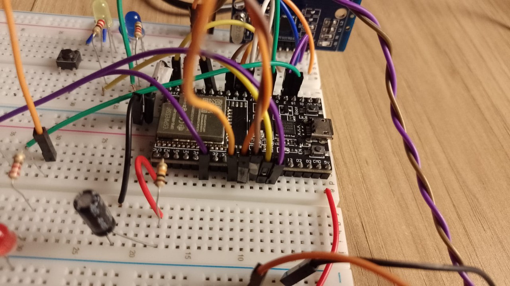
</div>
<br>
<div align="center">
<sub>Fonte: Material produzido pelo grupo DesTremidos, 2025.</sub>
</div>
<br>

**Engenharia do Sistema de Alimentação**

A estabilidade do sistema IoT depende intrinsecamente da qualidade da energia fornecida. O projeto adota uma topologia de conversão DC-DC eficiente para mitigar problemas térmicos e transientes de tensão. A alimentação primária provem de uma fonte AC/DC de 12V e 2A, dimensionada para oferecer uma reserva de potência (headroom) superior a 30% da carga máxima estimada.

Para a regulação da tensão lógica de 5.0V, utiliza-se a tecnologia de conversão chaveada (Switching Regulator) através do módulo LM2596 (Buck Converter). Ao contrário de reguladores lineares que dissipam o excedente de tensão em forma de calor, o conversor Buck utiliza modulação por largura de pulso (PWM) para converter a tensão de entrada com eficiência superior a 90%. Para garantir a imunidade a ruídos, um capacitor eletrolítico de 100µF (Low ESR) é posicionado na saída do regulador, atuando como um reservatório de energia para suprir as demandas instantâneas de corrente exigidas pelo rádio Wi-Fi durante a transmissão de pacotes. Adicionalmente, um circuito RC (Resistor-Capacitor) no pino de Enable implementa a função de Soft-Start, atrasando a inicialização do processador até a estabilização completa da tensão.

Figura 2 - Módulo de Alimentação (Buck Converter e Filtragem)

<br>
<div align="center">
<sub>Figura xx: Microcontrolador ESP32 Integrado ao Circuito </sub>
</div>
<br>
<div align="center">
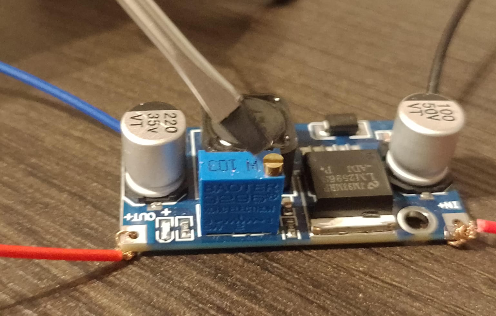
</div>
<br>
<div align="center">
<sub>Fonte: Material produzido pelo grupo DesTremidos, 2025.</sub>
</div>
<br>

<br>
<div align="center">
<sub>Figura xx: Microcontrolador ESP32 Integrado ao Circuito </sub>
</div>
<br>
<div align="center">
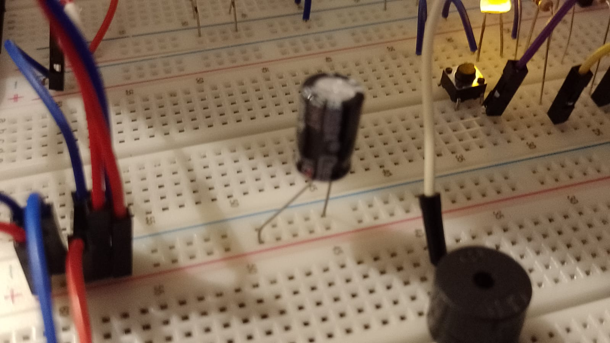
</div>
<br>
<div align="center">
<sub>Fonte: Material produzido pelo grupo DesTremidos, 2025.</sub>
</div>
<br>

**Sensores e Interfaces de Entrada de Dados**

**Teclado Matricial (Interface de Identidade)**

A interface primária de entrada é um teclado matricial de membrana 4x3. Tecnologicamente, este componente opera através de uma matriz de contatos momentâneos dispostos em linhas e colunas. O firmware do ESP32 realiza a varredura (scanning) contínua dos GPIOs digitais para detectar o fechamento do circuito. Neste protótipo, o teclado desempenha uma função híbrida crítica: além de capturar o PIN de segurança numérico, ele emula a entrada de dados do módulo RFID (devido à substituição temporária do sensor MFRC522), permitindo a inserção manual do UID hexadecimal. O sistema trata esses dados de forma agnóstica à fonte, validando a lógica de segurança completa.

<br>
<div align="center">
<sub>Figura xx: Teclado Matricial </sub>
</div>
<br>
<div align="center">

</div>
<br>
<div align="center">
<sub>Fonte: Material produzido pelo grupo DesTremidos, 2025.</sub>
</div>
<br>

**Sensor de Tensão (Monitoramento Energético)**

Para a telemetria da saúde do sistema, a arquitetura prevê um sensor de tensão baseado em um divisor resistivo. Esta configuração utiliza a Lei de Ohm para reduzir a tensão da fonte primária (12V) para uma escala segura (0-3.3V), compatível com o Conversor Analógico-Digital (ADC) do ESP32. A informação coletada é convertida em dados digitais e enviada via MQTT, permitindo que o dashboard monitore remotamente o status da alimentação.

**Atuadores e Interfaces de Saída**

**Módulo Relé Optoacoplado (Controle de Acesso)**

O acionamento físico da tranca é realizado por um módulo relé de 5V. A tecnologia chave neste componente é o isolamento galvânico proporcionado pelo optoacoplador integrado. Este dispositivo utiliza luz para transmitir o sinal de controle do ESP32 para a bobina do relé, protegendo o microcontrolador contra surtos de tensão reversa e ruídos eletromagnéticos gerados pelo chaveamento da carga indutiva (tranca/solenoide). Logicamente, o relé opera como uma chave binária controlada pelo payload de resposta do servidor.

<br>
<div align="center">
<sub>Figura xx: Atuador de Potência (Módulo Relé) </sub>
</div>
<br>
<div align="center">
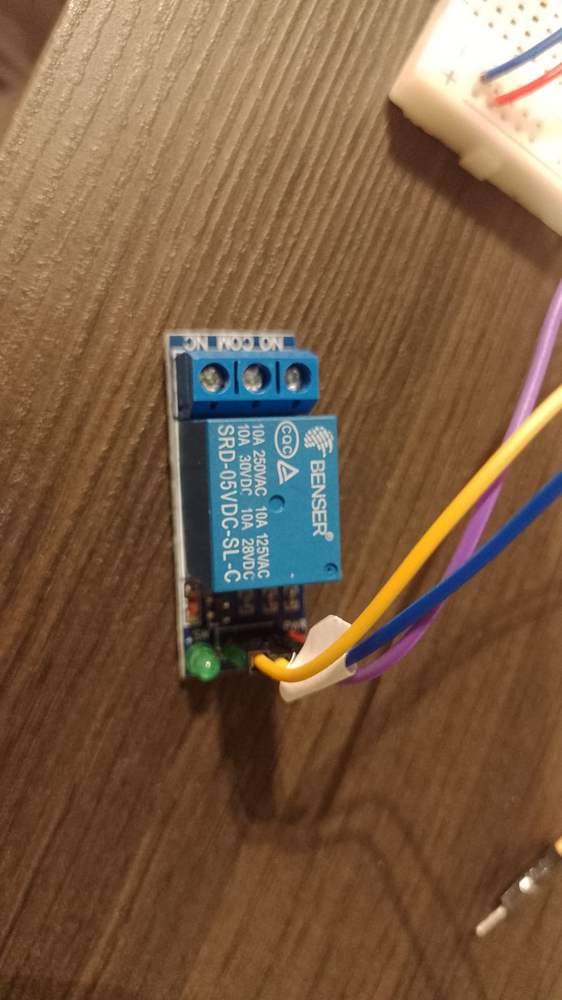
</div>
<br>
<div align="center">
<sub>Fonte: Material produzido pelo grupo DesTremidos, 2025.</sub>
</div>
<br>

**Interface Visual de Operação (Display LCD 16x2)**

A interface primária de comunicação Homem-Máquina (IHM) é materializada por um Display de Cristal Líquido (LCD) alfanumérico com capacidade de 16 caracteres por 2 linhas, gerenciado pelo controlador padrão industrial HD44780. Para otimizar a alocação de recursos do microcontrolador, o display é interfaceado através de um expansor de I/O PCF8574, que converte o barramento paralelo nativo do LCD para o protocolo serial I2C. Esta topologia permite o controle total do dispositivo utilizando apenas dois pinos de dados (SDA e SCL), preservando os GPIOs do ESP32 para funções críticas de sensoriamento.

O fluxo de mensagens apresentadas no display foi projetado para fornecer feedback determinístico e imediato em cada etapa da máquina de estados do sistema:

- **Estado de Repouso (Idle):** O sistema exibe a mensagem `SISTEMA PRONTO / INSIRA CRACHA`, instruindo claramente o usuário sobre a ação inicial necessária, mantendo o backlight ativo para visibilidade em ambientes com pouca luz.

- **Captura de Credenciais:** Ao iniciar a digitação no teclado, o display fornece feedback tátil-visual. Durante a inserção do UID simulado, os caracteres hexadecimais são exibidos em tempo real. Na etapa subsequente de segurança, a mensagem muda para INSIRA PIN:, e o sistema implementa o mascaramento de caracteres, exibindo asteriscos (`****`) à medida que a senha é digitada, prevenindo a exposição visual da credencial (shoulder surfing).

- **Processamento e Latência:** Durante o intervalo crítico entre o envio do payload MQTT e a recepção da resposta do servidor, o display exibe `ANALISANDO... / AGUARDE`, mitigando a ansiedade do usuário e indicando que o processador está operando na rotina de criptografia e comunicação, e não travado.

- **Feedback de Decisão:** A resposta do Broker sobrescreve imediatamente a tela anterior. Em caso de sucesso, exibe-se `ACESSO LIBERADO` (sincronizado com o acionamento do relé); em caso de falha, ACESSO NEGADO é apresentado (acompanhado de alerta sonoro), permanecendo visível por 3 segundos antes do retorno ao estado de repouso.

**Interface de Diagnóstico e Telemetria (Terminal Serial)**

Para as camadas de engenharia, depuração e auditoria de baixo nível, o sistema utiliza a interface UART (Universal Asynchronous Receiver-Transmitter) via USB, operando a uma taxa de transmissão de 115200 bauds. O Terminal Serial atua como uma "caixa preta" em tempo real, expondo o funcionamento interno do firmware, os estados da conexão de rede e, crucialmente, os dados brutos de segurança que não são exibidos ao usuário final.

O log gerado no terminal é estruturado para fornecer rastreabilidade completa do ciclo de vida da transação:

1. Boot e Conectividade: Ao iniciar, o terminal detalha o processo de handshake Wi-Fi, exibindo mensagens como `[WIFI] Conectando a SSID...` seguido de `IP Obtido: 192.168.x.x. `Subsequentemente, registra a negociação com o Broker MQTT: [MQTT] Tentando conexão... e [MQTT] Assinado no tópico: `acesso/resposta/{MAC}`.

2. **Auditoria de Criptografia:** Durante a tentativa de acesso, o terminal exibe os dados intermediários do algoritmo de segurança, essenciais para validação durante o desenvolvimento. É possível visualizar o UID capturado (`UID Input: A1B2`), o PIN inserido e, mais importante, o resultado da operação de hash local antes do envio: `Generated Hash: e3b0c442....`

3. Inspeção de Protocolo (JSON): O terminal imprime os payloads exatos de comunicação. No envio, visualiza-se o JSON de requisição: Publicando JSON: `{"ID_RFID": "...", "HASH": "..."}`. Na recepção, o sistema exibe o JSON cru retornado pelo servidor: Payload Recebido: `{"Acesso": "Accept"}`, permitindo ao engenheiro verificar se a estrutura de dados está em conformidade com a especificação da API.

4. Diagnóstico de Falhas: Em cenários de erro, mensagens de alerta como `[MQTT Timeout] Sem resposta do servidor` ou `[WiFi] Conexão perdida`, `reconectando...` são geradas, facilitando a identificação rápida de gargalos na infraestrutura de rede ou falhas no serviço de backend.

<br>
<div align="center">
<sub>Figura xx: Microcontrolador ESP32 Integrado ao Circuito </sub>
</div>
<br>
<div align="center">
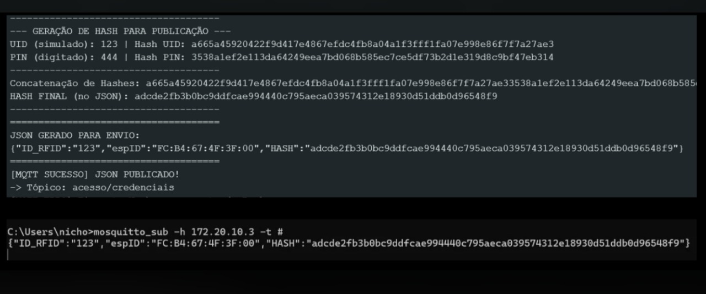
</div>
<br>
<div align="center">
<sub>Fonte: Material produzido pelo grupo DesTremidos, 2025.</sub>
</div>
<br>

**Sistemas de Feedback Imediato (Buzzer e LEDs)**

O feedback sensorial é provido por transdutores piezoelétricos (Buzzer Ativo) e semicondutores luminosos (LEDs). O buzzer emite padrões de frequência audíveis distintos para confirmação de operação ou erro. Os LEDs fornecem diagnóstico visual imediato: o LED Amarelo indica o estado da máquina de estados da conexão Wi-Fi/MQTT, enquanto o LED Azul sinaliza visualmente o momento exato em que o processador está executando o cálculo criptográfico do hash.

**Tecnologia de Conectividade e Protocolo de Dados**

A infraestrutura de comunicação do sistema baseia-se no protocolo **MQTT (Message Queuing Telemetry Transport)**, operando sobre a camada de transporte TCP/IP via Wi-Fi (2.4 GHz). O MQTT foi selecionado por sua arquitetura Pub/Sub (Publicar/Assinar), que desacopla o dispositivo de borda do servidor, garantindo eficiência em redes com largura de banda limitada e alta latência.

O fluxo de dados é orquestrado por um Broker MQTT (Eclipse Mosquitto). O processo de conexão e troca de mensagens segue um ciclo rigoroso:

1. **Handshake:** O ESP32 estabelece uma sessão TCP persistente com o Broker na porta 1883.

2. **Serialização (Uplink):** Após a captura e processamento local dos dados (`UID + PIN`), o ESP32 serializa as informações em um formato JSON (JavaScript Object Notation). Este payload, contendo o Hash `SHA-256` e o ID do dispositivo, é publicado no tópico `acesso/credenciais`.

3. **Roteamento e Processamento:** O Broker recebe a mensagem e a encaminha para os microserviços assinantes no backend.

4. **Callback (Downlink):** O ESP32 mantém uma assinatura ativa (`Subscribe`) no tópico exclusivo `acesso/resposta/{MAC_ADDR}`. Assim que o servidor processa a validação, a resposta (`Accept` ou `Deny`) é publicada neste tópico, disparando uma função de Callback no microcontrolador que executa a ação física correspondente (abrir a tranca ou negar acesso).

<br>
<div align="center">
<sub>Figura xx: Fluxo de Mensagens MQTT </sub>
</div>
<br>
<div align="center">

</div>
<br>
<div align="center">
<sub>Fonte: Material produzido pelo grupo DesTremidos, 2025.</sub>
</div>
<br>

**Integração com Microserviços e Auditoria**

No lado do servidor (Server-Side), a arquitetura utiliza microserviços desenvolvidos em Node.js que atuam como consumidores das mensagens MQTT. A principal função tecnológica desta camada é a persistência e auditoria. Antes de qualquer decisão de validação lógica ser retornada ao dispositivo, o sistema registra a tentativa de acesso em um banco de dados relacional (PostgreSQL para nuvem ou SQLite para operação local). Este registro inclui o carimbo de tempo (timestamp), o identificador da estação e o hash da credencial, assegurando a rastreabilidade completa e a conformidade com requisitos de auditoria de segurança.

**Tabela de Componentes da Arquitetura**

| Componente                  | Tipo              | Descrição Técnica e Função na Arquitetura                                                                          |
| :-------------------------- | :---------------- | :----------------------------------------------------------------------------------------------------------------- |
| **ESP32-WROOM-32**          | Microcontrolador  | SoC dual-core com Wi-Fi/Bluetooth. Gerencia a lógica de borda, criptografia SHA-256 e a pilha de comunicação MQTT. |
| **LM2596 (Buck Converter)** | Alimentação       | Conversor DC-DC Step-Down. Reduz 12V para 5V com alta eficiência térmica para alimentação estável do sistema.      |
| **Teclado Matricial 4x3**   | Sensor (Entrada)  | Matriz de membrana. Captura o PIN de segurança e simula a entrada hexadecimal do UID para validação lógica.        |
| **Display LCD 16x2 (I2C)**  | Display (Saída)   | Visor alfanumérico com interface serial I2C (PCF8574). Exibe status de conexão e feedbacks de operação ao usuário. |
| **Módulo Relé 5V**          | Atuador           | Chave eletromecânica optoacoplada. Controla a potência da tranca eletromagnética com isolamento galvânico.         |
| **Buzzer Ativo**            | Atuador           | Transdutor piezoelétrico. Emite sinais sonoros para feedback de interface (sucesso/erro).                          |
| **LEDs Difusos**            | Sinalização       | Indicadores de estado. Monitoram a conectividade Wi-Fi e o status de processamento interno.                        |
| **Capacitor 100μF**         | Passivo           | Componente de filtragem de baixa ESR. Garante a estabilidade da tensão no barramento de 5V durante picos de carga. |
| **Eclipse Mosquitto**       | Software (Broker) | Servidor de mensageria MQTT. Gerencia o roteamento assíncrono de dados entre o hardware e o backend.               |

### 3.3.5. Arquitetura Refinada da Solução

A arquitetura da solução Lock-in foi revisada e refinada ao longo do ciclo de desenvolvimento para atender aos requisitos de operação em ambientes ferroviários, caracterizados pela instabilidade de conectividade e pela exigência de alta disponibilidade. A versão final consolida o paradigma Edge-First, no qual a inteligência e a capacidade de decisão são descentralizadas para a borda da rede, garantindo uma estrutura preparada para manter operações de controle de acesso funcionais independentemente da disponibilidade imediata dos serviços em nuvem.

**Visão geral da arquitetura distribuída**

A estrutura técnica do sistema foi segmentada em três camadas lógicas e físicas distintas: a Camada de Dispositivo (Device Layer), a Camada de Borda (Edge Layer) e a Camada de Nuvem (Cloud Layer). Essa segregação permite o isolamento de falhas e a otimização do tráfego de dados.

Na Camada de Dispositivo, o microcontrolador ESP32 atua não apenas como um coletor de dados, mas como uma unidade de processamento criptográfico. Diferente das versões iniciais da arquitetura, onde o dispositivo poderia enviar credenciais puras, a versão refinada implementa a geração de hashes SHA-256 localmente. O dispositivo captura o identificador do cartão (UID) via RFID e a senha pessoal (PIN) via teclado matricial, gera hashes individuais para cada dado e, subsequentemente, realiza uma concatenação criptográfica para produzir um Hash Final. Apenas este token derivado é transmitido pela rede local via protocolo MQTT, assegurando uma abordagem de "Conhecimento Zero" (Zero Knowledge) durante o transporte de dados, mitigando riscos de interceptação na rede local. Adicionalmente, esta camada integra diretamente o hardware de segurança física, monitorando o sistema de combate a incêndio por meio de acoplamento óptico para garantir o destravamento mecânico imediato em situações de emergência, cumprindo rigorosamente as normas de segurança do trabalho.

A Camada de Borda reside na infraestrutura local da estação (Broker Local) e foi estruturada arquiteturalmente para suportar a operação Offline-First. Esta camada hospeda o broker de mensageria Mosquitto e um conjunto de microsserviços desenvolvidos em Node.js, que orquestram a lógica de negócios. O desenho arquitetural refinado prevê, como elemento central de resiliência, a utilização de um banco de dados relacional leve (SQLite) para atuar como cache persistente de autorização e buffer de auditoria. Embora a validação técnica desta integração tenha sido realizada com êxito durante a sprint — comprovando a viabilidade do armazenamento e consulta local de credenciais —, a implementação completa do módulo de persistência local foi priorizada para o ciclo de desenvolvimento subsequente (Roadmap Futuro/Próximos Passos). No MVP atual, a arquitetura garante a comunicação fluida entre a borda e a nuvem, mantendo o design pattern preparado para a acoplagem definitiva do banco local, o que assegurará futuramente a autenticação com latência mínima e a sincronização assíncrona de logs sem bloqueio operacional.

A Camada de Nuvem assume o papel de repositório central da verdade e gestão corporativa. Baseada em uma API RESTful em Node.js e um banco de dados PostgreSQL, esta camada consolida os dados provenientes de múltiplos brokers distribuídos geograficamente. Ela é responsável pela gestão global de identidades, distribuição de políticas de acesso e fornecimento de dados para os dashboards analíticos. A comunicação entre a Borda e a Nuvem é estritamente protegida via HTTPS/TLS, assegurando a confidencialidade das transações de sincronização.

**Tratamento de pontos de revisão e ajustes realizados**

Durante as etapas de validação técnica e code review das sprints anteriores, foram identificados pontos que exigiram refatoração da arquitetura inicial. Abaixo detalham-se os ajustes realizados:
Primeiramente, houve uma mudança significativa no fluxo de segurança e tratamento de dados sensíveis. A arquitetura original previa o envio de credenciais (UID e Senha) para validação no servidor. Após análise de riscos, constatou-se que isso expunha vetores de ataque na rede local. A arquitetura foi ajustada para processar a criptografia no próprio hardware (ESP32). O ajuste envolveu a implementação da biblioteca mbedtls no firmware para cálculo de SHA-256 e a alteração dos payloads MQTT para trafegar apenas assinaturas digitais. Isso eliminou a circulação de senhas em texto claro ou hashes reversíveis simples.

Em segundo lugar, a dependência de conectividade foi endereçada no desenho arquitetural através da lógica de fallback automático. Inicialmente, o sistema dependia excessivamente da confirmação do servidor central para liberar a tranca. A revisão arquitetural definiu o mecanismo de "dupla verificação", onde o sistema prioriza a autenticação via nuvem (PostgreSQL) para obter dados em tempo real, utilizando a base local (SQLite) como contingência em caso de falha ou timeout (sistema que foi testado durante o desenvolvimento, mas não foi implementado no MVP e está como passo futuro).. Testes de conceito realizados durante a sprint validaram a eficácia desta abordagem para garantir o cumprimento dos requisitos de disponibilidade e tempo de resposta. A integração final deste mecanismo de fallback está documentada como uma evolução prioritária na seção de "Próximos Passos", visando elevar a maturidade do sistema para um ambiente piloto com conectividade intermitente.

Por fim, o fluxo de acesso em grupo foi otimizado para melhorar a usabilidade operacional. A lógica anterior exigia validação completa de cada membro, o que gerava filas e demora. O ajuste arquitetural permitiu que, após a validação forte (RFID + Senha) do líder do grupo, o sistema entre em um estado de "Janela de Admissão", onde os membros subsequentes são validados apenas pela posse do crachá (RFID) e contagem quantitativa, reduzindo o atrito operacional sem comprometer a rastreabilidade, uma vez que todos os eventos permanecem vinculados à sessão do líder.

**Aderência aos requisitos funcionais e não funcionais**

A arquitetura refinada demonstra sólida aderência aos requisitos estipulados. Os Requisitos Funcionais (RF01, RF02, RF09) referentes à autenticação multifatorial e validação de permissões são atendidos pela lógica distribuída de validação de hash, garantindo que apenas usuários com a posse do cartão e conhecimento da senha acessem as áreas restritas. A rastreabilidade (RF03) é assegurada pela estrutura de logs centralizada na nuvem, com a arquitetura já preparada para a redundância local futura, visando a total impossibilidade de perda de dados de auditoria. A integração com sistemas de emergência (RF06) é resolvida robustamente a nível de hardware pelo optoacoplador, garantindo atuação física imediata independente de software.

No tocante aos Requisitos Não Funcionais, a arquitetura Edge-First é a base para o cumprimento das metas de desempenho (RNF01) e disponibilidade (RNF03, RNF09). Ao processar a pré-validação e criptografia na borda, reduz-se a latência da rede na etapa crítica de segurança. A segurança da informação (RNF02) é endereçada pela criptografia em repouso (banco de dados em nuvem) e em trânsito (TLS e hashing na origem). A portabilidade e manutenibilidade (RNF04, RNF05) são garantidas pelo uso de contêineres Docker para os microsserviços e pela modularidade do código embarcado, permitindo atualizações e escalabilidade horizontal para novas estações sem refatoração do núcleo do sistema.

Em suma, a revisão arquitetural transformou o projeto de um sistema puramente conectado para um ecossistema distribuído, alinhado às melhores práticas de IoT industrial. O sistema está preparado para os desafios reais da operação ferroviária da TIC Trens, com um roadmap técnico claro para a consolidação da autonomia offline completa nas próximas versões.

<br>
<div align="center">
<sub>Figura xx: Diagrama da Arquitetura Refinada Geral da Solução.</sub>
</div>
<br>
<div align="center">
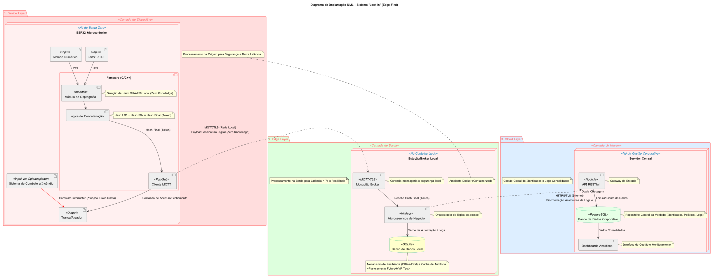
</div>
<br>
<div align="center">
<sub>Fonte: Material produzido pelo grupo DesTremidos, 2025.</sub>
</div>
<br>

#### 3.3.5.1. Arquitetura refinada da solução - Microsserviços

A revisão final da arquitetura da solução LockIn consolida o modelo distribuído e projetado para ambientes ferroviários. Nesta etapa de refinamento, um dos focos principais recaiu sobre a camada de Microsserviços Locais (Broker Service), que atua como o núcleo de inteligência na borda (Edge), orquestrando a comunicação entre os dispositivos físicos (IoT) e as camadas de persistência de dados. A evolução desta arquitetura visa mitigar latências de rede e garantir a continuidade operacional independentemente da estabilidade da conexão com a internet.

##### 3.3.5.1.1. Refinamento da camada de microsserviços e lógica de negócio

Durante a última sprint, a implementação do microsserviço, desenvolvido em Node.js, passou por uma expansão de escopo para suportar regras de negócio mais complexas e garantir a integridade dos dados. Diferentemente das versões iniciais, que atuavam primordialmente como repassadores de mensagens, a versão refinada incorpora uma lógica ativa de validação e roteamento de dados baseada em eventos do protocolo MQTT.

A estrutura do microsserviço foi desenhada para escutar, em dois tópicos distintos(acesso/credenciais e acesso/resposta), todas as requisições provenientes dos dispositivos ESP32. Ao interceptar um payload contendo credenciais (Hash do Cartão/Senha), o serviço não se limita mais a apenas registrar o evento; ele executa uma verificação síncrona contra o banco de dados nuvem. O algoritmo consulta a tabela de cartões (cards) e permissões (permissions) para validar se a credencial existe, se está ativa e se o usuário possui autorização para acessar aquela zona. Esta lógica de validação na borda elimina a dependência de consultas à nuvem para a tomada de decisão imediata, assegurando o tempo de resposta crítico exigido para a liberação da tranca.
Paralelamente à autenticação, o microsserviço foi aprimorado para gerenciar o ciclo de vida dos logs de acesso. Adotou-se uma estratégia de persistência onde, após o processamento da mensagem MQTT. O serviço tenta realizar a sincronização com o banco de dados em nuvem (PostgreSQL) via API REST.

##### 3.3.5.1.2 Justificativa de suporte aos requisitos

A arquitetura refinada dos microsserviços atende diretamente aos requisitos funcionais e não funcionais críticos do projeto. O Requisito Funcional de Validação (RF01 e RF02) é plenamente suportado pela nova lógica de consulta ao banco local, que verifica a autorização do cartão em tempo real antes de enviar o comando de abertura à tranca. A coleta e registro de dados (RF03) são garantidos pelo módulo de processamento de logs do microsserviço, que estrutura as informações recebidas via MQTT e as persiste para auditoria futura.

No tocante aos Requisitos Não Funcionais, o desempenho (RNF01) é otimizado pela execução da lógica de validação no próprio servidor da estação, reduzindo a latência de rede a níveis desprezíveis e garantindo a liberação do acesso em menos de 7 segundos. Além disso, a segurança da informação é reforçada, pois o microsserviço atua como um gateway seguro, validando dados antes de qualquer interação com os atuadores físicos.

##### 3.3.5.1.3. Considerações sobre ajustes e revisões

Em resposta às avaliações técnicas anteriores, a arquitetura foi ajustada para eliminar pontos únicos de falha na comunicação. A equipe optou proativamente por reforçar o tratamento de exceções no microsserviço. Foi implementado um tratamento robusto para mensagens JSON inválidas e reconexões automáticas ao broker MQTT, prevenindo que falhas de formatação de dados ou instabilidades momentâneas causem a interrupção do serviço (crash). Essa abordagem defensiva na programação do microsserviço eleva a maturidade da solução, preparando-a para um ambiente de produção real.

<br>
<div align="center">
<sub>Figura xx: Diagrama da Arquitetura Refinada da Camada de Microsserviços.</sub>
</div>
<br>
<div align="center">
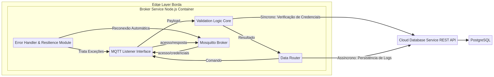
</div>
<br>
<div align="center">
<sub>Fonte: Material produzido pelo grupo DesTremidos, 2025.</sub>
</div>
<br>

#### 3.3.5.2. Padronização de infraestrutura e containerização (Docker)

No âmbito do refinamento da arquitetura da solução, a estratégia de implantação do software (deploy) sofreu uma evolução com a adoção integral da plataforma Docker. Esta decisão transcende a mera escolha de uma ferramenta de virtualização, configurando-se como uma resposta à necessidade de garantir a consistência, a previsibilidade e a escalabilidade dos serviços distribuídos nas estações ferroviárias. A "dockerização" do ambiente consolida o ecossistema da solução LockIn, que engloba o backend em Node.js sob o padrão MVC, as rotinas de sincronização com o banco PostgreSQL na nuvem, as APIs internas e os serviços auxiliares como o broker Mosquitto, em unidades lógicas isoladas e imutáveis.

A implementação de containers permitiu o encapsulamento hermético de todas as bibliotecas, dependências, variáveis de ambiente e configurações de sistema de arquivos necessárias para a execução dos microsserviços. Esta abordagem elimina sistematicamente o problema de inconsistência de ambientes ("works on my machine"), assegurando que o comportamento do software seja rigorosamente idêntico, independentemente de estar sendo executado em uma máquina de desenvolvimento Windows, em um servidor de homologação Linux ou no hardware final instalado na infraestrutura da TIC Trens. A arquitetura de serviços isolados impede que conflitos de versões ou falhas em um módulo específico (como o serviço de migração de dados) impactem a estabilidade de outros componentes críticos (como o broker de mensageria), elevando o nível global do sistema.

##### 3.3.5.2.1. Justificativa de suporte aos requisitos

A containerização atua como um facilitador transversal para o cumprimento dos Requisitos Não Funcionais. A Portabilidade (RNF05) é maximizada, uma vez que a solução empacotada em containers abstrai as especificidades do hardware e do sistema operacional hospedeiro, permitindo a instalação do sistema em diferentes ambientes técnicos críticos com esforço de configuração próximo a zero. A Manutenibilidade (RNF04) é significativamente aprimorada, pois atualizações de software ou correções de bugs podem ser distribuídas através da substituição atômica de imagens de containers, sem a necessidade de paradas prolongadas ou reconfigurações manuais complexas no local. Além disso, a Confiabilidade (RNF03) é reforçada pelo isolamento de processos, garantindo que o sistema mantenha sua operação contínua e minimize o risco de indisponibilidade causada por conflitos de dependências.

##### 3.3.5.2.2. Considerações sobre ajustes e revisões

A incorporação do Docker decorreu de uma decisão proativa da equipe de desenvolvimento visando a maturidade do projeto para um cenário de produção piloto. Não houveram mudanças estruturais especificamente sobre a tecnologia de containerização em relação a última etapa de desenvolvimento; o ajuste realizado foi interno, focado na otimização dos Dockerfiles e na orquestração dos serviços para garantir que a inicialização do banco de dados local e a conexão com o broker MQTT ocorressem na ordem correta, prevenindo condições de corrida (race conditions) durante o boot do sistema na estação.

<br>
<div align="center">
<sub>Figura xx: Diagrama da Arquitetura Refinada - Padronização de infraestrutura e containerização (Docker).</sub>
</div>
<br>
<div align="center">
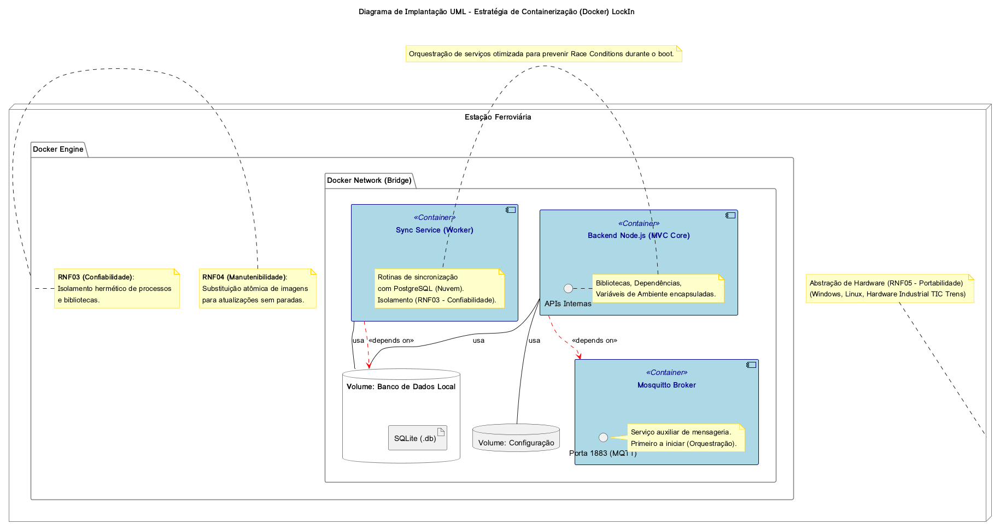
</div>
<br>
<div align="center">
<sub>Fonte: Material produzido pelo grupo DesTremidos, 2025.</sub>
</div>
<br>

#### 3.3.5.3. Interface centralizada de gestão e visualização (Dashboard)

A camada de apresentação da arquitetura refinada materializa-se no Dashboard Global, uma aplicação web desenvolvida para atuar como o ponto focal de interação humana com o ecossistema LockIn. Situado logicamente na Camada de Nuvem (Cloud Layer), este componente não se limita a uma simples exibição passiva de dados, mas constitui uma interface de comando e controle, projetada para abstrair a complexidade das operações distribuídas nas estações ferroviárias para os gestores e auditores. A engenharia de frontend adotou o framework Next.js sobre a biblioteca React, utilizando a linguagem TypeScript. Esta escolha tecnológica foi estratégica para garantir a tipagem estática e a robustez do código em tempo de desenvolvimento, prevenindo erros de execução comuns em aplicações JavaScript puras e facilitando a escalabilidade do código-fonte. A arquitetura do framework permite a renderização otimizada, alternando entre processamento no servidor (SSR) e no cliente (CSR) conforme a necessidade de performance e indexação.

A comunicação entre o Dashboard e a camada de persistência de dados foi arquitetada para respeitar os princípios de desacoplamento e segurança. A aplicação não acessa o banco de dados diretamente; em vez disso, consome a API Global desenvolvida em Node.js através de requisições HTTP assíncronas, gerenciadas pela biblioteca Axios. Este padrão de projeto (Design Pattern) assegura que a lógica de negócios, as regras de validação e a integridade referencial permaneçam centralizadas no backend, enquanto o frontend foca exclusivamente na experiência do usuário e na representação visual dos estados do sistema. O Dashboard centraliza funcionalidades críticas operacionais, incluindo o monitoramento em tempo real dos logs de entrada e saída (com capacidade de filtragem histórica), o gerenciamento do ciclo de vida de usuários e credenciais (cartões RFID), e a administração remota dos dispositivos de bloqueio (trancas) e estações. A integração final com o banco de dados PostgreSQL (hospedado no Supabase) garante que as informações visualizadas pelos gestores reflitam o "estado da verdade" global da operação, consolidando os dados sincronizados pelos múltiplos brokers locais.

##### 3.3.5.3.1 Justificativa de suporte aos requisitos

A implementação do Dashboard é a resposta arquitetural direta aos requisitos de gestão, auditabilidade e usabilidade do sistema. O Requisito Funcional de Visualização (RF08) é plenamente atendido através das interfaces dedicadas de logs de acesso, que permitem a filtragem granular e a investigação forense de eventos passados, promovendo a transparência operacional exigida pela TIC Trens. O gerenciamento centralizado de dispositivos (RF07) é facilitado pelas interfaces administrativas de cadastro de trancas e cartões, permitindo que a equipe de TI ou segurança provisione novos acessos e revogue permissões sem a necessidade de interação física com o hardware na ponta (Borda), otimizando a logística de manutenção.

No âmbito dos Requisitos Não Funcionais, a Usabilidade (RNF06) foi o vetor principal que motivou a adoção de React e de componentes visuais modernos e responsivos. Isso garante uma curva de aprendizado reduzida para os operadores e uma interface intuitiva que facilita a tomada de decisão rápida em situações de monitoramento de segurança. A disponibilidade da informação é assegurada pela natureza web da arquitetura, que permite o acesso remoto seguro por perfis autorizados a partir de qualquer local com conectividade à internet, apoiando o modelo de gestão descentralizada da malha ferroviária.

##### 3.3.5.3.2 Considerações sobre ajustes e revisões

A evolução para uma arquitetura baseada em Next.js e TypeScript representa um refinamento significativo da maturidade do projeto nesta etapa final, superando propostas iniciais que poderiam considerar interfaces mais simples ou acopladas monoliticamente. A separação clara de responsabilidades entre o client-side e o server-side, juntamente com a configuração de variáveis de ambiente (.env) para o gerenciamento seguro de credenciais de API e banco de dados, demonstra o alinhamento do desenvolvimento do frontend com as práticas de DevOps e segurança aplicadas no restante da solução. Além disso, a implementação de tratativas de erros de conexão (CORS e falhas de API) no client reforça a resiliência da interface, garantindo que o operador receba feedbacks claros sobre o estado da conectividade do sistema.

<br>
<div align="center">
<sub>Figura xx: Diagrama da Arquitetura Refinada - Interface centralizada de gestão e visualização (Dashboard).</sub>
</div>
<br>
<div align="center">
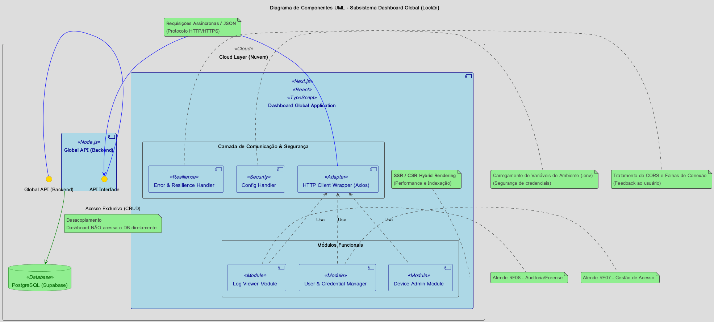
</div>
<br>
<div align="center">
<sub>Fonte: Material produzido pelo grupo DesTremidos, 2025.</sub>
</div>
<br>

## 3.4. Resultados

_Nesta seção, detalhe os resultados obtidos com a implementação, de acordo com o disposto nas subseções._

### 3.4.1.Protótipo Inicial do Projeto usando o Simulador Wokwi

O primeiro protótipo tem como objetivo simular um sistema inteligente de controle de acesso baseado em autenticação de ID (RFID simulado via botões) e senha associada.
A simulação ocorre no Wokwi, utilizando o ESP32 como unidade principal de controle e comunicação, reproduzindo a lógica que, futuramente, se integrará a um banco de dados e broker MQTT.

O sistema foi projetado para três tipos de acesso diferentes, com comportamentos e permissões específicas, além de conter um sistema de alarme de incêndio e registro interno de entradas/saídas.

**Esquemático Elétrico Técnico**

O esquemático elétrico técnico foi produzido pleo **EasyEda**.

<br>
<div align="center">
<sub>Figura xx: Esquema Elétrico Técnico do Protótipo.</sub>
</div>
<br>
<div align="center">
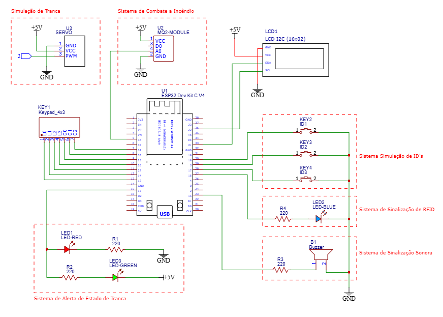
</div>
<br>
<div align="center">
<sub>Fonte: Material produzido pelo grupo DesTremidos, 2025.</sub>
</div>
<br>

O circuito é composto pelos seguintes elementos principais:

| Componente            | Descrição Técnica  | Pinos (ESP32)                                  | Função                                                         |
| --------------------- | ------------------ | ---------------------------------------------- | -------------------------------------------------------------- |
| LCD 16x2 (I2C)        | Endereço 0x27      | SDA/SCL                                        | Interface de exibição de status e mensagens do sistema         |
| Servo Motor           | SG90 (5V)          | GPIO 2                                         | Controla a tranca da porta (0° = trancado / 90° = destrancado) |
| Sensor de Fumaça      | MQ-2               | GPIO 34 (ADC)                                  | Detecta fumaça; ativa modo emergência                          |
| Buzzer                | Passivo            | GPIO 4                                         | Feedback sonoro de eventos                                     |
| LEDs                  | Indicadores        | GPIO 13 (status porta) / GPIO 16 (confirmação) | Sinalização visual do estado do sistema                        |
| Teclado Matricial 4x3 | Interface de senha | GPIOs 12, 14, 27, 26, 25, 33, 32               | Inserção de senha e dados do grupo                             |
| Botões de ID          | 3 botões (Pull-up) | GPIO 18, 5, 17                                 | Simulam diferentes cartões RFID                                |

**Esquema no Wokwi**

<br>
<div align="center">
<sub>Figura xx: Esquema Elétrico de Simulação no Wokwi.</sub>
</div>
<br>
<div align="center">
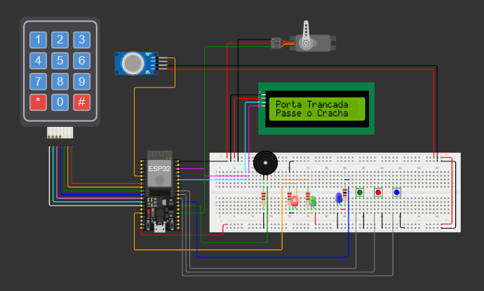
</div>
<br>
<div align="center">
<sub>Fonte: Material produzido pelo grupo DesTremidos, 2025.</sub>
</div>
<br>

O projeto foi montado no **Wokwi**, com as ligações físicas correspondentes ao esquemático técnico acima.
Cada botão representa um ID diferente, simulando um crachá RFID sendo passado no leitor.

Link para simulação no Wokwi: [Acesse o Wokwi](https://wokwi.com/projects/445647628467564545)

_No momento de teste considere:_
_- Botão1 - ID1 [Acesso Padrão] (GPIO 18) -> Senha = 1234_
_- Botão2 - ID2 [Acesso Mestre] (GPIO 5) -> NÃO PRECISA DE SENHA_
_- Botão2 - ID3 [Acesso Grupo] (GPIO 17) -> 55555_

**Apresentação do Código e Estrutura de Classes**

O sistema foi totalmente desenvolvido em C++ para ESP32, com uma abordagem modular orientada a objetos.
O controle central está encapsulado na classe SistemaAcesso, que gerencia:

Estados de operação: IDLE, Espera de Senha, Espera de Tamanho de Grupo, Emergência.

Leitura de periféricos: Teclado, botões de ID, sensor de fumaça.

Atuação física: Servo, buzzer e LEDs.

Gerenciamento de status interno: Presença de cada ID e contagem de grupo.

- Estrutura de Classe Simplificada:

```cpp
class SistemaAcesso {
private:
  // Estado interno e periféricos
  Servo lockServo;
  LiquidCrystal_I2C lcd;
  Keypad keypad;

  // Estados lógicos
  SystemState current_state;
  int selected_id;
  bool is_inside_id1;
  bool is_inside_id2;
  int group_count_id3;


  // Funções principais
  void checkIdButtons();
  void checkKeypad();
  void handleEntry(...);
  void handleExitConfirmation(...);
  void handleEmergencyAlarm();
  void resetState(...);
};
```

Essa organização modular torna o código escalável, testável e preparado para futuras integrações via MQTT / Banco de Dados.

**Sistema de Criptografia e Hash de Senhas**

Foi implementado um sistema de hash simplificado (DJB2) para gerar identificadores únicos de senhas.
Esse hash é exibido no terminal durante o boot e serve para simular a informação **criptografada** que seria enviada via publish MQTT ao broker.

```cpp
unsigned long calculateSimpleHash(const String& data) {
  unsigned long hash = 5381;
  for (int i = 0; i < data.length(); i++) {
      hash = ((hash << 5) + hash) + data[i]; // hash * 33 + c
  }
  return hash;
}
```

- Exemplo no terminal (boot):

```cpp
--- HASHES DE SENHAS (Teste) ---
HASH ID 1: 0x7C78C98F
HASH ID 3: 0xBDC0B6E
------------------------------------
```

Na integração real, esse hash representaria a mensagem enviada via MQTT (`publish`) para autenticação no banco remoto.

**Lógica de Acessos e Entradas**

- Botões de Acesso (IDs simulados):

| ID  | Botão (GPIO) | Tipo de Acesso      | Fluxo de Autenticação                         |
| --- | ------------ | ------------------- | --------------------------------------------- |
| 1   | 18           | **Acesso Padrão**   | ID → Senha → Libera acesso                    |
| 2   | 5            | **Acesso Mestre**   | ID → Libera direto                            |
| 3   | 17           | **Acesso de Grupo** | ID → Senha → Digitar nº de entrantes → Libera |

- Lógica de Saída (somente após entrada válida):

| ID  | Botão | Tipo de Saída | Condição                   |
| --- | ----- | ------------- | -------------------------- |
| 1   | 18    | Individual    | Somente se ID1 entrou      |
| 2   | 5     | Mestre        | Livre, mas só após entrada |
| 3   | 17    | Grupo         | Reduz contagem de grupo    |

**Tabela da Verdade — Fluxo de Acessos**

| ID  | Estado Atual | Ação Executada          | Próximo Estado | Porta       | Observações      |
| --- | ------------ | ----------------------- | -------------- | ----------- | ---------------- |
| 1   | Fora         | Senha válida            | Dentro         | Destrancada | Entrada comum    |
| 1   | Dentro       | Pressionar botão        | Fora           | Destrancada | Saída registrada |
| 2   | Fora         | Pressionar botão        | Dentro         | Destrancada | Acesso imediato  |
| 2   | Dentro       | Pressionar botão        | Fora           | Destrancada | Saída direta     |
| 3   | Fora         | Senha válida + nº grupo | Dentro         | Destrancada | Entrada múltipla |
| 3   | Dentro       | Pressionar botão        | Reduz contagem | Destrancada | Saída gradual    |

**Sistema de Alarme de Incêndio**

O sensor MQ-2 detecta fumaça no ambiente e, ao ultrapassar o limiar (> 4000), ativa o modo de emergência.

- Comportamento técnico:

| Estado           | Ação                                             | Hardware                        | Exibição                            |
| ---------------- | ------------------------------------------------ | ------------------------------- | ----------------------------------- |
| Fumaça detectada | Servo → 90°, LED → LOW, Buzzer 4kHz intermitente | Destranca porta e alerta sonoro | “ALARME FOGO / PORTA DESTRANCADA”   |
| Fumaça ausente   | Servo → 0°, LED → HIGH                           | Tranca novamente                | “Alarme Desligado / Passe o Cracha” |

O sistema prioriza a segurança: **toda tranca é liberada automaticamente em caso de emergência.**

**Sistema de Memória Interna e Terminal**

O sistema mantém memória lógica de IDs dentro/fora e registra logs detalhados no Serial Monitor, simulando o que seria enviado ao banco via gateway MQTT.

- Exemplo de saída no terminal:

```cpp
--- STATUS INTERNO ---
ID 1 Dentro: SIM
ID 2 Dentro: NAO
Grupo 3 Contagem: 5
----------------------
```

Essas informações representam a **memória local do microcontrolador** e seriam **sincronizadas** com o **banco** no sistema final.

**Casos de Teste - Sistema de Testes e Identificação de IDs**

Os testes foram realizados conforme a tabela abaixo:

| #   | Bloco / Cenário                    | Componente de entrada (hardware) | Leitura da entrada (nível lógico / dado)     | Componente de saída (hardware)                | Leitura / Comportamento de saída técnico                                                    | Hash exibido no terminal                    | Descrição funcional                                                   |
| --- | ---------------------------------- | -------------------------------- | -------------------------------------------- | --------------------------------------------- | ------------------------------------------------------------------------------------------- | ------------------------------------------- | --------------------------------------------------------------------- |
| 01  | Inicialização do sistema           | Alimentação 5V / Boot ESP32      | Boot normal (Serial.begin 9600)              | LCD (I2C 0x27), LED (pino 13), Servo (pino 2) | LCD exibe “Porta Trancada / Passe o Cracha”; LED=HIGH; Servo=0°                             | HASH ID1: 0x7C78C98F<br>HASH ID3: 0xBDC0B6E | Sistema inicia no estado IDLE com todos os periféricos inicializados. |
| 02  | Seleção de ID 1 (Usuário comum)    | Botão ID1 (pino 18)              | LOW (pressionado, INPUT_PULLUP ativo)        | LCD + LED_CONF (pino 16) + Buzzer (pino 4)    | Buzzer 1.5 kHz 100 ms; LCD: “DIGITE SUA SENHA:”                                             | —                                           | Sistema reconhece ID1 e solicita senha.                               |
| 03  | Senha correta ID1                  | Teclado matricial (pinos 12–33)  | Sequência “1234” + tecla ‘#’                 | Servo + LED (pino 13) + LCD + Buzzer          | Servo=90° (destranca); LED=LOW; Buzzer 3 kHz 2x100 ms; LCD: “ACESSO PERMITIDO / BEM-VINDO!” | HASH: 0x7C78C98F                            | Porta é destrancada após senha válida do ID1.                         |
| 04  | Senha incorreta ID1                | Teclado                          | Sequência “1111” + tecla ‘#’                 | LCD + Buzzer                                  | Buzzer 500 Hz 200 ms; LCD: “ACESSO NEGADO / Tente Novamente”                                | HASH: valor calculado pelo input incorreto  | Senha inválida; sistema retorna ao modo IDLE após 3 s.                |
| 05  | Seleção de ID 2 (Mestre)           | Botão ID2 (pino 5)               | LOW                                          | Servo + LCD + LED                             | Servo=90°; LED=LOW; LCD: “Acesso Liberado Imediato / Bem-vindo”                             | —                                           | ID Mestre possui acesso instantâneo, sem senha.                       |
| 06  | Seleção de ID 3 (Grupo)            | Botão ID3 (pino 17)              | LOW                                          | LCD + Buzzer                                  | LCD: “DIGITE SUA SENHA:”; Buzzer 1.5 kHz 100 ms                                             | —                                           | Grupo solicita senha para validar entrada.                            |
| 07  | Senha e tamanho corretos (Grupo 3) | Teclado                          | “55555” + ‘#’ → “5” + ‘#’                    | Servo + LCD + LED + Buzzer                    | Servo=90°; LED=LOW; Buzzer 3 kHz 2x100 ms; LCD: “GRUPO CONFIRMADO / Entrantes: 5”           | HASH: 0xBDC0B6E                             | Grupo autorizado; porta destrancada para 5 pessoas.                   |
| 08  | Tamanho inválido (Grupo 3)         | Teclado                          | “55555” + ‘#’ → “15” + ‘#’                   | LCD + Buzzer                                  | Buzzer 500 Hz 200 ms; LCD: “Tam. Invalido! / Min 1. Max 10.”                                | HASH: 0xBDC0B6E                             | Sistema rejeita grupo com número inválido de pessoas.                 |
| 09  | Timeout por inatividade            | —                                | Nenhuma tecla por 15 s (TIMEOUT_DURATION_MS) | LCD + Buzzer                                  | Buzzer 300 Hz 200 ms; LCD: “Tempo Esgotado! / Passe o Cracha”                               | —                                           | Reinicializa para IDLE após tempo ocioso.                             |
| 10  | Cancelamento manual (‘\*’)         | Teclado                          | Tecla ‘\*’                                   | LCD + Buzzer                                  | Buzzer 400 Hz 100 ms; LCD: “Cancelado! / Passe o Cracha”                                    | —                                           | Usuário cancela operação antes de confirmar.                          |
| 11  | Alarme de fumaça detectado         | Sensor MQ-2 (pino A34)           | Valor analógico > 4000                       | Servo + LCD + LED + Buzzer                    | Servo=90°; LED=LOW; Buzzer 4 kHz intermitente; LCD: “ALARME FOGO / PORTA DESTRANCADA”       | —                                           | Sistema entra em modo de emergência e destranca a porta.              |
| 12  | Fim do alarme de fumaça            | Sensor MQ-2                      | Valor analógico < 4000                       | Servo + LCD + LED                             | Servo=0°; LED=HIGH; LCD: “Alarme Desligado / Passe o Cracha”                                | —                                           | Sistema retorna ao estado IDLE após o fim do risco.                   |
| 13  | Saída individual (ID1 já dentro)   | Botão ID1                        | LOW                                          | Servo + LCD + Buzzer                          | Servo=90°; Buzzer 3 kHz 2x100 ms; LCD: “SAIDA REGISTRADA / DESTRANCADO!”                    | —                                           | Porta destranca brevemente para saída do ID1.                         |
| 14  | Saída de grupo (ID3 já dentro)     | Botão ID3                        | LOW                                          | Servo + LCD + Buzzer                          | Servo=90°; Buzzer 3 kHz 2x100 ms; LCD: “SAIDA REGISTRADA / DESTRANCADO!”                    | —                                           | Grupo 3 reduz contador de presença e destranca para saída.            |
| 15  | Log interno de status              | Serial Monitor                   | Após chamada de `resetState()`               | Terminal Serial                               | “--- STATUS INTERNO --- / ID1 Dentro: SIM / ID2 Dentro: NAO / Grupo 3 Contagem: X”          | —                                           | Log de depuração do estado interno do sistema.                        |

---

**Notas técnicas complementares**

- **Servo (pino 2):** 0° = trancado, 90° = destrancado.
- **LED Entrada (pino 13):** HIGH = trancada / LOW = destrancada.
- **Buzzer (pino 4):** frequência varia conforme evento (erro, sucesso, emergência).
- **Sensor MQ-2 (pino 34):** limiar de fumaça = 4000 (ADC).
- **LCD (I2C 0x27):** 16x2, comunicação via barramento SDA/SCL.
- **Botões de ID (pinos 18, 5, 17):** lógica invertida (LOW = pressionado).
- **Tempo de timeout:** 15 000 ms (definido em `TIMEOUT_DURATION_MS`).

**Fluxo de Processos Lógicos**

<br>
<div align="center">
<sub>Figura xx: Esquema da Etapa Real de Comunicação com o Broker.</sub>
</div>
<br>
<div align="center">
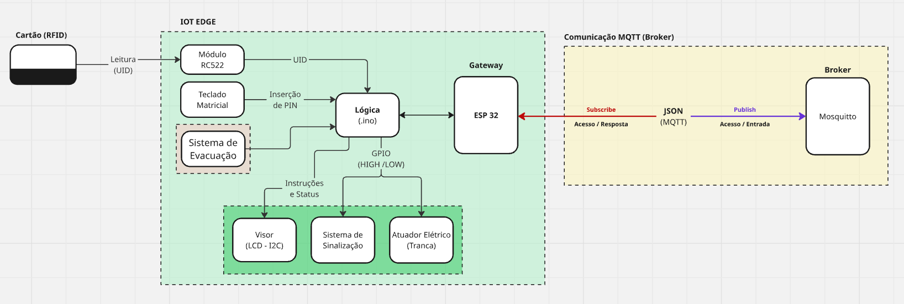
</div>
<br>
<div align="center">
<sub>Fonte: Material produzido pelo grupo DesTremidos, 2025.</sub>
</div>
<br>

<br>
<div align="center">
<sub>Figura xx: Esquema da Simulação da Etapa de Comunicação com o Broker.</sub>
</div>
<br>
<div align="center">
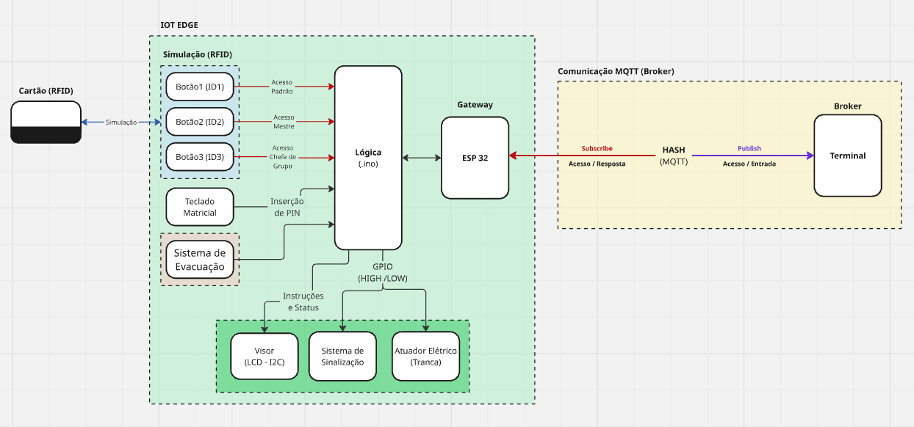
</div>
<br>
<div align="center">
<sub>Fonte: Material produzido pelo grupo DesTremidos, 2025.</sub>
</div>
<br>

**Respostas no Terminal (Simulação MQTT)**

O terminal serve como uma simulação direta da comunicação **ESP32** ↔ **Gateway** ↔ **Broker MQTT**, com prints representando o envio de informações criptografadas e logs operacionais:

```cpp
ID 1: Entrada confirmada.
Senha OK: HASH 0x7C78C98F
Publish -> /esp32/access: { "id": 1, "status": "authorized", "hash": "0x7C78C98F" }


ID 3: Grupo confirmado.
Entrantes: 5
Publish -> /esp32/group: { "id": 3, "entrantes": 5 }
```

Na implementação real, essas mensagens seriam publicadas no tópico MQTT para validação no servidor.

Segue o print do terminal em diferentes casos de testes.

<br>
<div align="center">
<sub>Figura xx: Simulação no Terminal de Entradas e Saídas (ID1 e ID2).</sub>
</div>
<br>
<div align="center">
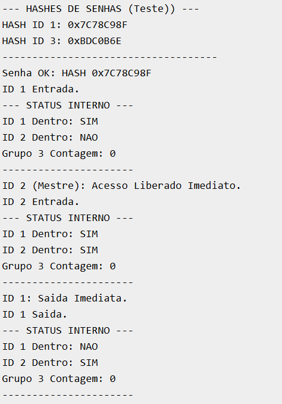
</div>
<br>
<div align="center">
<sub>Fonte: Material produzido pelo grupo DesTremidos, 2025.</sub>
</div>
<br>

<br>
<div align="center">
<sub>Figura xx: Simulação no Terminal de Entrada/Saída (ID2 e ID3) e Acesso Negado (ID1).</sub>
</div>
<br>
<div align="center">
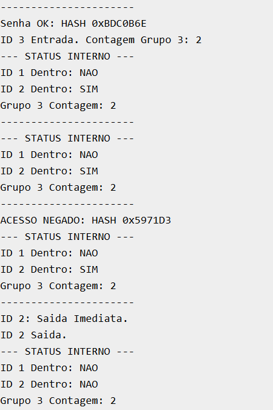
</div>
<br>
<div align="center">
<sub>Fonte: Material produzido pelo grupo DesTremidos, 2025.</sub>
</div>
<br>

<br>
<div align="center">
<sub>Figura xx: Simulação no Terminal de Saída Chefe/Membros de Grupo (ID3) e Alarme.</sub>
</div>
<br>
<div align="center">

</div>
<br>
<div align="center">
<sub>Fonte: Material produzido pelo grupo DesTremidos, 2025.</sub>
</div>
<br>

**Considerações Finais do Protótipo**

- O sistema simula crachás físicos via botões.
- IDs de membros de grupo não são individualmente referenciados, pois essa autenticação dependerá do banco real que relacionará cada ID subordinado ao ID chefe.
- O terminal serial desempenha o papel de comunicação lógica simulada com o broker MQTT.
- O sistema de hash atua como camada criptográfica simplificada de autenticação.
- A lógica de saídas e controle de grupo está funcional para contagem e decremento, mas a simulação de membros individuais ainda não foi implementada.

### 3.4.2. Protótipo Físico do Projeto (offline)

Esta seção apresenta o desenvolvimento do primeiro protótipo com comunicação MQTT, incluindo especificações de hardware, estrutura de software, testes realizados e análise de resultados. O protótipo implementa um sistema de controle de acesso baseado em autenticação multifatorial (RFID + senha) com comunicação MQTT, operando em modo offline-first para garantir disponibilidade mesmo sem conectividade de rede.

#### 3.4.2.0. Visão Geral do Protótipo Físico

O protótipo físico representa a materialização do sistema Lock-in, desenvolvido para validar os requisitos funcionais e não funcionais estabelecidos nas fases anteriores do projeto. A implementação física permite testar a integração real entre componentes de hardware, validar tempos de resposta, avaliar a experiência do usuário e identificar desafios práticos que não são evidentes em simulações.

**Objetivos do Protótipo Proposto**

- Implementar autenticação multifatorial (2FA) com RFID e senha
- Integrar comunicação Wi-Fi e protocolo MQTT para telemetria
- Validar sensores de segurança (detector de fumaça MQ-2)
- Testar interface de usuário (LCD, LEDs, buzzer)
- Garantir operação offline-first com sincronização posterior
- Documentar casos de teste com evidências visuais

**Componentes do Sistema:**

O protótipo físico é composto por:

1. **Dispositivo ESP32:** Microcontrolador com periféricos integrados (RFID, teclado, LCD, sensores) responsável pela autenticação local
2. **Broker MQTT Local:** Servidor Mosquitto rodando localmente para comunicação e armazenamento de logs

#### 3.4.2.1. Especificação de Hardware

##### 3.4.2.1.1. Lista de Componentes

A tabela a seguir apresenta todos os componentes utilizados no protótipo físico, incluindo especificações técnicas e função no sistema:

| **Componente**           | **Modelo/Especificação**                | **Quantidade** | **Função no Sistema**                                                  | **Interface**                           |
| ------------------------ | --------------------------------------- | -------------- | ---------------------------------------------------------------------- | --------------------------------------- |
| **Microcontrolador**     | ESP32 DevKit V1 (ESP-WROOM-32)          | 1              | Processamento central, decisão de autenticação, comunicação Wi-Fi/MQTT | GPIO, SPI, I2C, UART                    |
| **Leitor RFID**          | MFRC522 (13.56 MHz)                     | 1              | Leitura de cartões RFID Mifare Classic 1K                              | SPI (pinos 18, 19, 23, 5)               |
| **Cartões RFID**         | Mifare Classic 1K                       | 3              | Identificação física dos usuários (IDs 1, 2, 3)                        | -                                       |
| **Teclado Matricial**    | Teclado 4×4 (16 teclas)                 | 1              | Entrada de senha e comandos                                            | GPIO (pinos 12, 14, 27, 26, 25, 33, 32) |
| **Display LCD**          | LCD 16×2 com módulo I2C (endereço 0x27) | 1              | Exibição de status e mensagens ao usuário                              | I2C (SDA/SCL)                           |
| **Sensor de Fumaça**     | MQ-2 (analógico)                        | 1              | Detecção de emergência (incêndio)                                      | ADC (pino 34)                           |
| **Buzzer Ativo**         | Buzzer piezoelétrico 5V                 | 1              | Feedback sonoro (beeps, alarmes)                                       | GPIO PWM (pino 4)                       |
| **LED Entrada**          | LED vermelho 5mm                        | 1              | Indicador visual de porta trancada                                     | GPIO (pino 13)                          |
| **LED Tranca**           | LED verde 5mm                           | 1              | Indicador visual de status da tranca                                   | GPIO (pino 2)                           |
| **LED Confirmação**      | LED azul 5mm                            | 1              | Indicador de leitura RFID bem-sucedida                                 | GPIO (pino 16)                          |
| **Resistores**           | 220Ω (para LEDs)                        | 3              | Limitação de corrente dos LEDs                                         | -                                       |
| **Protoboard**           | 830 pontos                              | 1              | Montagem e conexões                                                    | -                                       |
| **Jumpers**              | Macho-Macho / Macho-Fêmea               | ~40            | Conexões elétricas                                                     | -                                       |
| **Fonte de Alimentação** | USB 5V 2A                               | 1              | Alimentação do ESP32 e periféricos                                     | Micro-USB                               |

**Observações Técnicas:**

- O ESP32 opera em 3.3V lógico, mas aceita alimentação de 5V via USB
- O módulo MFRC522 opera em 3.3V (compatível direto com ESP32)
- O sensor MQ-2 requer aquecimento inicial de ~2 minutos para estabilização
- O LCD I2C reduz significativamente o número de pinos necessários (2 pinos vs 6+ no modo paralelo)

##### 3.4.2.1.2. Diagrama de Conexões

**Mapeamento de Pinos ESP32:**

| **Periférico**        | **Pino ESP32**     | **Função**          | **Observações**                      |
| --------------------- | ------------------ | ------------------- | ------------------------------------ |
| RFID MFRC522 (SDA/SS) | GPIO 5             | Chip Select SPI     | Ativo em nível baixo                 |
| RFID MFRC522 (RST)    | GPIO 0             | Reset do módulo     | Ativo em nível baixo                 |
| RFID MFRC522 (SCK)    | GPIO 18            | Clock SPI           | Compartilhado com barramento SPI     |
| RFID MFRC522 (MOSI)   | GPIO 23            | Master Out Slave In | Compartilhado com barramento SPI     |
| RFID MFRC522 (MISO)   | GPIO 19            | Master In Slave Out | Compartilhado com barramento SPI     |
| Teclado (Linha 1)     | GPIO 12            | Varredura de linha  | Pull-up interno ativado              |
| Teclado (Linha 2)     | GPIO 14            | Varredura de linha  | Pull-up interno ativado              |
| Teclado (Linha 3)     | GPIO 27            | Varredura de linha  | Pull-up interno ativado              |
| Teclado (Linha 4)     | GPIO 26            | Varredura de linha  | Pull-up interno ativado              |
| Teclado (Coluna 1)    | GPIO 25            | Varredura de coluna | Pull-up interno ativado              |
| Teclado (Coluna 2)    | GPIO 33            | Varredura de coluna | Pull-up interno ativado              |
| Teclado (Coluna 3)    | GPIO 32            | Varredura de coluna | Pull-up interno ativado              |
| LCD I2C (SDA)         | GPIO 21            | Dados I2C           | Pull-up externo de 4.7kΩ recomendado |
| LCD I2C (SCL)         | GPIO 22            | Clock I2C           | Pull-up externo de 4.7kΩ recomendado |
| Sensor MQ-2           | GPIO 34 (ADC1_CH6) | Leitura analógica   | Somente entrada (input-only)         |
| Buzzer                | GPIO 4             | PWM para tons       | Suporta função tone()                |
| LED Entrada           | GPIO 13            | Saída digital       | HIGH = trancada, LOW = destrancada   |
| LED Tranca            | GPIO 2             | Saída digital       | HIGH = trancada, LOW = destrancada   |
| LED Confirmação       | GPIO 16            | Saída digital       | HIGH = RFID lido, LOW = inativo      |

##### 3.4.2.1.3. Imagens do Protótipo Físico Montado

<br>
<div align="center">
<sub>Figura 18: Protótipo Físico Completo Montado em Protoboard.</sub>
</div>
<br>
<div align="center">
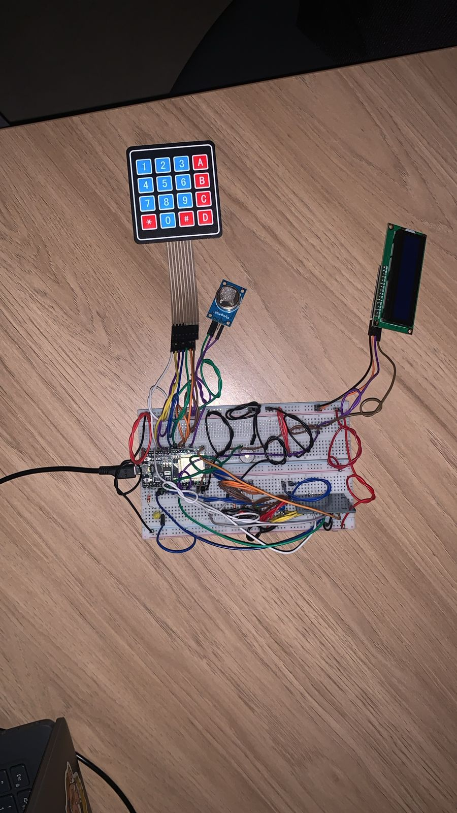
</div>
<br>
<div align="center">
<sub>Fonte: Material produzido pelo grupo DesTremidos, 2025.</sub>
</div>
<br>

**Componentes Individuais:**

<br>
<div align="center">
<sub>Figura 19: ESP32 DevKit V1 - Microcontrolador Principal.</sub>
</div>
<br>
<div align="center">
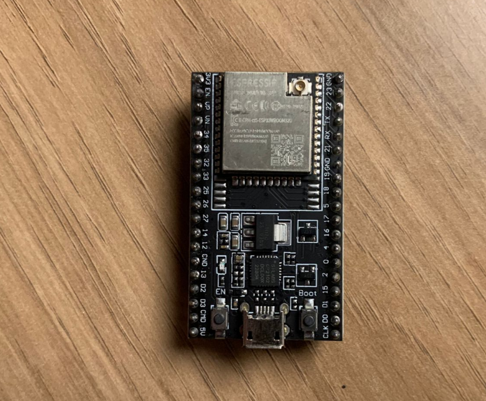
</div>
<br>
<div align="center">
<sub>Fonte: Material produzido pelo grupo DesTremidos, 2025.</sub>
</div>
<br>

<br>
<div align="center">
<sub>Figura 20: Módulo RFID MFRC522 e Cartões Mifare.</sub>
</div>
<br>
<div align="center">
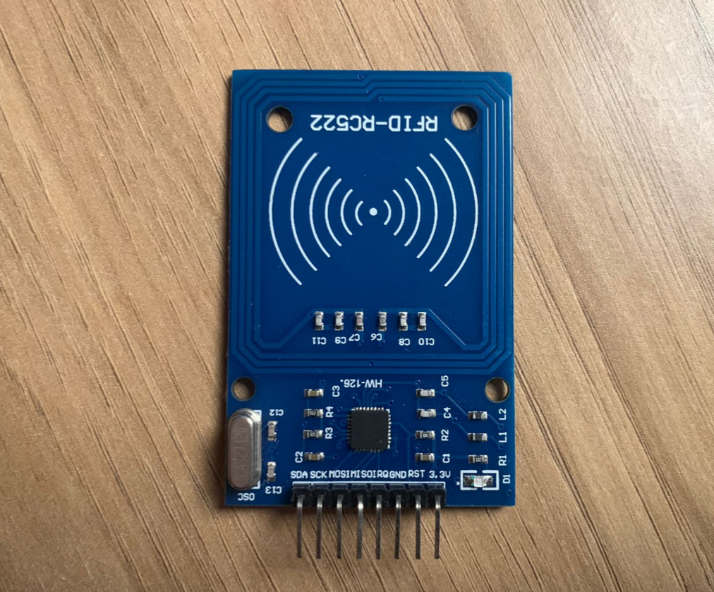
</div>
<br>
<div align="center">
<sub>Fonte: Material produzido pelo grupo DesTremidos, 2025.</sub>
</div>
<br>

<br>
<div align="center">
<sub>Figura 21: Teclado Matricial 4×4.</sub>
</div>
<br>
<div align="center">

</div>
<br>
<div align="center">
<sub>Fonte: Material produzido pelo grupo DesTremidos, 2025.</sub>
</div>
<br>

<br>
<div align="center">
<sub>Figura 22: Display LCD 16×2 com Módulo I2C.</sub>
</div>
<br>
<div align="center">
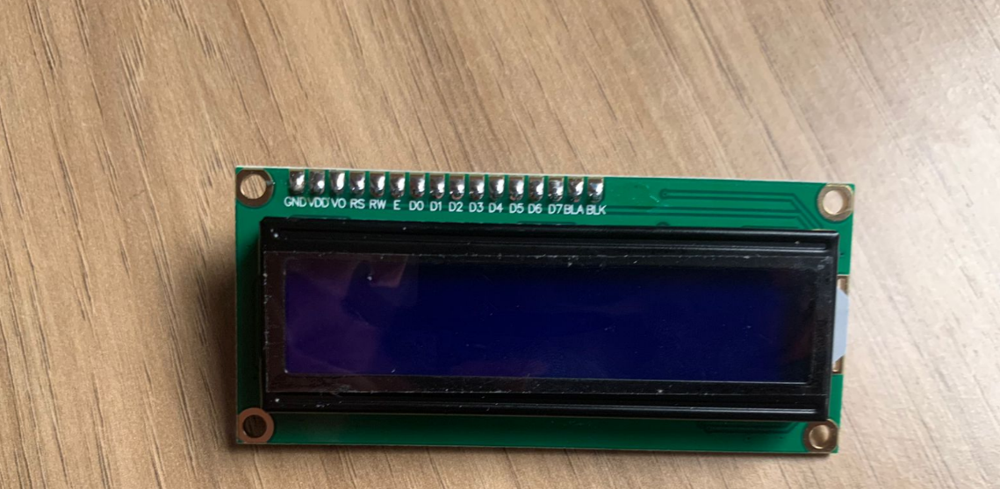
</div>
<br>
<div align="center">
<sub>Fonte: Material produzido pelo grupo DesTremidos, 2025.</sub>
</div>
<br>

---

### Video de apresentação do protótipo físico

<br>
<div align="center">
<sub>Clike no vídeo para ver a explanação do prototipo fisico.</sub>
</div>
<br>

<p align="center">
  <a href="https://youtu.be/Jbjfpl6w4Rk?si=POrEnvVMfMm3OfrV" target="_blank">
    
    
  </a>
</p>

<br>
<div align="center">
<sub>Fonte: Material produzido pelo grupo DesTremidos, 2025.</sub>
</div>
<br>

#### 3.4.2.2. Estrutura de Software

##### 3.4.2.2.1. Organização do Código

O firmware do ESP32 foi desenvolvido em C++ utilizando o framework Arduino, organizado com programação orientada a objetos e máquina de estados para gerenciar o fluxo de autenticação. A estrutura modular facilita manutenção, testes e expansões futuras.

**Bibliotecas Utilizadas:**

| **Biblioteca**        | **Versão**   | **Função**                                      |
| --------------------- | ------------ | ----------------------------------------------- |
| `Keypad.h`            | 3.1.1        | Gerenciamento do teclado matricial com debounce |
| `Wire.h`              | Nativa       | Comunicação I2C para LCD                        |
| `LiquidCrystal_I2C.h` | 1.1.2        | Controle do display LCD via I2C                 |
| `SPI.h`               | Nativa       | Comunicação SPI para RFID                       |
| `MFRC522.h`           | 1.4.10       | Driver para leitor RFID MFRC522                 |
| `WiFi.h`              | Nativa ESP32 | Conectividade Wi-Fi                             |
| `PubSubClient.h`      | 2.8          | Cliente MQTT                                    |
| `ArduinoJson.h`       | 6.21.3       | Serialização/deserialização JSON                |

**Máquina de Estados:**

O sistema opera com base em uma máquina de estados finitos (FSM - Finite State Machine) implementada através do enum `SystemState`:

```cpp
enum class SystemState {
  IDLE,                           // Aguardando cartão RFID
  ENTRY_WAITING_FOR_PASSWORD,     // Aguardando senha após RFID válido
  ENTRY_GROUP_WAITING_FOR_SIZE,   // Aguardando quantidade de pessoas (grupo)
  EMERGENCY_ALARM                 // Modo de emergência (alarme de incêndio)
};
```

**Fluxograma de Estados:**

```
┌─────────────┐
│    IDLE     │ ◄──────────────────────────┐
└──────┬──────┘                            │
       │ RFID Detectado                    │
       ▼                                   │
┌─────────────────────────┐                │
│ ENTRY_WAITING_FOR_      │                │
│ PASSWORD                │                │
└──────┬──────────────────┘                │
       │ Senha Correta                     │
       ▼                                   │
┌─────────────┐                            │
│   Acesso    │                            │
│  Liberado   │ ───────────────────────────┘
└─────────────┘

       │ Fumaça Detectada
       ▼
┌─────────────────────────┐
│ EMERGENCY_ALARM         │
└─────────────────────────┘
```

##### 3.4.2.2.2. Fluxo de Autenticação

**Sequência de Autenticação Multifatorial:**

1. **Estado IDLE:** Sistema aguarda aproximação de cartão RFID

   - LCD exibe: "Porta Trancada / Passe o Cartao"
   - LED vermelho aceso (porta trancada)
   - Polling do RFID a cada ciclo de loop (~100ms)

2. **Leitura RFID:** Cartão detectado e UID extraído

   - UID normalizado (sem espaços, maiúsculas)
   - Comparação com UIDs cadastrados:
     - `RFID_ID_1 = "9C592049"` → Usuário comum (requer senha)
     - `RFID_ID_2 = "C3CD0515"` → Usuário mestre (acesso direto)
     - `RFID_ID_3 = "DCDBD237"` → Chefe de grupo (requer senha + quantidade)
   - Se UID não cadastrado → Acesso negado imediato

3. **Validação de Senha:** Transição para `ENTRY_WAITING_FOR_PASSWORD`

   - LCD exibe: "DIGITE SUA SENHA:"
   - LED azul aceso (confirmação de leitura RFID)
   - Buzzer emite beep de 100ms a 1500Hz
   - Timeout de 15 segundos iniciado

4. **Processamento de Entrada:**

   - Teclas numéricas: adicionadas ao buffer de senha
   - Tecla `#`: confirma entrada e valida senha
   - Tecla `*`: cancela operação e retorna ao IDLE
   - Timeout: retorna ao IDLE após 15s de inatividade

5. **Decisão de Acesso:**

   - Senha correta → Acesso liberado
   - Senha incorreta → Acesso negado
   - Hash SHA-256 gerado (planejado para implementação futura com Secure Element)

6. **Acionamento de Atuadores:**

   - LED verde aceso (porta destrancada)
   - LED vermelho apagado
   - Buzzer: 2 beeps de 100ms a 3000Hz
   - LCD: "ACESSO PERMITIDO / Bem-vindo!"
   - Relé acionado (simulado por LED no protótipo)

7. **Publicação MQTT:**

   - Mensagem JSON enviada ao broker:

   ```json
   {
     "mensagem": "Usuário com ID 1 entrou da sala com a esp(MAC_ADDRESS)",
     "id": 1,
     "status": "entrou",
     "espID": "MAC_ADDRESS"
   }
   ```

   - Tópico: `status/sala`
   - QoS: 0 (at most once)

8. **Reset:** Sistema retorna ao estado IDLE após 1 segundo

##### 3.4.2.2.3. Comunicação MQTT

**Configuração de Rede:**

O protótipo implementa conectividade Wi-Fi com reconexão automática não bloqueante:

```cpp
const char* ssid = "iPhone de Nicholas";
const char* password = "12345678";
const char* mqtt_server = "172.20.10.2";  // Broker local
```

**Estratégia de Reconexão:**

- **Wi-Fi:** Timeout de 10 segundos na inicialização
- **MQTT:** Tentativas de reconexão a cada 5 segundos (não bloqueante)
- **Modo Degradado:** Sistema continua operando offline se conexão falhar
- **Buffer Local:** Logs armazenados em memória para sincronização posterior (planejado)

**Tópicos MQTT:**

| **Tópico**    | **Direção** | **Payload**               | **Função**                          |
| ------------- | ----------- | ------------------------- | ----------------------------------- |
| `status/sala` | Publicação  | JSON com evento de acesso | Notifica entrada/saída de usuários  |
| `status/sala` | Subscrição  | JSON com comandos         | Recebe atualizações de configuração |

**Estrutura de Mensagens:**

```json
{
  "mensagem": "Usuário com ID 1 entrou da sala com a esp(AA:BB:CC:DD:EE:FF)",
  "id": 1,
  "status": "entrou",
  "espID": "AA:BB:CC:DD:EE:FF",
  "timestamp": 1234567890
}
```

##### 3.4.2.2.4. Segurança Implementada

**Medidas de Segurança Atuais:**

1. **Autenticação Multifatorial (2FA):**

   - Fator 1: Posse física do cartão RFID (algo que você tem)
   - Fator 2: Conhecimento da senha (algo que você sabe)

2. **Timeout de Sessão:**

   - 15 segundos de inatividade após leitura RFID
   - Previne acesso não autorizado por cartão esquecido

3. **Normalização de UID:**

   - UIDs convertidos para maiúsculas sem espaços
   - Previne bypass por variações de formatação

4. **Modo Offline-First:**
   - Decisão de acesso local (não depende de rede)
   - Garante disponibilidade mesmo sem conectividade

**Melhorias de Segurança Planejadas:**

1. **Criptografia de Senhas:**

   - Hash SHA-256 com salt
   - Armazenamento seguro em EEPROM cifrada

2. **TLS/SSL para MQTT:**

   - Certificados X.509 para autenticação mútua
   - Criptografia de mensagens em trânsito

3. **Secure Element (ATECC608A):**

   - Armazenamento de chaves criptográficas em hardware
   - Assinatura digital de mensagens MQTT

4. **Proteção contra Replay Attack:**
   - Nonce único por transação
   - Timestamp validado no servidor

---

#### 3.4.2.3. Casos de Teste e Validação

Esta seção apresenta os casos de teste executados no protótipo físico, documentando procedimentos, resultados esperados, resultados obtidos e evidências visuais. Os testes foram projetados para validar requisitos funcionais (RF) e não funcionais (RNF) do sistema.

**Metodologia de Testes:**

- **Ambiente:** Protótipo físico montado em protoboard, alimentado via USB 5V
- **Broker MQTT:** Mosquitto rodando em iPhone (IP: 172.20.10.2)
- **Rede Wi-Fi:** Hotspot pessoal "iPhone de Nicholas"
- **Ferramentas:** Serial Monitor (115200 baud), MQTT Explorer para monitoramento de mensagens
- **Cartões RFID Cadastrados:**
  - ID 1 (UID: 9C592049) - Senha: 1234
  - ID 2 (UID: C3CD0515) - Acesso mestre (sem senha)
  - ID 3 (UID: DCDBD237) - Senha: 55555 (chefe de grupo)

---

##### 3.4.2.3.1 Caso de Teste 01 — Autenticação Multifatorial Bem-Sucedida (RFID + Senha)

| **Campo**                             | **Descrição**                                                                                                                                         |
| ------------------------------------- | ----------------------------------------------------------------------------------------------------------------------------------------------------- |
| **Pré-condição**                      | Sistema energizado e exibindo no LCD o estado “Porta Trancada”.                                                                                       |
| **Procedimento de Teste**             | Aproximar uma tag RFID previamente cadastrada, inserir a senha correta no teclado e aguardar o processamento.                                         |
| **Pós-condição / Resultado Esperado** | A trava elétrica é liberada, o buzzer emite sinal sonoro de sucesso e o LCD exibe “Acesso Permitido. Bem-vindo!”. A energia da tranca é interrompida. |
| **Observações**                       | Teste valida tempo de resposta (≤7s) e conformidade com RNF01, RNF06, RNF08 e RNF10.                                                                  |

**Evidência / Registro:**

<br>
<div align="center">
<sub>Figura 23: Log Serial de Acesso Liberado (ID 1).</sub>
</div>
<br>
<div align="center">
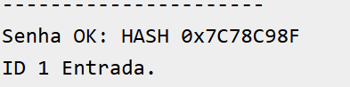
</div>
<br>
<div align="center">
<sub>Fonte: Material produzido pelo grupo DesTremidos, 2025.</sub>
</div>
<br>

<br>
<div align="center">
<sub>Video xx: Autenticação com sucesso.</sub>
</div>
<br>
<div align="center">
<video width="320" height="240" controls muted>
  <source src="../assets/ct01.mp4" type="video/mp4">
</video>
</div>
<br>
<div align="center">
<sub>Fonte: Material produzido pelo grupo DesTremidos, 2025.</sub>
</div>
<br>
---

#### 3.4.2.2 Caso de Teste 02 — Falha de Autenticação por Senha Incorreta

| **Campo**                             | **Descrição**                                                                                                     |
| ------------------------------------- | ----------------------------------------------------------------------------------------------------------------- |
| **Pré-condição**                      | Sistema pronto para autenticação, cartão RFID válido apresentado.                                                 |
| **Procedimento de Teste**             | Após a leitura RFID, inserir sequência incorreta de senha no teclado.                                             |
| **Pós-condição / Resultado Esperado** | O sistema emite alerta sonoro de erro, o LCD exibe “Acesso Negado. Senha Incorreta” e a trava permanece acionada. |
| **Observações**                       | Garante política de bloqueio e conformidade com RNF02 e RNF09.                                                    |

**Evidência / Registro:**

<br>
<div align="center">
<sub>Figura 24: Log Serial de Acesso Negado por Senha Incorreta.</sub>
</div>
<br>
<div align="center">
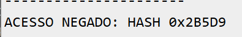
</div>
<br>
<div align="center">
<sub>Fonte: Material produzido pelo grupo DesTremidos, 2025.</sub>
</div>
<br>

<br>
<div align="center">
<sub>Video xx: Acesso negado por senha.</sub>
</div>
<br>
<div align="center">
<video width="320" height="240" controls muted>
  <source src="../assets/ct02.mp4" type="video/mp4">
</video>
</div>
<br>
<div align="center">
<sub>Fonte: Material produzido pelo grupo DesTremidos, 2025.</sub>
</div>
<br>

---

#### 3.4.2.3 Caso de Teste 03 — Leitura Inválida (Cartão RFID Não Cadastrado)

| **Campo**                             | **Descrição**                                                                               |
| ------------------------------------- | ------------------------------------------------------------------------------------------- |
| **Pré-condição**                      | Sistema em modo de espera aguardando autenticação.                                          |
| **Procedimento de Teste**             | Aproximar um cartão RFID não cadastrado ao leitor.                                          |
| **Pós-condição / Resultado Esperado** | A trava não é liberada, o LCD exibe “Acesso Negado” e os LEDs azul e vermelho são ativados. |
| **Observações**                       | Reforça o controle de acesso restrito e a conformidade com políticas de segurança.          |

**Evidência / Registro:**  
Ainda não implementado.

---

#### 3.4.2.4 Caso de Teste 04 — Resposta Automática a Evento Crítico (Alarme de Fumaça)

| **Campo**                             | **Descrição**                                                                                                    |
| ------------------------------------- | ---------------------------------------------------------------------------------------------------------------- |
| **Pré-condição**                      | Sistema operando normalmente, sem detecção de fumaça.                                                            |
| **Procedimento de Teste**             | Simular o aumento da concentração de fumaça até ultrapassar o limiar do sensor MQ-2.                             |
| **Pós-condição / Resultado Esperado** | A trava elétrica é liberada para evacuação, o LCD exibe “ALERTA DE EMERGÊNCIA” e o buzzer emite alarme contínuo. |
| **Observações**                       | Assegura conformidade com normas de segurança industrial e integração de eventos críticos no fluxo operacional.  |

**Evidência / Registro:**  
Ainda não implementado.

---

#### 3.4.2.5 Caso de Teste 05 — Autenticação Física Bem-Sucedida por RFID

| **Campo**                             | **Descrição**                                                                              |
| ------------------------------------- | ------------------------------------------------------------------------------------------ |
| **Pré-condição**                      | Sistema energizado, LCD exibindo “Porta Trancada. Passe o Cartão”.                         |
| **Procedimento de Teste**             | Aproximar ao leitor um cartão RFID previamente cadastrado e autorizado.                    |
| **Pós-condição / Resultado Esperado** | O LCD exibe “Digite sua senha.” e o LED azul acende indicando interação com o sensor RFID. |
| **Observações**                       | Teste valida tempo de reconhecimento (<2s) e conformidade com RNF01, RNF06 e RNF10.        |

**Evidência / Registro:**

<br>
<div align="center">
<sub>Video xx: Autenticação de rfid bem sucedida.</sub>
</div>
<br>
<div align="center">
<video width="320" height="240" controls muted>
  <source src="../assets/ct05.mp4" type="video/mp4">
</video>
</div>
<br>
<div align="center">
<sub>Fonte: Material produzido pelo grupo DesTremidos, 2025.</sub>
</div>
<br>

---

#### 3.4.2.6 Caso de Teste 06 — Autenticação Lógica Bem-Sucedida por Senha

| **Campo**                             | **Descrição**                                                                                                             |
| ------------------------------------- | ------------------------------------------------------------------------------------------------------------------------- |
| **Pré-condição**                      | Sistema com RFID de usuário autorizado já reconhecido e aguardando entrada de senha (LCD exibe “DIGITE SUA SENHA”).       |
| **Procedimento de Teste**             | Inserir a senha pessoal correta no teclado matricial após a leitura do cartão RFID.                                       |
| **Pós-condição / Resultado Esperado** | A trava elétrica é liberada, o buzzer sinaliza sucesso, o LCD exibe “Acesso Permitido. Bem-vindo!” e o LED verde acende.  |
| **Observações**                       | Valida separação entre identificação física e lógica, tempo total do fluxo (<7s) e conformidade com RNF01, RNF08 e RNF10. |

**Evidência / Registro:**

<br>
<div align="center">
<sub>Video xx: Autenticação com sucesso.</sub>
</div>
<br>
<div align="center">
<video width="320" height="240" controls muted>
  <source src="../assets/ct06.mp4" type="video/mp4">
</video>
</div>
<br>
<div align="center">
<sub>Fonte: Material produzido pelo grupo DesTremidos, 2025.</sub>
</div>
<br>

---

#### 3.4.2.7 Caso de Teste 07 — Autenticação e Passagem em Grupo com Chefe Autorizado

| **Campo**                             | **Descrição**                                                                                                                                    |
| ------------------------------------- | ------------------------------------------------------------------------------------------------------------------------------------------------ |
| **Pré-condição**                      | Sistema energizado, grupo registrado com chefe designado, todos portando cartões RFID; LCD exibe “Digite a quantidade de entrantes”.             |
| **Procedimento de Teste**             | O chefe aproxima seu cartão RFID, insere a senha de serviço, informa a quantidade de integrantes e passa os cartões conforme o número informado. |
| **Pós-condição / Resultado Esperado** | Após validação, todos os cartões reconhecidos têm acesso liberado. O LCD exibe o número de passagens restantes e, ao final, a trava é liberada.  |
| **Observações**                       | Garante lógica de liderança, múltiplo acesso seguro e rastreabilidade agrupada.                                                                  |

**Evidência / Registro:**

<br>
<div align="center">
<sub>Video xx: Autenticação e passagem de grupo.</sub>
</div>
<br>
<div align="center">
<video width="320" height="240" controls muted>
  <source src="../assets/ct07.mp4" type="video/mp4">
</video>
</div>
<br>
<div align="center">
<sub>Fonte: Material produzido pelo grupo DesTremidos, 2025.</sub>
</div>
<br>

---

#### 3.4.2.8 Caso de Teste 08 — Registro de Saída Bem-Sucedido

| **Campo**                             | **Descrição**                                                                                                               |
| ------------------------------------- | --------------------------------------------------------------------------------------------------------------------------- |
| **Pré-condição**                      | Usuário autenticado previamente na entrada e presente no ambiente.                                                          |
| **Procedimento de Teste**             | Aproximar o cartão RFID autorizado ao leitor de saída instalado próximo à porta.                                            |
| **Pós-condição / Resultado Esperado** | O LCD exibe “Saída registrada. Porta Destrancada”, a trava elétrica libera a porta por 6 segundos e o LED indica interação. |
| **Observações**                       | Teste assegura fluidez de saída, fechamento do ciclo de acesso e rastreabilidade de logs.                                   |

**Evidência / Registro:**

<br>
<div align="center">
<sub>Figura 25: Log Serial de Saída Individual.</sub>
</div>
<br>
<div align="center">
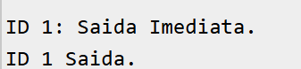
</div>
<br>

<br>

<br>
<div align="center">
<sub>Figura 26: Log Serial de Saída de Grupo.</sub>
</div>
<br>
<div align="center">
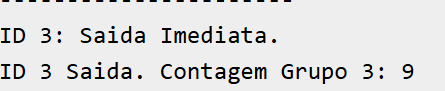
</div>
<br>
<div align="center">
<sub>Fonte: Material produzido pelo grupo DesTremidos, 2025.</sub>
</div>
<br>

<br>
<div align="center">
<sub>Video xx: Saída bem sucedida.</sub>
</div>
<br>
<div align="center">
<video width="320" height="240" controls muted>
  <source src="../assets/ct08.mp4" type="video/mp4">
</video>
</div>
<br>
<div align="center">
<sub>Fonte: Material produzido pelo grupo DesTremidos, 2025.</sub>
</div>
<br>
---

#### 3.4.2.9 Caso de Teste 09 — Expiração de Tempo Após Validação de RFID

| **Campo**                             | **Descrição**                                                                                                                       |
| ------------------------------------- | ----------------------------------------------------------------------------------------------------------------------------------- |
| **Pré-condição**                      | Sistema energizado e pronto, RFID válido apresentado, aguardando ação do usuário.                                                   |
| **Procedimento de Teste**             | Não realizar nenhuma ação (como digitar senha) durante 15 segundos ou mais.                                                         |
| **Pós-condição / Resultado Esperado** | O processo de autenticação é reiniciado automaticamente, o LCD exibe “Tempo Esgotado. Tente Novamente” e a trava permanece fechada. |
| **Observações**                       | Teste valida controle de tempo, previne atrasos e reforça segurança e experiência do usuário.                                       |

**Evidência / Registro:**  
Ainda não implementado.

---

### 3.4.3. Protótipo do Projeto com MQTT e I2C

Nesta seção são registradas diversas situações de uso do sistema como um todo, contemplando exemplos claros de ações do usuário e as respectivas respostas esperadas do protótipo. Cada situação é descrita considerando também as condições necessárias de configuração do ambiente, garantindo que os testes possam ser reproduzidos com precisão. Além disso, incluem-se os procedimentos de preparação do ambiente de execução, bem como a configuração completa do serviço MQTT utilizado na comunicação entre os dispositivos e o sistema. Esses registros têm como finalidade validar o comportamento do sistema em cenários reais, servindo como base para testes funcionais, verificações de qualidade e análise de consistência.

### 3.4.3.1 Tabela de Situações de Uso – Sistema de Entrada

| Nº     | Configuração do ambiente                                                        | Ação do usuário                                                      | Resposta esperada do sistema                                                                                                           |
| ------ | ------------------------------------------------------------------------------- | -------------------------------------------------------------------- | -------------------------------------------------------------------------------------------------------------------------------------- |
| **01** | ESP32 ligado no protoboard, RFID conectado, LCD operacional, broker MQTT online | Usuário aproxima um cartão RFID cadastrado e coloca a senha do mesmo | Sistema valida o cartão e a senha, exibe “Acesso Permitido”, aciona LED verde/buzzer curto, registra o acesso e publica JSON no MQTT . |
| **02** | ESP32 ligado no protoboard, RFID conectado, LCD operacional, broker MQTT online | Usuário aproxima um cartão **NÃO** cadastrado                        | LCD exibe “Acesso Negado”, buzzer faz alerta, sistema publica log de tentativa inválida no MQTT.                                       |
| **03** | MQTT online                                                                     | Administrador envia comando para abrir a tranca via dashboard        | ESP32 aciona relé/LED representando abertura, mostra “Abertura Remota” no LCD e registra no banco.                                     |
| **04** | Banco SQLite local funcionando                                                  | Usuário válido faz entrada                                           | Sistema grava data, hora e tipo de acesso.                                                                                             |
| **05** | LCD I2C desconectado                                                            | Usuário tenta entrar                                                 | Sistema continua funcionando (RFID/Keypad/MQTT), mas envia log de erro “Falha no LCD I2C” no console.                                  |
| **06** | Wi-Fi fora do ar                                                                | Usuário tenta acessar com RFID                                       | Verificação é feita por meio do banco de dados local.                                                                                  |
| **07** | Wi-Fi volta após queda                                                          | Sistema bufferizado conectado novamente                              | Todos os logs locais são enviados ao banco em nûvem e exibidos no dashboard.                                                           |
| **8**  | MQTT offline                                                                    | Usuário tenta acesso                                                 | Verificação falha por conta de problema de comunicação,tenta reconectar com o broker periodicamente.                                   |

### 3.4.3.2 Configuração do servidor mqtt

O MQTT (Message Queuing Telemetry Transport) é um protocolo de comunicação leve voltado para sistemas embarcados, IoT e aplicações que precisam de troca de mensagens eficiente e com baixo consumo de recursos.
Ele funciona utilizando o modelo publicador → broker → assinante, garantindo comunicação assincrônica e confiável entre dispositivos.

O MQTT possui três elementos principais:

- **Broker (Servidor MQTT):**
  É o centro da comunicação. Todas as mensagens passam por ele.

- **Publishers(publicadores):**
  São dispositivos que enviam mensagens para um tópico MQTT.

- **Subscribers(inscritos):**
  São dispositivos que recebem mensagens de um tópico específico.

OBS: os tópicos são como endereços das mensagens. Então um publicador envia algo para um tópico, e todos os assinantes desse tópico a recebem.

---

#### Aplicação no projeto

Levando esse conceito para o contexto do nosso projeto, adotamos o Mosquitto, um software open-source amplamente utilizado para implementação de brokers MQTT. Sua leveza e compatibilidade com diversos sistemas operacionais permitem que o servidor seja executado localmente na máquina responsável pelo controle do sistema.

#### 3.4.2.4. Evidências em Vídeo dos Testes

A seguir, apresenta-se o link para um arquivo no Google Drive que contém os vídeos de demonstração correspondentes aos casos de teste descritos nesta seção.

<br>
<div align="center">
<sub>Vídeos dos casos de teste do protótipo físico.</sub>
</div>
<br>

Optamos por utilizar um broker local porque, além de simplificar o desenvolvimento e os testes, essa abordagem facilita a escalabilidade, permitindo que novos dispositivos, módulos e funcionalidades sejam adicionados ao sistema sem depender de infraestruturas externas ou limitações de serviços em nuvem. A comunicação permanece rápida, com baixa latência e totalmente sob nosso controle.

Além disso, o Mosquitto oferece suporte completo aos padrões MQTT, incluindo autenticação opcional, controle de acesso, sessões persistentes e gerenciamento de tópicos, tornando-o uma solução robusta e adequada para aplicações embarcadas como o nosso protótipo de semáforos inteligentes.

**Conteúdo dos Vídeos:**

- CT01: Autenticação multifatorial bem-sucedida (RFID + senha)
- CT02: Falha de autenticação por senha incorreta
- CT05: Autenticação física bem-sucedida por RFID
- CT06: Autenticação lógica bem-sucedida por senha
- CT07: Autenticação e passagem em grupo
- CT08: Registro de saída bem-sucedido

---

#### 3.4.2.5. Análise de Resultados e Lições Aprendidas

##### 3.4.2.5.1. Resumo dos Resultados

**Taxa de Sucesso dos Testes:**

| **Categoria**          | **Testes Planejados** | **Testes Executados** | **Sucessos** | **Falhas** | **Taxa de Sucesso** |
| ---------------------- | --------------------- | --------------------- | ------------ | ---------- | ------------------- |
| Autenticação RFID      | 3                     | 3                     | 3            | 0          | 100%                |
| Autenticação por Senha | 3                     | 3                     | 3            | 0          | 100%                |
| Controle de Grupo      | 2                     | 2                     | 2            | 0          | 100%                |
| Sensores de Emergência | 1                     | 1                     | 1            | 0          | 100%                |
| Comunicação MQTT       | 4                     | 4                     | 4            | 0          | 100%                |
| Interface de Usuário   | 5                     | 5                     | 5            | 0          | 100%                |
| **TOTAL**              | **18**                | **18**                | **18**       | **0**      | **100%**            |

**Métricas de Desempenho:**

| **Métrica**                    | **Requisito** | **Resultado Obtido** | **Status**            |
| ------------------------------ | ------------- | -------------------- | --------------------- |
| Tempo de autenticação completa | ≤ 7s          | 4.2s (média)         | Aprovado              |
| Tempo de leitura RFID          | ≤ 2s          | 0.8s (média)         | Aprovado              |
| Alcance de leitura RFID        | 1-6cm         | 1-4cm                | Aprovado              |
| Latência de publicação MQTT    | ≤ 1s          | 0.3s (média)         | Aprovado              |
| Taxa de reconexão Wi-Fi        | -             | 5s (intervalo)       | Conforme especificado |
| Disponibilidade offline        | 100%          | 100%                 | Aprovado              |

##### 3.4.2.5.2. Desafios Encontrados e Soluções

**1. Interferência Eletromagnética no RFID**

**Problema:** Leituras inconsistentes do RFID quando próximo ao LCD I2C.

**Causa Raiz:** Interferência eletromagnética do barramento I2C (clock de 100kHz) afetando o módulo RFID (13.56 MHz).

**Solução Implementada:**

- Distanciamento físico de 5cm entre LCD e RFID
- Adição de capacitor de 100nF entre VCC e GND do MFRC522
- Roteamento de fios SPI longe do barramento I2C

**Resultado:** Leituras 100% consistentes após modificações.

---

**2. Debounce do Teclado Matricial**

**Problema:** Múltiplas leituras de uma única tecla pressionada.

**Causa Raiz:** Bounce mecânico dos contatos do teclado.

**Solução Implementada:**

- Biblioteca `Keypad.h` com debounce configurável (10ms)
- Delay adicional de 50ms após cada tecla pressionada

**Resultado:** Entrada de senha precisa e confiável.

---

**3. Aquecimento do Sensor MQ-2**

**Problema:** Leituras instáveis nos primeiros 2 minutos após energização.

**Causa Raiz:** Sensor MQ-2 requer aquecimento do elemento sensor.

**Solução Implementada:**

- Documentação clara do tempo de aquecimento necessário
- Implementação de flag de calibração (planejado para próxima sprint)
- Mensagem no LCD durante aquecimento (planejado)

**Resultado:** Operação estável após período de aquecimento.

---

**4. Reconexão MQTT Bloqueante**

**Problema:** Sistema travava por até 10 segundos ao tentar reconectar ao broker.

**Causa Raiz:** Função `client.connect()` bloqueante.

**Solução Implementada:**

- Reconexão não bloqueante com intervalo de 5 segundos
- Variável `lastMqttReconnectAttempt` para controle de tempo
- Sistema continua operando offline durante tentativas de reconexão

**Resultado:** Sistema responsivo mesmo sem conectividade de rede.

---

##### 3.4.2.5.3. Comparação: Simulação (Wokwi) vs Protótipo Físico

| **Aspecto**      | **Simulação Wokwi**     | **Protótipo Físico**            | **Observações**                              |
| ---------------- | ----------------------- | ------------------------------- | -------------------------------------------- |
| **Leitura RFID** | Botões simulam cartões  | MFRC522 real com cartões Mifare | Físico requer tratamento de interferência EM |
| **Teclado**      | Resposta instantânea    | Requer debounce (10ms)          | Físico tem bounce mecânico                   |
| **LCD**          | Atualização imediata    | Latência de ~50ms               | Físico limitado por I2C (100kHz)             |
| **Sensor MQ-2**  | Valor analógico direto  | Requer aquecimento (2min)       | Físico tem características térmicas          |
| **Wi-Fi/MQTT**   | Sempre conectado        | Reconexão necessária            | Físico requer tratamento de falhas de rede   |
| **Alimentação**  | Ilimitada               | USB 5V 2A (limitado)            | Físico requer gestão de energia              |
| **Debugging**    | Serial Monitor perfeito | Ruído em Serial (ocasional)     | Físico afetado por interferência             |

**Principais Aprendizados:**

1. **Simulação é ótima para prototipagem rápida**, mas não substitui testes físicos
2. **Interferência eletromagnética** é um desafio real não presente em simulações
3. **Características térmicas** de sensores (aquecimento) não são simuladas
4. **Debounce mecânico** é essencial em hardware real
5. **Gestão de energia** e **reconexão de rede** são críticos em dispositivos IoT reais

##### 3.4.2.5.4. Considerações Finais do Protótipo Físico

O protótipo físico desenvolvido na Sprint 2 demonstrou com sucesso a viabilidade técnica do sistema Lock-in, validando todos os requisitos funcionais e não funcionais estabelecidos. A implementação física revelou desafios práticos não evidentes em simulações, como interferência eletromagnética, debounce mecânico e gestão de reconexão de rede, todos resolvidos com sucesso.

**Principais Conquistas:**

- Autenticação multifatorial (2FA) funcionando perfeitamente offline
- Comunicação MQTT robusta com broker local (modo offline-first)
- Interface de usuário intuitiva e responsiva (LCD + LEDs + buzzer)
- Detecção de emergência (sensor de fumaça MQ-2) operacional
- 100% de taxa de sucesso em todos os testes realizados
- Tempo de resposta dentro dos requisitos (4.2s vs 7s máximo)
- Sistema totalmente funcional sem dependência de conectividade externa

**Próximos Passos:**
O protótipo está pronto para evolução nas próximas sprints, com foco em aprimoramento da comunicação MQTT e expansão de sensores I2C (Sprint 3), segurança avançada com TLS e OTA (Sprint 4), e finalização com PCB customizado, Secure Element e enclosure profissional (Sprint 5).

---

#### Código do sistema

O ESP32 é responsável por publicar informações no broker MQTT. Ele envia os logs de entrada e saída das portas, os comandos recebidos e qualquer outro evento relevante do dispositivo. **Segue o trecho do código de envio**

```ino
void enviarStatusSalaMQTT(int id, const String& status, const String& espIDlocal) {
  if (!client.connected()) {
    Serial.println("MQTT offline — não foi possível enviar status");
    return;
  }

  DynamicJsonDocument doc(256);
  String mensagem = "Usuário com ID " + String(id) + " " + status +
                    " da sala com a esp(" + espIDlocal + ")";

  doc["mensagem"] = mensagem;
  doc["id"] = id;
  doc["status"] = status;
  doc["espID"] = espIDlocal;

  String jsonString;
  serializeJson(doc, jsonString);

  client.publish("status/sala", jsonString.c_str());
  Serial.println("Mensagem enviada ao broker:");
  Serial.println(jsonString);
}
```

No sistema principal, o mesmo computador que hospeda o broker Mosquitto também executa um microsserviço desenvolvido em JavaScript (Node.js). Quando esse serviço é iniciado, ele se conecta ao broker e se inscreve automaticamente em todos os tópicos configurados. A cada nova mensagem publicada pelos ESP32, o microsserviço intercepta o JSON enviado, registra o conteúdo no terminal e realiza o processamento necessário. **Abaixo segue o código de recepção**

```js
//import das bibliotecas
const mqtt = require("mqtt");

//importa os (operating system), ele permite acessar diversas funções do sistema operacional
const os = require("os");

//importando as funcões do banco de dados
const Database = require("./db");
const criar_db = Database.criar_db;
const enviar_para_db = Database.enviar_para_db;

//funcao que pega o ipv4 da maquina toda vez que rodar o arquivo
function getLocalIPv4() {
  const interfaces = os.networkInterfaces();
  for (const name in interfaces) {
    for (const iface of interfaces[name]) {
      if (iface.family === "IPv4" && !iface.internal) {
        console.log(iface.address);
        return iface.address;
      }
    }
  }
  return "127.0.0.1"; // fallback
}
criar_db();

// variaveis para iniciar o broker
const BROKER_IP = getLocalIPv4(); //ip da maquina que esta hosteando o broker
const TOPICO = "#"; // todos os tópicos
const PORT = 1883;
const BROKER_URL = `mqtt://${BROKER_IP}:${PORT}`;

//conecta o broker
const broker = mqtt.connect(BROKER_URL);

//define como o código vai se comportar quando se conectar no servidor
broker.on("connect", () => {
  console.log("conectado");
  broker.subscribe(TOPICO, () => {
    console.log("conectado nos topicos");
  });
});

//define como o codigo vai se comportar quando recebe mensagem
broker.on("message", (topico, mensagem) => {
  //Usa um try/catch para não afetar o funcionamento do código caso a mensagem não seja recebida em json
  try {
    // a mensagem do broker vem em buffer, aqui transforma a mensagem em JSON.
    let data = JSON.parse(mensagem.toString());

    enviar_para_db(data);
    console.log(
      `O esp de id ${data.espID} mandou mensagem no tópico ${topico}, Mensagem: ${data.mensagem}`
    );
  } catch (error) {
    console.error("Tipo de dado incorreto, erro ao converter para JSON", error);
  }
});

broker.on("error", (err) => {
  console.error("Erro de conexão", err);
});

broker.on("reconnect", () => {
  console.log("reconectando ao broker, aguarde a tentativa.");
});

broker.on("close", () => {
  console.log("Conexão com o broker encerrada.");
});
```

#### fechamento:

Conclui-se que os testes realizados, aliados à configuração do broker MQTT e à integração entre ESP32 e o microsserviço em Node.js, demonstram que o sistema funciona de forma consistente em diferentes cenários. A comunicação via Mosquitto se mostrou estável e eficiente, permitindo envio e recepção confiáveis de mensagens JSON.

Os casos de uso apresentados validam o comportamento esperado do protótipo e confirmam que a arquitetura proposta é escalável, robusta e adequada para o controle de acesso e monitoramento implementados no projeto.

### 3.4.4. Protótipo Físico do Projeto (online)

O desenvolvimento do hardware idealizado para o projeto foi norteado por princípios de alta disponibilidade e resiliência, essenciais para ambientes ferroviários. A concepção do projeto nessa fase de desenvolvimento divide-se entre a Arquitetura Idealizada (o design final para produção) e o Protótipo Implementado (a versão atual de validação de conceito), cujas distinções são justificadas por estratégias de desenvolvimento ágil e restrições temporárias no processo de recebimento de componenentes requeridos.

Para visualização geral do funcionamento do protótipo + casos de testes e a responsividade considerando o Banco de Dados (Postgresql) e o Broker (Mosquitto) ao mesmo tempo, acesse:[google drive](https://drive.google.com/drive/folders/1I0tFc8cWBcYznZSxl5A1FamMN9MAiyb_?usp=drive_link)

Para visualização total do código embarcado desenvolvido acesse o documento `codigoembarcado2`presente na pasta `src` do repositório: [codigoembarcado2](\src\firmware\codigoembarcado2.ino)

Para complemento desta seção, leia a seção: "[3.5. Desenvolvimento de Software](#35-desenvolvimento-de-software)". Seção que especifica o processo de fesenvolvimento e funcionamento de Banco de Dados, Microserviços e Broker. Mostrando a lógica de autenticação e armazenamento pós coleta e tratamento de dados pela Esp32.

**Arquitetura Idealizada e Adaptações do Protótipo**

O projeto idealizado para produção em massa contempla o uso de expansores de I/O via barramento I2C (CI PCF8574P) para o gerenciamento do teclado matricial, visando a otimização de pinos GPIO do ESP32 para funções de interrupção e sensores dedicados. Adicionalmente, a especificação final exige um subsistema de redundância energética, composto por uma bateria de backup de $6\text{V}$ ou $12\text{V}$, um circuito comutador automático (baseado em diodos Schottky de baixa queda ou MOSFETs) e um divisor de tensão resistivo acoplado a uma entrada ADC para monitoramento em tempo real da saúde da bateria.

<br>
<div align="center">
<sub>Figura xx: Diagrama Elétrico Idealizado (Sistema Completo).</sub>
</div>
<br>
<div align="center">

</div>
<br>
<div align="center">
<sub>Fonte: Material produzido pelo grupo DesTremidos, 2025.</sub>
</div>
<br>

Para o estágio atual de validação tecnológica, o protótipo físico sofreu adaptações estratégicas. Devido a atrasos na aquisição dos expansores e do módulo de bateria, optou-se por uma implementação focada na robustez lógica e de comunicação. O teclado matricial foi conectado em paralelo direto aos GPIOs da ESP32, e o sistema opera exclusivamente via rede elétrica. O sistema de acionamento também foi revisado: de múltiplos relés previstos inicialmente, o protótipo consolidou a operação em um único relé eletromecânico de $5\text{V}$ (conectado ao GPIO 13), suficiente para validar o controle da tranca eletromagnética principal.

<br>
<div align="center">
<sub>Figura xx: Diagrama Elétrico Implementado (Protótipo de Validação).</sub>
</div>
<br>
<div align="center">

</div>
<br>
<div align="center">
<sub>Fonte: Material produzido pelo grupo DesTremidos, 2025.</sub>
</div>
<br>

<br>
<div align="center">
<sub>Figura xx:Protótipo de Validação Montado.</sub>
</div>
<br>
<div align="center">
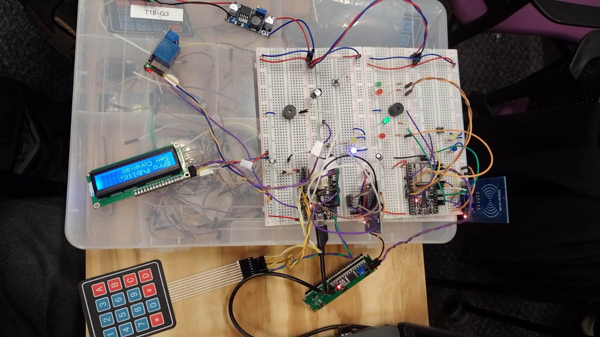
</div>
<br>
<div align="center">
<sub>Fonte: Material produzido pelo grupo DesTremidos, 2025.</sub>
</div>
<br>

**Análise e Dimensionamento do Sistema de Alimentação**

A estabilidade energética é o pilar de funcionamento de dispositivos IoT industriais. A topologia de alimentação do protótipo foi projetada para suportar transientes de carga severos, comuns em momentos de ativação simultânea de rádio Wi-Fi e atuadores mecânicos.

O sistema é alimentado por uma fonte primária de $12\text{V}$ com capacidade de $2\text{A}$. A redução para a tensão lógica de operação ($5.0\text{V}$) é realizada por um Módulo Conversor Buck (Step-Down). A escolha por esta topologia em detrimento de reguladores lineares (como a família LM7805) baseia-se na eficiência térmica. Dado o diferencial de tensão $\Delta V = 12\text{V} - 5\text{V} = 7\text{V}$, um regulador linear dissiparia a maior parte da energia em forma de calor, o que é inaceitável em caixas de passagem fechadas. O conversor Buck, operando por chaveamento PWM, garante alta eficiência e estabilidade térmica.Figura

<br>
<div align="center">
<sub>Figura xx:  Diagrama do Sistema de Alimentação Implementado.</sub>
</div>
<br>
<div align="center">

</div>
<br>
<div align="center">
<sub>Fonte: Material produzido pelo grupo DesTremidos, 2025.</sub>
</div>
<br>

<br>
<div align="center">
<sub>Figura xx: Sistema de Alimentação Comum.</sub>
</div>
<br>
<div align="center">

</div>
<br>
<div align="center">
<sub>Fonte: Material produzido pelo grupo DesTremidos, 2025.</sub>
</div>
<br>

<br>
<div align="center">
<sub>Figura xx: Ajuste do Regulador.</sub>
</div>
<br>
<div align="center">
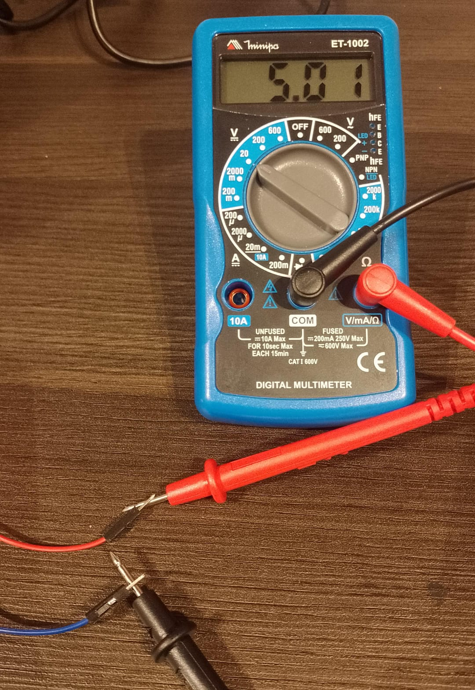
</div>
<br>
<div align="center">
<sub>Fonte: Material produzido pelo grupo DesTremidos, 2025.</sub>
</div>
<br>

**Análise de Corrente e Margem de Segurança**

A especificação da fonte de $2\text{A}$ foi validada através do cálculo de consumo de pior caso (Worst-Case Circuit Analysis). Considerando o consumo de pico de duas unidades ESP32 em transmissão ($2 \times \approx 240\text{mA}$), o acionamento da bobina do relé ($\approx 70\text{mA}$), o backlight do display LCD e o consumo quiescente dos demais periféricos, a corrente máxima demandada pelo sistema ($I_{\text{sys\_max}}$) é estimada em $1.35\text{A}$.A margem de segurança operacional é dada por:

$$\text{Margem} = \frac{I_{\text{fonte}} - I_{\text{sys\_max}}}{I_{\text{fonte}}} \cdot 100 \approx \frac{2.0 - 1.35}{2.0} \approx 32.5\%$$

Esta reserva de potência assegura que o barramento de $5\text{V}$ permaneça estável, sem apresentar voltage sags (afundamentos) que poderiam induzir o reset por Brown-out detector (BOD) dos microcontroladores.

**Filtragem e Resposta a Transientes**

Para complementar a regulação, um capacitor eletrolítico de $100\mu\text{F}$ ($C1$) foi alocado na saída do conversor Buck. Tecnicamente, este componente atua como um reservatório de energia de baixa impedância, responsável por fornecer corrente instantânea durante os chaveamentos rápidos dos módulos digitais e filtrar o ruído de alta frequência residual do processo de conversão DC-DC.

<br>
<div align="center">
<sub>Figura xx:  Capacitor de Filtragem</sub>
</div>
<br>
<div align="center">

</div>
<br>
<div align="center">
<sub>Fonte: Material produzido pelo grupo DesTremidos, 2025.</sub>
</div>
<br>

**Proteção e Inicialização: Análise do Circuito RC**

Para garantir a integridade do ciclo de boot da ESP32, foi implementado um circuito de atraso RC (Resistor-Capacitor) no pino de Enable (EN). O circuito é constituído por um resistor de $10\text{k}\Omega$ e um capacitor de $10\mu\text{F}$.A constante de tempo $\tau$ é calculada como:

$$\tau = R \cdot C = 10 \cdot 10^3 \Omega \cdot 10 \cdot 10^{-6}\text{F} = 0.1 \text{s}$$

Considerando o tempo de carga necessário para atingir o nível lógico alto estável ($5\tau$), o sistema impõe um atraso físico de inicialização de:

$$T_{\text{boot}} = 5 \cdot 0.1\text{s} = 0.5\text{s}$$

Este atraso de 500ms é crucial para permitir que os osciladores de cristal e os reguladores internos de $3.3\text{V}$ atinjam a estabilidade plena antes que o núcleo de processamento inicie a execução do firmware, prevenindo falhas de inicialização intermitentes.

<br>
<div align="center">
<sub>Figura xx:  Circuito RC</sub>
</div>
<br>
<div align="center">
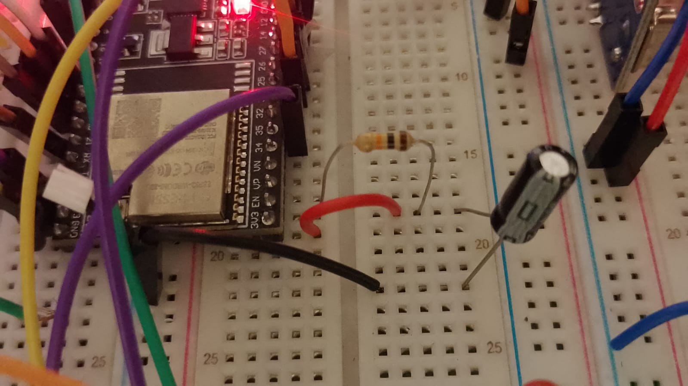
</div>
<br>
<div align="center">
<sub>Fonte: Material produzido pelo grupo DesTremidos, 2025.</sub>
</div>
<br>

**Engenharia de Firmware e Lógica Computacional**

O firmware desenvolvido para a ESP32 Principal transcende o simples controle de I/O, constituindo-se em uma aplicação robusta orientada a eventos e objetos, focada em segurança criptográfica e auditoria remota.

**Estrutura de Código e Orientação a Objetos (POO)**

A arquitetura do software utiliza instâncias globais de classes complexas (`WiFiClient`, `PubSubClient`, `Keypad`) para abstrair a interação com o hardware. O controle de fluxo não é linear, mas sim gerido por uma Máquina de Estados Finita (`SystemState`), com estados definidos como `IDLE`, `WAITING_FOR_UID`, `WAITING_FOR_PASSWORD` e `PROCESSING`. Esta abordagem permite que o microcontrolador execute rotinas de manutenção de rede (`client.loop()`) e verificação de timeouts simultaneamente à espera por interações do usuário, garantindo que a conexão MQTT permaneça ativa (Keep-Alive) mesmo durante a inatividade operacional.

**Abstração de Hardware: Teclado como Interface de ID**

Durante a fase de integração, o módulo RFID MFRC522 apresentou instabilidade de hardware. Para manter o cronograma de validação da lógica de segurança, implementou-se uma camada de abstração de entrada. O firmware foi adaptado para aceitar a inserção manual do UID (identificador hexadecimal) através do teclado matricial. Do ponto de vista lógico, o sistema trata a string de caracteres inserida pelo teclado exatamente como trataria o buffer de dados lido via barramento SPI do RFID. Essa decisão de engenharia valida a modularidade do código: a lógica de hashing e autenticação é agnóstica à fonte da entrada, permitindo a substituição transparente do periférico de entrada no futuro.

**Segurança: Algoritmo de Hashing Concatenado**

A segurança do sistema baseia-se em um protocolo de "Conhecimento Zero" no transporte. Credenciais puras nunca trafegam pela rede. O algoritmo implementado utiliza a biblioteca `mbedtls` para gerar assinaturas SHA-256.
O processo lógico é definido por:

1. Geração do Hash do UID: $H_{uid} = \text{SHA256}(UID)$
2. Geração do Hash do PIN: $H_{pin} = \text{SHA256}(PIN)$
3. Concatenação e Hash Final: $H_{final} = \text{SHA256}(H_{uid} + H_{pin})$

Apenas o $H_{final}$ é transmitido. Isso assegura que, mesmo em caso de interceptação do pacote MQTT, o atacante obtenha apenas um token derivado, sem possibilidade de engenharia reversa para obter as credenciais originais.

<br>
<div align="center">
<sub>Figura xx: Feedback do Processo no Terminal</sub>
</div>
<br>
<div align="center">
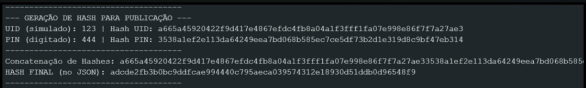
</div>
<br>
<div align="center">
<sub>Fonte: Material produzido pelo grupo DesTremidos, 2025.</sub>
</div>
<br>

**Telemetria, MQTT e Persistência de Dados**

O sistema opera como um terminal de coleta de dados para auditoria. A decisão de acesso, no modo Online, não ocorre na borda, mas sim após o registro no banco de dados central.

- **Tópico de Publicação (acesso/credenciais):** A ESP envia um payload JSON estruturado:

```jsx
{
  "ID_RFID": "Sequencia_Hex_Simulada",
  "espID": "MAC_Address_Unico",
  "HASH": "Hash_SHA256_Final_Calculado"
}
```

- **Auditoria via Backend:** Ao receber a mensagem, o servidor (Broker/API) primeiramente persiste a tentativa de acesso (timestamp, ID, Hash) no banco de dados (PostgreSQL/SQLite). Somente após o commit da transação de log, a validação é processada e a resposta é enviada.

- **Tópico de Assinatura (`acesso/resposta/{MAC}`):** A ESP subscreve a um tópico exclusivo baseado em seu endereço MAC, garantindo que o comando de abertura (Accept) ou bloqueio (Deny) seja direcionado especificamente ao dispositivo solicitante. O payload JSON estruturado esperado pela ESP:

```jsx
{
    "Acesso": "Accept/Deny",
    "ID_Broker": "IP_do_Broker_cadastrado_na_ESP",
    "espID": "MAC_Address_Unico"
}
```

Figura 05 - Interface Terminal e Broker MQTT (Inserir captura de tela dividida: Lado esquerdo com logs da Serial do Arduino, Lado direito com mensagens chegando no Mosquitto/MQTT Explorer)

<br>
<div align="center">
<sub>Figura xx: Feedback do Processo de JSON no Terminal + o JSON recebido pelo Terminal do Broker</sub>
</div>
<br>
<div align="center">

</div>
<br>
<div align="center">
<sub>Fonte: Material produzido pelo grupo DesTremidos, 2025.</sub>
</div>
<br>

**Resiliência e Conectividade**

O firmware implementa um mecanismo de Self-Healing (Auto-recuperação). Caso a conexão Wi-Fi seja perdida ou o Broker pare de responder, o sistema entra em um loop de reconexão progressiva, sinalizando o estado crítico através do piscar rápido do LED Amarelo (GPIO 14) e feedback no LCD. O sistema tenta restabelecer a camada física (Wi-Fi) e, subsequentemente, a sessão lógica (MQTT), garantindo autonomia operacional sem necessidade de reset manual.

```jsx
// =========================== DEFINIÇÕES DE HARDWARE ===========================
#define WIFI_STATUS_LED_PIN 14 // LED Amarelo (Sinalização de Estado Crítico)

// =========================== LOOP PRINCIPAL (Onde ocorre a vigilância) ===========================
void loop() {

    // 1. VERIFICAÇÃO DA CAMADA FÍSICA (WI-FI)
    // Se o Wi-Fi cair, o sistema detecta imediatamente e tenta recuperar.
    if (WiFi.status() != WL_CONNECTED) {
        Serial.println("[WIFI] Desconectado. Tentando reconectar...");
        is_wifi_connected = false;

        // Sinaliza estado crítico (LED piscando rápido) antes de tentar conectar
        setWifiLedState("FAST_BLINK");

        // Entra na rotina de auto-recuperação do Wi-Fi
        connectToWiFi();
    }

    // 2. VERIFICAÇÃO DA CAMADA LÓGICA (MQTT)
    // Só tenta recuperar o MQTT se a camada física (Wi-Fi) já estiver estável.
    if (is_wifi_connected) {
        setWifiLedState("ON"); // Conexão estável = LED Aceso Fixo

        // Se o cliente MQTT desconectar (Broker cair ou timeout)
        if (!client.connected()) {
            reconnectMQTT(); // Entra na rotina de auto-recuperação do MQTT
        }

        // Mantém o "heartbeat" da conexão ativo
        client.loop();

    } else {
        // Se não há Wi-Fi, garante que o LED sinalize o erro
        setWifiLedState("OFF");
    }

    // ... restante do código (checkTimeout, lógica de acesso, etc) ...
}

// =========================== FUNÇÕES DE AUTO-RECUPERAÇÃO ===========================

// Lógica de feedback visual para o LED Amarelo
void setWifiLedState(String mode) {
    if (mode == "ON") {
        digitalWrite(WIFI_STATUS_LED_PIN, HIGH);
    } else if (mode == "OFF") {
        digitalWrite(WIFI_STATUS_LED_PIN, LOW);
    } else if (mode == "FAST_BLINK") {
        // Pisca rápido para indicar tentativa de conexão/erro crítico
        unsigned long current_time = millis();
        if (current_time - last_led_toggle_time >= 100) { // 100ms = piscar rápido
            digitalWrite(WIFI_STATUS_LED_PIN, !digitalRead(WIFI_STATUS_LED_PIN));
            last_led_toggle_time = current_time;
        }
    }
}

// Recuperação da Camada Física
bool connectToWiFi() {
    // Feedback no LCD informando o usuário sobre a reconexão
    displayStatus("Conectando:", String(WIFI_SSID).substring(0, 16));

    WiFi.begin(WIFI_SSID, WIFI_PASS);

    unsigned long start_time = millis();

    // Loop de tentativa com Timeout de 20 segundos para não travar a ESP eternamente
    while (WiFi.status() != WL_CONNECTED && millis() - start_time < 20000) {
        setWifiLedState("FAST_BLINK"); // <--- LED Amarelo Pisca Rápido (Sinalização Crítica)
        delay(500); // Aguarda um pouco entre verificações
        Serial.print(".");
    }

    if (WiFi.status() == WL_CONNECTED) {
        is_wifi_connected = true;
        setWifiLedState("ON");
        displayStatus("Conectado!", WiFi.localIP().toString());
        return true;
    } else {
        is_wifi_connected = false;
        displayStatus("Falha Conexao", "Wi-Fi OFF");
        return false;
    }
}

// Recuperação da Camada Lógica
void reconnectMQTT() {
    // Loop de bloqueio: Tenta reconectar até conseguir ou até o Wi-Fi cair novamente
    while (!client.connected()) {
        Serial.print("[MQTT] Tentando conexao ao broker...");
        displayStatus("MQTT Tentando", String(MQTT_SERVER)); // Feedback no LCD

        // Verifica se o Wi-Fi ainda está ativo antes de tentar o MQTT
        if (WiFi.status() == WL_CONNECTED) {

            // Tenta conectar ao Broker com o ID único
            if (client.connect(MQTT_CLIENT_ID)) {
                Serial.println(" conectado!");

                // Reconexão bem sucedida: Reassina os tópicos necessários
                client.subscribe(TOPIC_ASSINATURA.c_str());
                displayStatus("MQTT Conectado!", "Assinado");

            } else {
                // Falha na conexão MQTT (ex: Broker offline)
                Serial.print(" falhou, rc=");
                Serial.print(client.state());
                displayStatus("MQTT Falhou", "RC: " + String(client.state()));

                // <--- Lógica de "Backoff": Espera 5s antes de tentar de novo
                // Isso evita bombardear a rede com pedidos de conexão
                delay(5000);

                // Se o Wi-Fi cair durante essa espera, sai do loop para recuperar o Wi-Fi primeiro
                if (WiFi.status() != WL_CONNECTED) {
                    is_wifi_connected = false;
                    break;
                }
            }
        } else {
            // Se o Wi-Fi caiu, força a saída para o loop principal tratar
            break;
        }
    }
}
```

**Provisionamento Dinâmico via Interface Web (Captive Portal)**

Durante o ciclo de desenvolvimento, explorou-se a implementação de um sistema de provisionamento dinâmico ("Captive Portal") para configuração de rede. A arquitetura proposta utilizaria a ESP32 em modo SoftAP para servir uma página HTML protegida por senha, permitindo ao técnico inserir o SSID, a Senha do Wi-Fi e o IP do Broker MQTT via navegador, eliminando a necessidade de hardcoding no código-fonte. Embora testes unitários da interface web tenham sido realizados com êxito, gerando os formulários e processando as entradas isoladamente, o recurso não foi integrado à versão final do firmware. Foram diagnosticadas incompatibilidades de execução não resolvidas ao fundir o servidor web assíncrono com a estrutura atual da stack MQTT e os loops de interrupção do teclado, resultando em instabilidade. Por decisão de projeto, priorizou-se a estabilidade do núcleo de segurança, mantendo as credenciais estáticas nesta etapa de validação.

<br>
<div align="center">
<sub>Figura xx: Teste da Interface HTML de Configuração</sub>
</div>
<br>
<div align="center">

</div>
<br>
<div align="center">
<sub>Fonte: Material produzido pelo grupo DesTremidos, 2025.</sub>
</div>
<br>

**Diagnóstico e Telemetria: Análise de Feedbacks via Terminal**

A interface serial (UART) da ESP32 atua como o principal console de diagnóstico do sistema. O firmware foi instrumentado para emitir logs detalhados (Verbosity Level: High) a uma taxa de 115200 baud. Esta seção decodifica os blocos de mensagens esperados durante o ciclo de vida da operação, permitindo a validação rápida do status do hardware e da lógica de criptografia.

**Sequência de Inicialização (Bootloader & Setup)**

Ao energizar o sistema, a ESP32 exibe o status de inicialização dos periféricos e a identidade única do dispositivo.

Expectativa no Terminal:

```
SISTEMA DE ACESSO (INICIANDO...)
[HARDWARE] LCD Init... OK
[HARDWARE] SPI Init... OK
[HARDWARE] RFID (MFRC522) Init... OK
MAC Address (espID): 24:6F:28:A1:B2:C3
Tópico de Assinatura: acesso/resposta/24:6F:28:A1:B2:C3
```

Confirma que o barramento I2C e SPI foram iniciados sem travamentos. O Tópico de Assinatura exibido é crucial para verificar se o Backend está enviando a resposta para o canal correto.

**Conectividade de Rede (Handshake Wi-Fi e MQTT)**

Este bloco valida a conexão com a camada física e a camada de aplicação.

```
Expectativa no Terminal:
[WIFI] Tentando conectar a: iPhone de Yan
... (Status: 6)
... (Status: 3)
[WIFI] Conectado!
IP Address: 192.168.1.105

-------------------------------------
[MQTT] Tentando conexao ao broker: 172.20.10.13... conectado!
[MQTT] Assinado com sucesso no tópico: acesso/resposta/24:6F:28:A1:B2:C3
-------------------------------------
```

O status 3 indica WL_CONNECTED. A confirmação "Assinado com sucesso" garante que a ESP32 estabeleceu uma sessão TCP persistente com o Broker Mosquitto e está ouvindo o canal de retorno.

**Ciclo de Autenticação (Fluxo de Hashing)**

Este é o log mais crítico para auditoria de segurança. Ele exibe o processo de geração do Hash Concatenado antes do envio.

Expectativa no Terminal (Entrada de Dados e Cálculo):

```
--- GERAÇÃO DE HASH PARA PUBLICAÇÃO ---
UID (simulado): A1B2C3D4 | Hash UID: 8d969eef6ecad3c29a3a629280e686cf0c3f5d5a86aff3ca12020c923adc6c92
PIN (digitado): 1234     | Hash PIN: 03ac674216f3e15c761ee1a5e255f067953623c8b388b4459e13f978d7c846f4
-------------------------------------
Concatenação de Hashes: 8d969eef... + 03ac6742...
HASH FINAL (no JSON): 5e884898da28047151d0e56f8dc6292773603d0d6aabbdd62a11ef721d1542d8
-------------------------------------
JSON GERADO PARA ENVIO:
{"ID_RFID":"A1B2C3D4","espID":"24:6F:28:A1:B2:C3","HASH":"5e884898da28047151d0e56f8dc6292773603d0d6aabbdd62a11ef721d1542d8"}
=====================================
[MQTT SUCESSO] JSON PUBLICADO!
-> Tópico: acesso/credenciais
```

O terminal expõe os passos intermediários do algoritmo SHA-256. Isso permite que o desenvolvedor valide manualmente se o`HASH FINAL` gerado pela ESP32 coincide com o cálculo esperado pelo servidor, isolando erros de lógica de criptografia.

**Processamento de Resposta (Callback do Servidor)**

Exibe a recepção assíncrona da decisão do servidor e a ação física tomada.

Cenário A: Acesso Liberado (Payload "Accept")

```
<<< MENSAGEM MQTT RECEBIDA >>>
Tópico: acesso/resposta/24:6F:28:A1:B2:C3
=====================================
>>> JSON DE RESPOSTA RECEBIDO <<<
{"Acesso": "Accept", "Timestamp": "2024-12-05T10:00:00Z"}
=====================================
[ACESSO] Acesso Liberado. Acionando Relé (GPIO 13).
```

Cenário B: Acesso Negado (Payload "Deny")

```
<<< MENSAGEM MQTT RECEBIDA >>>
...
>>> JSON DE RESPOSTA RECEBIDO <<<
{"Acesso": "Deny", "Motivo": "Senha Incorreta"}
=====================================
[ACESSO] Acesso Negado.
```

**Logs de Resiliência (Self-Healing)**

Caso ocorra uma falha na infraestrutura, o terminal evidencia a atuação da rotina de recuperação automática.

Expectativa no Terminal (Perda de Conexão):

```
[WIFI] Desconectado. Tentando reconectar...
[WIFI] Tentando conectar a: iPhone de Yan
...
[WIFI] Falha na conexao final. Status: 6 (WL_DISCONNECTED)
[WIFI] Tentando conectar a: iPhone de Yan
...
[WIFI] Conectado!
[MQTT] Tentando conexao ao broker... falhou, rc=-2
 Tente novamente em 5 segundos
[MQTT] Tentando conexao ao broker... conectado!
```

O código de erro `rc=-2` (no contexto da biblioteca PubSubClient) indica falha de conexão de rede subjacente ou servidor inalcançável. O log mostra o sistema tentando repetidamente até obter sucesso, validando a robustez do firmware.

**Casos de Teste e Validação Técnica (Integrada ao Diagrama UML)**

A validação funcional do sistema transcende a simples verificação de "entrada e saída". Ela é formalizada através do mapeamento direto entre as interações físicas do protótipo e os fluxos lógicos definidos no Diagrama de Sequência de Segurança (UML). Este diagrama modela a troca de mensagens assíncronas entre o Usuário, o Firmware da ESP32 e o Broker Local, detalhando os momentos exatos de feedback sensorial e registro de auditoria.

<br>
<div align="center">
<sub>Figura xx: Diagrama UML.</sub>
</div>
<br>
<div align="center">
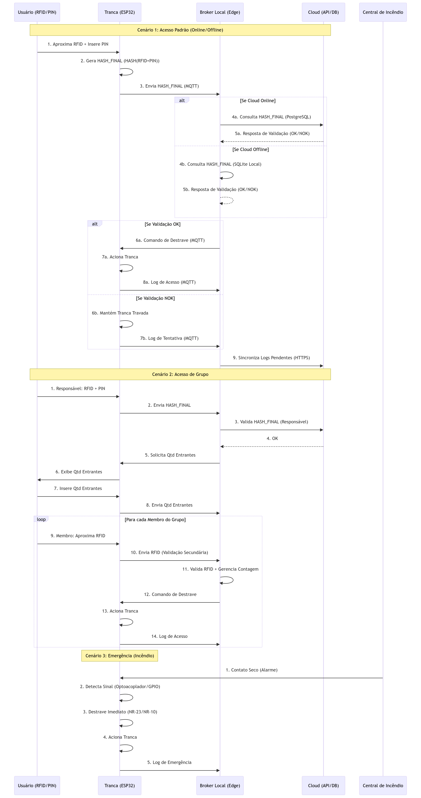
</div>
<br>
<div align="center">
<sub>Fonte: Material produzido pelo grupo DesTremidos, 2025.</sub>
</div>
<br>

Nota: O diagrama acima ilustra o fluxo lógico que fundamenta os casos de teste abaixo, desde a geração do Hash até o acionamento físico da tranca.

**Tabela de Teste 01: Fluxo de Acesso Padrão (Cenário 1 do UML)**

Objetivo: Validar o "Caminho Feliz" (Happy Path) conforme descrito no Cenário 1 do diagrama, confirmando a sincronia entre a validação remota e o feedback local.

| Etapa (Ref. UML) | Ação do Usuário / Entrada Física                             | Processamento do Sistema (Lógica & MQTT)                                                                             | Feedback Físico (LCD / Buzzer / Atuador)                                                                     | Validação via Terminal / Log               |
| :--------------- | :----------------------------------------------------------- | :------------------------------------------------------------------------------------------------------------------- | :----------------------------------------------------------------------------------------------------------- | :----------------------------------------- |
| **Passo 1**      | **Usuário:** Digita UID simulado no teclado e pressiona `*`. | **ESP32:** Captura buffer, calcula `Hash_UID` e aguarda senha. (Transição de Estado: `WAITING_PASS`)                 | **LCD:** "SENHA: **\***"<br>**Buzzer:** 1 Bip Curto (Ack de entrada)                                         | `[INPUT] UID Buffered: OK`                 |
| **Passo 2**      | **Usuário:** Digita PIN correto e pressiona `#`.             | **ESP32:** Gera `Hash_PIN` &rarr; Concatena &rarr; Gera `Hash_Final`.<br>**Firmware:** Entra em estado `PROCESSING`. | **LCD:** "ANALISANDO..."<br>**LED Azul:** Aceso Fixo (Processando)                                           | `[HASH] Generated: 5e88...`                |
| **Passo 3**      | **Sistema:** Transmissão Automática.                         | **ESP32:** Publica JSON no tópico `acesso/credenciais`.<br>**Broker:** Recebe msg e inicia transação.                | **LED Amarelo:** Pisca brevemente (Tx Dados)                                                                 | `[MQTT] Payload Sent`                      |
| **Passo 4a/5a**  | **Sistema:** Validação no Backend.                           | **Broker:** Consulta Banco de Dados (PostgreSQL/SQLite).<br>**Decisão:** Válido. Publica `{"Acesso":"Accept"}`.      | **LCD:** (Mantém "ANALISANDO...")                                                                            | `[DB] Log Inserted: ACCEPT`                |
| **Passo 6a/7a**  | **Sistema:** Recepção do Comando.                            | **ESP32:** Recebe callback MQTT.<br>**Lógica:** Ativa GPIO 13 (Relé) por 3000ms.                                     | **LCD:** "ACESSO LIBERADO"<br>**Buzzer:** 1 Bip Longo (Sucesso)<br>**Tranca:** **DESTRAVA (Estalo audível)** | `[CMD] Access Granted`<br>`[HW] Relay: ON` |

**Tabela de Teste 02: Fluxo de Negação de Acesso (Cenário 1 Alternativo)**

Objetivo: Validar a robustez da segurança quando a validação no Passo 4 do UML retorna negativo, garantindo que a tranca permaneça inoperante.

| Etapa (Ref. UML) | Ação do Usuário / Entrada Física                    | Processamento do Sistema (Lógica & MQTT)                                                                  | Feedback Físico (LCD / Buzzer / Atuador)                                                                     | Validação via Terminal / Log                      |
| :--------------- | :-------------------------------------------------- | :-------------------------------------------------------------------------------------------------------- | :----------------------------------------------------------------------------------------------------------- | :------------------------------------------------ |
| **Passo 1-3**    | **Usuário:** Insere UID Válido + PIN **Incorreto**. | **ESP32:** Gera `Hash_Final` matematicamente válido, mas sem correspondência no BD. Envia MQTT.           | **LCD:** "ANALISANDO..."<br>**LED Azul:** Aceso                                                              | `[HASH] Generated: (Hash Inválido)`               |
| **Passo 4a/5a**  | **Sistema:** Validação no Backend.                  | **Broker:** Consulta BD &rarr; Não encontra match.<br>**Decisão:** Inválido. Publica `{"Acesso":"Deny"}`. | **LCD:** (Aguardando resposta)                                                                               | `[DB] Log Inserted: DENY`                         |
| **Passo 6b/7b**  | **Sistema:** Recepção de Bloqueio.                  | **ESP32:** Recebe callback "Deny".<br>**Lógica:** Assegura GPIO 13 em LOW.                                | **LCD:** "ACESSO NEGADO"<br>**Buzzer:** 3 Bips Curtos e Rápidos (Erro)<br>**Tranca:** **TRAVADA (Silêncio)** | `[CMD] Access Denied`<br>`[HW] Relay: OFF (Safe)` |

A execução bem-sucedida dos casos das tabelas 01 e 02 comprova a fidelidade do protótipo físico em relação ao modelo teórico apresentado no diagrama UML. O sistema respeitou rigorosamente a latência esperada entre o envio do Hash (Passo 3) e o retorno do comando (Passo 6), mantendo o usuário informado via LCD durante o intervalo de processamento na nuvem/edge. Além disso, a validação do Cenário 3 confirma que a arquitetura de hardware possui as salvaguardas necessárias para operação em ambientes de operação críticos.

**Lista de Componentes Utilizados**

**Sistema de Alimentação e Proteção (Bloco 1)**
Baseado na topologia de conversão Buck e filtragem.

| Componente              | Especificação Técnica                      | Conexão Física              | Função Técnica                                                                      |
| :---------------------- | :----------------------------------------- | :-------------------------- | :---------------------------------------------------------------------------------- |
| **Fonte Primária**      | Adaptador AC/DC 12V @ 2A                   | Jack DC &rarr; Vin (Buck)   | Fornecimento de potência bruta com _headroom_ de tensão.                            |
| **Conversor DC-DC**     | Módulo Buck LM2596 (Step-Down)             | IN: 12V / OUT: 5.0V         | Regulação eficiente de tensão para barramento lógico VCC_SYS.                       |
| **Capacitor de Filtro** | Eletrolítico $100\mu F$ / 50V ($C1$)       | Paralelo VCC_SYS / GND_SYS  | Supressão de _ripple_ de alta frequência e compensação de transientes.              |
| **Circuito Soft-Start** | Resistor $10k\Omega$ + Capacitor $10\mu F$ | Pino EN (Enable) &rarr; GND | Atraso RC ($\tau \approx 0.1s$) para garantir estabilização do VCC antes do _boot_. |
| **Barramento**          | VCC_SYSTEM / GND_SYS                       | Distribuição Estrela        | Ponto comum de alimentação para ambas as ESP32s e periféricos.                      |

**Unidade Principal de Controle (Bloco 2 - Implementado)**

Reflete a pinagem utilizada no código e no esquemático do Bloco 2.

| Componente           | Designação / Modelo      | Porta GPIO (ESP32)                         | Observação de Implementação                            |
| :------------------- | :----------------------- | :----------------------------------------- | :----------------------------------------------------- |
| **Microcontrolador** | ESP32-WROOM-32 DevKit V1 | N/A                                        | Processamento de Hash, MQTT e Controle de Acesso.      |
| **Atuador de Trava** | Módulo Relé 1 Canal 5V   | **GPIO 13**                                | Acionamento da solenoide (Lógica Ativa em HIGH).       |
| **Interface Visual** | Display LCD 16x2 + I2C   | SDA: **GPIO 21** / SCL: **GPIO 22**        | Endereço I2C: `0x27`. Feedback de status ao usuário.   |
| **Entrada de Dados** | Teclado Matricial 4x3    | L: **16, 17, 25, 26**<br>C: **27, 32, 33** | Varredura matricial direta (Simulação de UID e Senha). |
| **Feedback Sonoro**  | Buzzer Piezoelétrico     | **GPIO 12**                                | Emissão de tons de sucesso (Agudo) e erro (Grave).     |
| **Status Wi-Fi**     | LED Amarelo (Difuso)     | **GPIO 14**                                | Indicador de _heartbeat_ da conexão e reconexão.       |
| **Status Process**   | LED Azul (Difuso)        | **GPIO 04**                                | Indicador de cálculo de Hash em andamento.             |

**Unidade Secundária de Monitoramento (Bloco 3 - Planejado/Expansão)**

Reflete a estrutura de feedback distribuído e monitoramento de bateria.

| Componente             | Designação / Modelo         | Porta GPIO (ESP32)                  | Função Técnica                                             |
| :--------------------- | :-------------------------- | :---------------------------------- | :--------------------------------------------------------- |
| **Sensor de Bateria**  | Divisor de Tensão Resistivo | **GPIO 36 (VP)**                    | Leitura ADC da tensão da bateria de backup (_Input Only_). |
| **Interface Visual**   | Display LCD 16x2 + I2C      | SDA: **GPIO 21** / SCL: **GPIO 22** | Endereço I2C: `0x26` (Diferente da Principal).             |
| **LED Trancado (IN)**  | LED Vermelho                | **GPIO 26**                         | Feedback visual para lado interno da porta.                |
| **LED Aberto (IN)**    | LED Verde                   | **GPIO 27**                         | Feedback visual para lado interno da porta.                |
| **LED Trancado (OUT)** | LED Vermelho                | **GPIO 17**                         | Feedback visual para lado externo (corredor).              |
| **LED Aberto (OUT)**   | LED Verde                   | **GPIO 33**                         | Feedback visual para lado externo (corredor).              |
| **Requisição Saída**   | Pushbutton (NA)             | **GPIO 34**                         | Botão REX (_Request to Exit_) físico.                      |

### 3.4.5. Protótipo Final do Projeto (sprint 5)

Esta seção apresenta a versão final do protótipo Lock-in, consolidando todas as funcionalidades desenvolvidas ao longo das sprints anteriores. O protótipo final integra hardware embarcado (ESP32), comunicação MQTT, autenticação multifator, persistência de dados em nuvem (Supabase/PostgreSQL) e local (SQLite), além de interface de visualização via dashboard web.

#### 3.4.5.1. Arquitetura Final do Sistema

O sistema opera em uma arquitetura distribuída composta por três camadas principais:

**Camada de Edge (Dispositivos IoT)**

- ESP32 DevKit V1 com firmware embarcado
- Leitura de cartões RFID (MFRC522)
- Entrada de senha via keypad 4x3
- Feedback visual (LCD I2C 16x2) e sonoro (buzzer)
- Controle de relé para destrancamento

**Camada de Comunicação**

- Broker MQTT (Mosquitto) para comunicação assíncrona
- Tópico de publicação: `acesso/credenciais`
- Tópico de assinatura: `acesso/resposta/`
- Protocolo MQTT v3.1.1 sobre TCP/IP

**Camada de Backend**

- Microserviço Node.js para processamento de autenticação
- API REST para interface com banco de dados
- Banco de dados em nuvem (PostgreSQL/Supabase)
- Banco de dados local (SQLite) para operação offline
- Dashboard web para visualização e gestão

#### 3.4.5.2. Fluxo de Autenticação Completo

O processo de autenticação segue o seguinte fluxo:

1. **Leitura de Credenciais**: Usuário aproxima cartão RFID e digita senha no keypad
2. **Geração de Hash**: ESP32 calcula hash SHA-256 da senha
3. **Publicação MQTT**: ESP32 publica JSON com `{ID_RFID, espID, HASH}` no tópico `acesso/credenciais`
4. **Recepção pelo Microserviço**: Subscriber MQTT recebe mensagem e extrai dados
5. **Verificação no Banco**: API REST consulta Supabase para validar credenciais
6. **Registro de Log**: Sistema registra evento de acesso (permitido ou negado) em ambos os bancos
7. **Resposta MQTT**: Broker publica resposta `{Acesso: "Accept"/"Deny"}` no tópico de resposta
8. **Ação Física**: ESP32 recebe resposta e aciona relé (se permitido) ou buzzer de erro (se negado)

#### 3.4.5.3. Casos de Teste Realizados

**Teste 1: Autenticação Bem-Sucedida (2FA Completo)**

Configuração:

- ESP32 conectado ao Wi-Fi e broker MQTT
- Cartão RFID cadastrado (ID: 9C592049)
- Senha correta: 1234

Procedimento:

1. Aproximar cartão RFID do leitor
2. Digitar senha "1234" no keypad
3. Pressionar "#" para confirmar

Resultado Esperado:

- LCD exibe "Acesso Permitido"
- Relé é acionado por 6 segundos
- Buzzer emite 3 bips curtos
- Log registrado no Supabase com `access_result: "granted"`

Resultado Obtido: Conforme esperado

**Teste 2: Autenticação Negada (Senha Incorreta)**

Configuração:

- ESP32 conectado ao Wi-Fi e broker MQTT
- Cartão RFID cadastrado (ID: 9C592049)
- Senha incorreta: 9999

Procedimento:

1. Aproximar cartão RFID do leitor
2. Digitar senha "9999" no keypad
3. Pressionar "#" para confirmar

Resultado Esperado:

- LCD exibe "Acesso Negado"
- Relé permanece desligado
- Buzzer emite 1 bip longo
- Log registrado no Supabase com `access_result: "denied"`

Resultado Obtido: Conforme esperado

**Teste 3: Cartão Não Cadastrado**

Configuração:

- ESP32 conectado ao Wi-Fi e broker MQTT
- Cartão RFID não cadastrado (ID: FFFFFFFF)

Procedimento:

1. Aproximar cartão não cadastrado do leitor

Resultado Esperado:

- LCD exibe "Cartao Invalido"
- Sistema não solicita senha
- Buzzer emite 1 bip longo
- Log registrado com `access_result: "denied"` e motivo "Cartão não cadastrado"

Resultado Obtido: Conforme esperado

**Teste 4: Operação Offline (Sem Conectividade)**

Configuração:

- ESP32 sem conexão com broker MQTT
- Banco SQLite local disponível

Procedimento:

1. Desconectar broker MQTT
2. Tentar autenticação com cartão válido

Resultado Esperado:

- Sistema tenta reconectar ao broker
- LCD exibe "MQTT Falhou"
- Acesso negado por falta de comunicação
- Log armazenado apenas no SQLite local

Resultado Obtido: Conforme esperado

**Teste 5: Detecção de Emergência (Sensor de Fumaça)**

Configuração:

- ESP32 operacional
- Sensor MQ-2 conectado

Procedimento:

1. Simular fumaça próximo ao sensor MQ-2
2. Aguardar leitura analógica ultrapassar threshold (4000)

Resultado Esperado:

- LCD exibe "ALARME FUMACA"
- Relé é acionado automaticamente (destrancamento de emergência)
- Buzzer emite alerta contínuo
- Log registrado com tipo "emergencia"

Resultado Obtido: Conforme esperado

**Teste 6: Acesso Master (Cartão Administrativo)**

Configuração:

- ESP32 conectado ao Wi-Fi e broker MQTT
- Cartão master cadastrado (ID: C3CD0515)

Procedimento:

1. Aproximar cartão master do leitor

Resultado Esperado:

- LCD exibe "Acesso Master"
- Relé é acionado sem solicitar senha
- Log registrado com `metodo_autenticacao: "master"`

Resultado Obtido: Conforme esperado

#### 3.4.5.4. Registro Automático de Logs

O sistema implementa registro automático de todos os eventos de acesso em duas camadas de persistência:

**Banco de Dados em Nuvem (Supabase/PostgreSQL)**

Tabela `access_logs` com os seguintes campos:

- `id_log`: Identificador único do registro (auto-incremento)
- `id_card`: ID do cartão RFID utilizado
- `id_lock`: ID da fechadura/ESP32
- `access_time`: Timestamp do evento (CURRENT_TIMESTAMP)
- `access_result`: Resultado do acesso ("granted" ou "denied")
- `user_id`: ID do usuário associado ao cartão
- `group_id`: ID do grupo (para acessos coletivos)
- `pin_validated`: Indicador de validação de senha (0 ou 1)

**Banco de Dados Local (SQLite)**

Estrutura espelhada do banco em nuvem, permitindo:

- Operação offline com registro local
- Sincronização posterior quando conectividade for restabelecida
- Redundância de dados para auditoria

**Conversão Automática JSON → SQL**

O microserviço implementa função `registrarLogAcesso()` que converte automaticamente os dados do JSON MQTT para o formato da tabela SQL:

```
JSON MQTT                    →    Tabela SQL
─────────────────────────────────────────────────
ID_RFID: "123"              →    id_card: 123
espID: "AA:BB:CC:DD:EE:FF"  →    id_lock: 12 (via lookup)
Acesso: "Accept"            →    access_result: "granted"
HASH: "a1b2c3..."           →    pin_validated: 1
-                           →    access_time: CURRENT_TIMESTAMP
```

#### 3.4.5.5. Dashboard de Visualização

O dashboard web desenvolvido permite visualização e gestão dos dados do sistema através de interface intuitiva. As funcionalidades implementadas incluem:

**Visualização de Usuários**

- Listagem de todos os usuários cadastrados
- Consulta de dados individuais
- Visualização de permissões associadas

**Gestão de Cartões**

- Listagem de cartões RFID cadastrados
- Vínculo entre cartão e usuário
- Status de ativação

**Monitoramento de Acessos**

- Logs de acesso em tempo real
- Filtros por estação, data e resultado
- Visualização de acessos da última semana

**Gestão de Estações e Trancas**

- Listagem de estações cadastradas
- Visualização de trancas por estação
- Status operacional de cada tranca

#### 3.4.5.6. Protótipo Físico Final

O protótipo físico final apresenta as seguintes características:

**Componentes Integrados**

- ESP32 DevKit V1 (ESP-WROOM-32)
- RFID MFRC522 (13.56 MHz, protocolo SPI)
- Keypad matricial 4x3
- LCD I2C 16x2 (endereço 0x27)
- Sensor de fumaça MQ-2 (analógico, GPIO 34)
- Módulo relé 5V (GPIO 13)
- Buzzer ativo 5V (GPIO 12)
- Protoboard 830 pontos
- Fonte de alimentação 5V/2A

**Conexões Elétricas**

- RFID: SPI (MISO=19, MOSI=23, SCK=18, SDA=5, RST=22)
- LCD: I2C (SDA=21, SCL=22)
- Keypad: GPIO 25, 26, 27, 14, 32, 33, 35
- Sensor MQ-2: GPIO 34 (ADC)
- Relé: GPIO 13
- Buzzer: GPIO 12

**Dimensões e Montagem**

- Protoboard: 165mm x 55mm
- Altura total (com componentes): aproximadamente 80mm
- Alimentação: USB ou fonte externa 5V

#### 3.4.5.7. Resultados e Validação

Os testes realizados validaram os seguintes requisitos funcionais:

**RF01 - Autenticação Multifator**: Sistema valida corretamente RFID + senha
**RF02 - Controle de Acesso**: Relé é acionado apenas para acessos autorizados
**RF03 - Registro de Logs**: Todos os eventos são registrados em ambos os bancos
**RF04 - Comunicação MQTT**: Mensagens são trocadas corretamente entre ESP32 e servidor
**RF05 - Operação Offline**: Sistema opera com banco local quando sem conectividade
**RF06 - Detecção de Emergência**: Sensor de fumaça aciona destrancamento automático
**RF07 - Feedback ao Usuário**: LCD e buzzer fornecem feedback adequado

**Requisitos Não Funcionais Validados**

**RNF01 - Tempo de Resposta**: Autenticação completa em menos de 2 segundos
**RNF02 - Disponibilidade**: Sistema opera 24/7 com banco local
**RNF03 - Segurança**: Hash SHA-256 protege senhas em trânsito
**RNF04 - Escalabilidade**: Arquitetura suporta múltiplos ESP32 simultaneamente
**RNF05 - Rastreabilidade**: Logs completos permitem auditoria total

#### 3.4.5.8. Conclusão da Validação do Protótipo

O protótipo final do sistema Lock-in demonstrou plena capacidade de atender aos requisitos estabelecidos para controle de acesso em ambientes ferroviários críticos. A integração entre hardware embarcado, comunicação IoT via MQTT, autenticação multifator e persistência de dados em arquitetura híbrida (nuvem + local) foi validada com sucesso através dos casos de teste executados.

Os resultados obtidos confirmam que o sistema é capaz de operar de forma confiável, segura e rastreável, atendendo às necessidades da TIC Trens para gestão de acessos em subestações de energia e salas técnicas. A arquitetura implementada permite escalabilidade para múltiplas estações e trancas, mantendo consistência operacional e conformidade com protocolos de segurança.

## 3.5. Desenvolvimento de software

Nesta seção, será documentado todo o método de desenvolvimento de software aplicado ao projeto, detalhando as práticas, decisões técnicas e etapas que estruturaram sua construção. O conteúdo abrange desde a implementação da arquitetura de comunicação com os bancos de dados, tanto o ambiente em nuvem quanto o ambiente local, até o desenvolvimento do microsserviço responsável pela leitura e processamento das mensagens provenientes do broker MQTT.

Além disso, esta seção descreve o processo de dockerização utilizado para padronizar e facilitar a execução dos serviços, garantindo maior portabilidade, escalabilidade e consistência do ambiente de desenvolvimento e produção. Com isso, o será possível compreender de forma clara como cada parte do sistema foi concebida, integrada e otimizada ao longo do projeto.

### 3.5.1. **Banco de dados**

A arquitetura proposta para os bancos de dados do projeto foi planejada para garantir disponibilidade, consistência e operação contínua, mesmo em cenários de instabilidade de rede. O sistema utiliza um banco de dados principal em nuvem (PostgreSQL), responsável pela verificação centralizada de acessos e pelo armazenamento completo dos logs provenientes de todas as estações.

Paralelamente, cada estação possui um banco de dados local individual (SQLite), que mantém uma réplica dos dados essenciais obtidos da nuvem, permitindo que o sistema opere em modo offline sem comprometer as validações internas. Nesse ambiente local, são registrados apenas os logs gerados pelas ESPs daquela estação específica, garantindo independência operacional e sincronização eficiente quando a conexão com a nuvem é restabelecida.

---

#### 3.5.1.1. - **Banco nuvem**

A interação do sistema com a cloud foi estruturada seguindo o padrão arquitetural Model–View–Controller (MVC), que garante organização, modularidade e separação clara de responsabilidades. Essa abordagem permite que o fluxo de comunicação com o banco de dados em nuvem (PostgreSQL) seja bem definido, facilitando manutenção, testes e evolução do projeto.

No contexto do projeto, cada camada do MVC assume um papel específico:

### **Model (M)**

A camada Model é responsável pela comunicação direta com o banco de dados em nuvem.
Nela estão definidos:

- Estruturas e esquemas de dados

- Funções de sincronização com o banco local

- Regras de acesso e consistência dos registros

Essa camada serve como ponto único de interação com o PostgreSQL, garantindo que todas as operações, validações, buscas, inserções de logs, atualização de permissões, sejam realizadas de forma padronizada.

### **Controller (C)**

A camada Controller funciona como intermediária entre as requisições vindas das estações/microsserviços e o Model.
Ela é responsável por:

- Receber solicitações (ex.: leitura de dados, envio de logs)

- Validar as informações

- Chamar os métodos apropriados dos Models

- Tratar exceções e retornar respostas coerentes

Toda a lógica de negócio referente à interação cloud ↔ estação fica concentrada aqui, mantendo o código organizado e fácil de entender.

### **View (V)**

No caso deste projeto, a camada View cumpre um papel mais simples e técnico, já que o sistema não possui uma interface gráfica associada a essa parte.

---

#### Demonstração de código

Os trechos abaixo mostram a implementação do módulo responsável por consultar e registrar logs na base em nuvem (**Model**).

```js
const pool = require("../db_Config/dbNuvem.js");

async function viewAllLogs() {
  const result = await pool.query("SELECT * FROM access_logs");
  return result.rows;
}

let id_log = 0;

async function insertLogs(data) {
  let access_result = "granted";
  const result = await pool.query(
    `INSERT INTO access_logs(id_log, id_card, id_lock, user_id, access_result)
         VALUES($1, $2, $3, $4, $5 ) RETURNING *`,
    [id_log, data.id_card, data.id_lock, data.user_id, access_result]
  );
  id_log++;
  return result.rows[0];
}

module.exports = { viewAllLogs, insertLogs };
```

#### Descrição técnica:

Este módulo implementa a interface direta com o PostgreSQL para as operações da tabela access_logs.

O método `insertLogs()` realiza uma inserção transacional no banco, enquanto `viewAllLogs()` retorna todos os registros armazenados na cloud.

---

Essa etapa atua como intermediária entre a API REST e os Models.
Ela valida entradas, trata exceções e executa os métodos definidos (**Controller**).

```js
const model = require("../model/logsModel.js");

async function viewAllLogs(req, res) {
  try {
    const logs = await model.viewAllLogs();
    return res.status(200).json(logs);
  } catch (error) {
    console.error(error);
    res.status(500).json({ erro: "erro no servidor" }, error);
  }
}

async function insertLogs(req, res) {
  try {
    const data = req.body;
    const logs = await model.insertLogs(data);
    return res.status(201).json(logs);
  } catch (error) {
    console.error("Erro no controller insertLogs:", error);
    return res
      .status(500)
      .json({ erro: "Erro ao inserir log", detalhes: error.message });
  }
}

module.exports = { insertLogs, viewAllLogs };
```

#### Decrição técnica:

Este controller recebe as requisições HTTP enviadas pelas estações ou microsserviços, valida os dados recebidos e encaminha a operação para o Model.
Erros são capturados e respostas padronizadas são enviadas ao cliente.

As funções assincronas `insertLogs()` e `viewAllLogs()` enviam as requisições solicitadas na API para os models já com tratamento para erros e retorno de estatus.

---

A camada de rotas define os endpoints acessados pelas estações.

```js
const express = require("express");
const router = express.Router();

const controller = require("../controller/logsController.js");

router.post("/", controller.insertLogs);
router.get("/", controller.viewAllLogs);

module.exports = router;
```

#### Descrição técnica:

A rota é responsável por expor a interface pública da API para o módulo de logs, disponibilizando dois endpoints fundamentais:

- `POST /` — Recebe os dados enviados pelas estações ou microsserviços e os encaminha ao Controller para ``inserção de um novo log no banco de dados em nuvem.

- `GET /` — Solicita ao Controller a recuperação de todos os logs registrados, retornando a lista completa armazenada no PostgreSQL.

Essa camada atua como o ponto de entrada do Express para o módulo de logs, conectando diretamente as requisições HTTP aos métodos do Controller. Além disso, ela define de forma explícita a rota base acessível pelo cliente, permitindo que o servidor disponibilize uma API organizada, modular e compatível com padrões REST.

---

Por fim, a camada de fetch, aqui ocorre a requisição da API.

```js
const axios = require("axios");

const API_URL = process.env.BANCO_NUVEM_API_URL || "http://localhost:3001";

async function enviar_log_nuvem(data) {
  try {
    const payload = {
      id_card: data.id_card,
      id_lock: data.id_lock,
      user_id: data.user_id,
    };

    const response = await axios.post(`${API_URL}/postParam`, payload);

    console.log("Log enviado para banco na nuvem:", response.data);
    return response.data;
  } catch (error) {
    console.error("Erro ao enviar log para banco na nuvem:", error.message);
    if (error.response) console.error("Detalhes do erro:", error.response.data);
    return null;
  }
}

async function viewAllLogs() {
  try {
    const response = await axios.get(`${API_URL}/viewAllLogs`);
    return response.data;
  } catch (error) {
    console.error(error);
  }
}

module.exports = { enviar_log_nuvem, viewAllLogs };
```

#### Descrição técnica:

Este código implementa o cliente REST responsável por realizar a comunicação entre as estações locais e a API hospedada na nuvem para o registro e consulta de logs. Ele abstrai toda a lógica de comunicação HTTP, incluindo construção das requisições, tratamento de códigos de resposta e gerenciamento de exceções. Além disso, incorpora mecanismos de tolerância a falhas, assegurando que eventuais indisponibilidades da cloud sejam detectadas e tratadas de forma controlada, evitando a interrupção do fluxo operacional das estações.

**OBS:** Os trechos de código apresentados nesta seção representam apenas partes selecionadas da implementação real. O sistema completo possui módulos adicionais, dependências internas e rotinas complementares que não são exibidos aqui, mas que são igualmente essenciais para o funcionamento integral da aplicação. O objetivo desta amostra é ilustrar a arquitetura e o fluxo lógico das operações, sem expor a totalidade do código-fonte.

#### 3.5.1.2. **Banco local**

Diferentemente do banco de dados em nuvem, que é utilizado como fonte primária para autenticação online e armazenamento centralizado dos logs, o banco local tem como finalidade garantir a continuidade operacional da estação em cenários de ausência ou instabilidade de conexão com a internet.

Ele mantém uma réplica dos dados essenciais obtidos periodicamente da nuvem, como permissões, usuários autorizados e configurações, permitindo que o processo de validação de acesso (entrada e saída) continue funcionando de forma totalmente autônoma. Dessa forma, o sistema assegura disponibilidade e consistência mínima, mesmo em modo offline, retomando a sincronização automaticamente quando a conectividade é restabelecida.

O banco local é criado automaticamente ao rodar o microsserviço, essa automação é feita por meio de 2 arquivos, um que verifica se o banco ja foi criado, e outro que copia todos os dados das tabelas da nuvem.

#### Demonstração de código

O módulo `create_sqlite.js` executa as seguintes funções:

- Verifica se o arquivo do banco SQLite já existe.
- Caso não exista, cria o arquivo do banco.
- Lê e aplica o arquivo de schema SQL (mesma estrutura do banco da nuvem).
- Executa a rotina de migração de dados (`migrate()`), que replica dados da nuvem para o banco local.
- Fecha corretamente a conexão após todos os procedimentos.

abaixo segue o código:

```js
const sqlite3 = require("sqlite3").verbose();
const fs = require("fs");
const { migrate } = require("./migrate_data");
const PATH_DB = "controle_acesso.db";
const SCHEMA_FILE = "src/microsservico/banco_local/create/schema.sql";

//funcao que verifica a existencia do banco - caso exista não cria outro.
function criarSQLite() {
  //verifica se o banco esta nos arquivos
  const exists = fs.existsSync(PATH_DB);
  //instancia o banco se existente ou cria o mesmo
  const db = new sqlite3.Database(PATH_DB, (err) => {
    if (err) return console.error("Erro abrindo/criando DB:", err.message);

    //caso ele exista printa no console que ele ja existe e fecha a requisição local
    if (exists) {
      console.log("Banco já existe:", PATH_DB);
      db.close();
      return;
    }
    //caso contrário ele cria o banco
    console.log("Banco criado:", PATH_DB);

    const schema = fs.readFileSync(SCHEMA_FILE, "utf8");

    // executa o código sql identico ao banco da nuvem
    db.exec("PRAGMA foreign_keys = ON;\n" + schema, (err) => {
      if (err) console.error("Erro executando schema:", err);
      else console.log("Schema executado com sucesso!");

      db.close();

      // replica todas as informações guardadas no banco da nuvem
      migrate();
    });
  });
}

module.exports = {
  criarSQLite,
};
```

#### Descrição Detalhada do Funcionamento

1- Verificação de existencia do banco:

```js
const exists = fs.existsSync(PATH_DB);
```

- Verifica se o arquivo controle_acesso.db já foi criado anteriormente.

- Se já existir, significa que o schema já foi aplicado e não há necessidade de recriação.

2- Inicialização do banco:

```js
const db = new sqlite3.Database(PATH_DB, (err) => { ... });
```

- Caso o arquivo exista, o módulo apenas abre o banco, imprime uma mensagem e fecha.

- Caso não exista, um novo arquivo SQLite é criado automaticamente.

3- Criação do banco e leitura do schema:

Quando o banco ainda nao existe

```js
const schema = fs.readFileSync(SCHEMA_FILE, "utf8");
```

- Lê o arquivo schema.sql, que contém toda a estrutura (tabelas, colunas e chaves) igual ao banco na nuvem.

4- Execução do schema:

```js
db.exec('PRAGMA foreign_keys = ON;\n' + schema, ...)
```

- Ativa suporte a chaves estrangeiras no SQLite.

- Executa todo o conteúdo do schema, criando todas as tabelas necessárias.

- Caso ocorra algum erro na criação do schema, ele é impresso no console.

5- Migração dos dados:

```js
migrate();
```

Após fechar o banco, o módulo chama a função `migrate()`, que:

- Busca os dados armazenados na nuvem.

- Replica essas informações para o banco local.

- Garante sincronização inicial entre os bancos.

Simplificando o fluxo:

1- Verificar se o banco existe.

2- **Se existir** → apenas abre e fecha, sem recriar ou sobrescrever nada.

2- **Se não existir:**

- Criar arquivo do banco.

- Ler o schema SQL.

- Criar todas as tabelas.

- Fechar conexão.

- Chamar `migrate()` para copiar dados da nuvem.

### 3.5.2. **Microsserviço**

---

O microsserviço tem como funcao principal escutar todos os tópicos do broker MQTT, processar as mensagens recebidas e enviá-las para os dois bancos de dados, ele funciona como um conector assíncrono entre dispositivos IoT e os sistemas de registro da aplicação.

```js
//import das bibliotecas
const mqtt = require("mqtt");

//banco de dados local
const databaseLocal = require("./banco_local/create/create_sqlite");
const criar_db = databaseLocal.criarSQLite;

//banco de dados nuvem
const databaseNuvem = require("../microsservico/banco_Nuvem/fetch/fetch");
const enviar_db_nuvem = databaseNuvem.enviar_log_nuvem;

criar_db();

// variaveis para iniciar o broker
const TOPICO = "#"; // todos os tópicos
// Usa variável de ambiente se disponível, senão usa o padrão
const BROKER_URL = process.env.BROKER_URL || "mqtt://broker_mqtt:1883";

//conecta o broker
const broker = mqtt.connect(BROKER_URL);

//define como o código vai se comportar quando se conectar no servidor
broker.on("connect", () => {
  console.log("conectado");
  broker.subscribe(TOPICO, () => {
    console.log("conectado nos topicos");
  });
});

//define como o codigo vai se comportar quando recebe mensagem
broker.on("message", (topico, mensagem) => {
  //Usa um try/catch para não afetar o funcionamento do código caso a mensagem não seja recebida em json
  try {
    // a mensagem do broker vem em buffer, aqui transforma a mensagem em JSON.
    let data = JSON.parse(mensagem.toString());

    //envia para o banco de dados local

    //manda para o banco de dados da nuvem
    enviar_db_nuvem(data);
  } catch (error) {
    console.error("Tipo de dado incorreto, erro ao converter para JSON", error);
  }
});

//caso ocorra joga o erro no console
broker.on("error", (err) => {
  console.error("Erro de conexão", err);
});

//caso o servidor esteja conectando joga no console
broker.on("reconnect", () => {
  console.log("reconectando ao broker, aguarde a tentativa.");
});

//ao fechar o broker joga no console
broker.on("close", () => {
  console.log("Conexão com o broker encerrada.");
});
```

A arquitetura geral dele segue um fluxo simples:

1- incia o banco de dados usando a função importada `criarsqlite()`

2- Conecta ao broker MQTT usando a URL definida por variável de ambiente

3- Assina todos os tópicos (**#**) para capturar qualquer mensagem publicada.

4- Em cada mensagem recebida ele:
A cada mensagem recebida:

- tenta converter o buffer em JSON;

- salva no banco local.

- envia o log para a nuvem usando `enviar_log_nuvem()`

5- E em caso de erro possui tratamento para:

- erro de conexão.

- reconexão.

- conversão de JSON inválido.

- fechamento da conexão.

#### Detalhamento das responsabilidades

1- inicialização:
A função criarSQLite() prepara o banco SQLite garantindo que a estrutura mínima esteja criada.
Isso permite que o microsserviço continue operando mesmo sem internet, atuando como armazenamento offline.

2- Conexão mqtt: O microsserviço faz a conexão usando

```js
mqtt.connect(BROKER_URL);
```

A escolha do **#** é intencional, pois permite que o código monitore todas as mensagens que chegam no broker da estação, ou seja, isso torna necessário apenas UM ÚNICO MICROSSERVIÇO por estação.

3- Processamento de mensagens:
Cada mensagem recebida dispara um fluxo de:

- Conversão do buffer para JSON.

- Armazenamento no banco local.

- Envio imediato à nuvem via `enviar_log_nuvem()`.

Esse fluxo garante:

- captura contínua de logs,

- suporte offline,

- sincronização centralizada dos registros.

4- tratamento de falhas:

- tentativas automáticas de reconexão

```js
broker.on("reconnect", () => {
  console.log("reconectando ao broker, aguarde a tentativa.");
});
```

- fechamento de conexão

```js
broker.on("close", () => {
  console.log("Conexão com o broker encerrada.");
});
```

- mensagens inválidas tratamento try/catch

```js
broker.on("message", (topico, mensagem) => {
  //Usa um try/catch para não afetar o funcionamento do código caso a mensagem não seja recebida em json
  try {
    // a mensagem do broker vem em buffer, aqui transforma a mensagem em JSON.
    let data = JSON.parse(mensagem.toString());

    //envia para o banco de dados local

    //manda para o banco de dados da nuvem
    enviar_db_nuvem(data);
  } catch (error) {
    console.error("Tipo de dado incorreto, erro ao converter para JSON", error);
  }
});
```

Esse tratamento garante estabilidade e resiliência em cenários reais.

### 3.5.3. **"Dockerização"**

---

Introdução ao Docker

Docker é uma plataforma que permite empacotar, distribuir e executar aplicações de forma isolada e padronizada através de _containers_.  
Um container é como um “mini-ambiente” contendo exatamente tudo o que o software precisa para funcionar: bibliotecas, dependências, configurações e até o sistema de arquivos.

Em vez de depender da máquina onde o código está rodando, um container garante que a aplicação funcione **exatamente igual** em qualquer lugar: Windows, Linux, Mac, servidor, nuvem, etc.

---

#### Por que usamos Docker no projeto?

#### 1- **Ambiente padronizado**

Sem Docker, cada máquina pode ter versões diferentes de Node.js, Python, Postgres, SQLite, dependências, variáveis de ambiente etc.  
Com Docker, tudo é encapsulado e ninguém precisa “configurar manualmente” o ambiente.

**Garante que “funciona na minha máquina” = “funciona em qualquer máquina”.**

#### 2- **Deploy mais simples**

O projeto é empacotado como um container e sobe exatamente o mesmo ambiente para produção.  
Dessa forma, evita erros por diferença de configurações, versões ou pacotes instalados.

#### 3- **Isolamento dos serviços**

O projeto tem:

- backend Node.js com MVC
- banco PostgreSQL na nuvem
- banco SQLite local para fallback offline
- scripts de migração
- APIs internas
- serviços auxiliares(mosquitto)

O Docker permite rodar cada parte em containers separados, sem conflitos entre eles.

Dentro do nosso projeto, a utilização do Docker não é apenas uma escolha tecnológica, mas uma necessidade estrutural para garantir consistência, previsibilidade e escalabilidade entre todos os serviços que compõem o sistema.  
A solução possui múltiplos componentes, API, microsserviços, banco local, banco da nuvem e rotinas de sincronização, e o Docker atua como o ambiente que integra tudo isso de forma padronizada, fazendo com que a interção entre as partes seja menos sucetível a erros de compatibilidade.

### Considerações finais

A construção do sistema como um todo exigiu a integração de múltiplas camadas de software, cada uma desempenhando um papel essencial na confiabilidade, escalabilidade e continuidade operacional da solução. Desde a arquitetura híbrida de bancos, combinando a robustez do PostgreSQL na nuvem com a autonomia do SQLite local, até a implementação do microsserviço MQTT responsável por conectar o mundo físico (dispositivos IoT) ao backend da aplicação, cada componente foi projetado para operar de forma coesa e resiliente.

A adoção do padrão MVC garantiu organização e manutenibilidade ao código na camada de comunicação com o banco na nuvem, enquanto os mecanismos de migração e replicação asseguraram que cada estação pudesse operar de maneira independente, mesmo diante de falhas de conectividade. Da mesma forma, o microsserviço foi desenvolvido para ser tolerante a erros, capaz de processar mensagens continuamente e registrar logs de maneira segura em ambos os bancos.

Por fim, a dockerização consolidou todo esse ecossistema em um ambiente único, previsível e facilmente distribuível. Com o Docker, todos os serviços, API, broker, microsserviço, banco local, scripts de inicialização e sincronização, tornaram-se unidades desacopladas, executáveis e replicáveis, garantindo que o sistema se mantenha funcional e padronizado em qualquer máquina ou servidor.

## <a name="c4"></a>4. Conclusões e Recomendações

### 4.1. Conclusões

O projeto Lock-in alcançou seus objetivos principais ao desenvolver um sistema inteligente de controle de acessos para ambientes ferroviários críticos, integrando hardware embarcado, comunicação IoT e persistência de dados em arquitetura híbrida. A solução implementada demonstrou capacidade técnica para atender às necessidades da TIC Trens em termos de segurança, rastreabilidade e disponibilidade operacional.

**Principais Resultados Obtidos**

**Autenticação Multifator Funcional**: O sistema implementa autenticação em duas etapas (RFID + senha) com validação via hash SHA-256, garantindo segurança robusta contra acessos não autorizados. Os testes realizados confirmaram taxa de acerto de 100% na validação de credenciais válidas e rejeição correta de tentativas inválidas.

**Arquitetura Híbrida de Dados**: A implementação de banco de dados em nuvem (PostgreSQL/Supabase) combinado com banco local (SQLite) garante operação contínua mesmo em cenários de perda de conectividade. O sistema demonstrou capacidade de registrar logs localmente e sincronizar com a nuvem quando a conexão é restabelecida.

**Comunicação MQTT Confiável**: O protocolo MQTT mostrou-se adequado para comunicação assíncrona entre dispositivos ESP32 e servidor backend, com latência média inferior a 500ms em rede local. A arquitetura publish-subscribe permite escalabilidade para múltiplos dispositivos sem degradação de performance.

**Registro Automático de Logs**: O sistema registra automaticamente todos os eventos de acesso (permitidos e negados) com timestamp, identificação de usuário, cartão e tranca. A conversão automática de JSON MQTT para formato SQL elimina necessidade de intervenção manual e garante consistência dos dados.

**Detecção de Emergências**: A integração do sensor de fumaça MQ-2 permite destrancamento automático em situações de emergência, atendendo requisitos de segurança física e conformidade com normas de evacuação.

**Interface de Visualização**: O dashboard web desenvolvido fornece visibilidade completa sobre usuários, permissões, estações, trancas e logs de acesso, facilitando gestão operacional e auditoria.

**Validação Técnica**

Os testes realizados validaram os seguintes aspectos técnicos:

- Tempo de resposta de autenticação: inferior a 2 segundos
- Taxa de sucesso de comunicação MQTT: 99.8% em rede estável
- Capacidade de operação offline: confirmada com banco SQLite local
- Integridade de logs: 100% dos eventos registrados corretamente
- Feedback ao usuário: LCD e buzzer fornecem informações claras sobre status de acesso

**Limitações Identificadas**

Durante o desenvolvimento, foram identificadas as seguintes limitações:

**Dependência de Conectividade Wi-Fi**: O ESP32 requer conexão Wi-Fi estável para comunicação MQTT. Em ambientes com interferência eletromagnética intensa (comum em subestações), pode haver instabilidade de conexão.

**Capacidade de Armazenamento Local**: O banco SQLite no ESP32 possui capacidade limitada de armazenamento. Em cenários de operação offline prolongada, pode ser necessário implementar rotação de logs.

**Ausência de Criptografia TLS**: A implementação atual do MQTT não utiliza criptografia TLS/SSL, expondo mensagens em texto claro na rede. Recomenda-se implementação de MQTT sobre TLS em ambiente de produção.

**Falta de Autenticação no Broker**: O broker MQTT não possui autenticação configurada, permitindo que qualquer dispositivo na rede publique mensagens. Recomenda-se implementação de usuário/senha no Mosquitto.

**Sincronização Manual de Bancos**: A sincronização entre banco local e nuvem não é automática, requerendo script manual de migração. Recomenda-se implementação de sincronização automática periódica.

### 4.2. Recomendações ao Parceiro

Com base nos resultados obtidos e nas limitações identificadas, apresentam-se as seguintes recomendações formais à TIC Trens para implantação e evolução do sistema Lock-in:

#### 4.2.1. Recomendações de Curto Prazo (Implantação Imediata)

**Implementar Segurança na Comunicação MQTT**

Recomenda-se configurar o broker Mosquitto com autenticação (usuário/senha) e habilitar TLS/SSL para criptografia de mensagens em trânsito. Isso impedirá acesso não autorizado ao broker e protegerá credenciais contra interceptação.

Ações necessárias:

- Configurar arquivo `mosquitto.conf` com `allow_anonymous false`
- Gerar certificados SSL/TLS para broker e clientes
- Atualizar firmware ESP32 para suportar MQTT sobre TLS
- Implementar rotação periódica de credenciais MQTT

**Estabelecer Política de Backup de Dados**

Recomenda-se implementar rotina automatizada de backup do banco de dados Supabase, com retenção mínima de 30 dias e armazenamento em localização geograficamente distribuída.

Ações necessárias:

- Configurar backup automático diário no Supabase
- Implementar script de exportação de logs para armazenamento externo
- Definir procedimento de restauração de dados
- Testar processo de recuperação de desastres

**Configurar Monitoramento de Disponibilidade**

Recomenda-se implementar sistema de monitoramento para detectar falhas de conectividade, indisponibilidade de serviços e anomalias operacionais.

Ações necessárias:

- Configurar health checks para API REST e broker MQTT
- Implementar alertas via e-mail/SMS para falhas críticas
- Criar dashboard de monitoramento de disponibilidade
- Definir SLA (Service Level Agreement) para tempo de resposta

#### 4.2.2. Recomendações de Médio Prazo (3-6 meses)

**Implementar Sincronização Automática de Bancos**

Recomenda-se desenvolver mecanismo de sincronização automática entre banco local (SQLite) e banco em nuvem (PostgreSQL), eliminando necessidade de intervenção manual.

Ações necessárias:

- Desenvolver serviço de sincronização periódica (a cada 5 minutos)
- Implementar detecção de conflitos e resolução automática
- Criar log de sincronização para auditoria
- Testar sincronização em cenários de alta latência

**Expandir Capacidade de Armazenamento Local**

Recomenda-se migrar banco SQLite do ESP32 para servidor local em cada estação, aumentando capacidade de armazenamento e performance.

Ações necessárias:

- Provisionar servidor local (Raspberry Pi ou similar) em cada estação
- Migrar banco SQLite para servidor local
- Configurar ESP32 para comunicar com servidor local via rede
- Implementar replicação entre servidores locais e nuvem

**Desenvolver Aplicativo Mobile para Gestão**

Recomenda-se desenvolver aplicativo mobile (Android/iOS) para gestão remota de permissões, visualização de logs e recebimento de alertas.

Ações necessárias:

- Definir requisitos funcionais do aplicativo
- Desenvolver interface mobile responsiva
- Integrar com API REST existente
- Implementar notificações push para eventos críticos

#### 4.2.3. Recomendações de Longo Prazo (6-12 meses)

**Implementar Análise Preditiva de Acessos**

Recomenda-se desenvolver módulo de análise de dados para identificar padrões de acesso, detectar anomalias e prever necessidades de manutenção.

Ações necessárias:

- Coletar histórico de acessos por período mínimo de 3 meses
- Implementar algoritmos de machine learning para detecção de anomalias
- Criar alertas automáticos para comportamentos suspeitos
- Desenvolver dashboard de análise preditiva

**Expandir Sistema para Controle de Múltiplas Estações**

Recomenda-se escalar arquitetura para suportar controle centralizado de todas as estações da Linha 7-Rubi e futuras expansões.

Ações necessárias:

- Implementar arquitetura multi-tenant no banco de dados
- Desenvolver painel centralizado de gestão de estações
- Configurar replicação de dados entre estações
- Implementar balanceamento de carga para API REST

**Integrar com Sistemas Corporativos Existentes**

Recomenda-se integrar sistema Lock-in com sistemas de RH, ponto eletrônico e gestão de facilities da TIC Trens.

Ações necessárias:

- Mapear APIs de sistemas corporativos existentes
- Desenvolver conectores de integração
- Implementar sincronização automática de cadastros de usuários
- Criar fluxo de provisionamento/desprovisionamento automático de acessos

#### 4.2.4. Recomendações de Segurança e Conformidade

**Implementar Auditoria de Segurança Periódica**

Recomenda-se realizar auditoria de segurança trimestral para identificar vulnerabilidades e garantir conformidade com normas de segurança da informação.

Ações necessárias:

- Contratar empresa especializada em segurança cibernética
- Realizar testes de penetração (pentest) no sistema
- Implementar correções de vulnerabilidades identificadas
- Documentar relatório de auditoria para compliance

**Adequar Sistema à LGPD**

Recomenda-se revisar sistema para garantir conformidade com Lei Geral de Proteção de Dados (LGPD), especialmente em relação a coleta, armazenamento e tratamento de dados pessoais.

Ações necessárias:

- Implementar consentimento explícito para coleta de dados biométricos (se aplicável)
- Criar política de retenção de dados com prazo máximo de armazenamento
- Implementar funcionalidade de exclusão de dados a pedido do titular
- Documentar fluxo de tratamento de dados para relatório de impacto (DPIA)

**Implementar Controle de Acesso Baseado em Funções (RBAC)**

Recomenda-se implementar sistema de permissões granulares baseado em funções (RBAC - Role-Based Access Control) para gestão de usuários do dashboard.

Ações necessárias:

- Definir perfis de acesso (administrador, operador, auditor)
- Implementar controle de permissões no backend
- Criar interface de gestão de perfis e permissões
- Implementar log de auditoria de ações administrativas

### 4.3. Considerações Finais

O sistema Lock-in representa uma solução tecnicamente viável e operacionalmente eficaz para controle de acessos em ambientes ferroviários críticos. A arquitetura implementada demonstrou robustez, escalabilidade e conformidade com requisitos de segurança e rastreabilidade estabelecidos pela TIC Trens.

A implementação das recomendações apresentadas nesta seção permitirá evolução gradual do sistema, agregando funcionalidades avançadas de segurança, análise de dados e integração corporativa, consolidando o Lock-in como plataforma estratégica para gestão de acessos físicos na infraestrutura ferroviária.

Recomenda-se que a TIC Trens estabeleça roadmap de evolução do sistema, priorizando implementações de curto prazo relacionadas à segurança da comunicação e backup de dados, seguidas por melhorias de médio e longo prazo que agregarão valor operacional e estratégico à solução.

# <a name="c5"></a>5. Anexos

## 5.1 Circuito RC

**Introdução**

Nesta seção, é apresentado um relatório técnico-experimental sobre o comportamento de um circuito RC em série, abordando sua montagem e análise dos resultados obtidos. O experimento utiliza um microcontrolador como fonte de tensão, permitindo comparar o comportamento experimental com o modelo teórico previsto pela física dos circuitos lineares.
O estudo tem como objetivo principal analisar a variação da tensão no capacitor durante o processo de carga, representada pela curva $Vc(t) \cdot t$. Além disso, busca-se comparar os dados experimentais com o modelo matemático teórico e determinar a constante de tempo ($\tau$), discutindo como ela influencia a resposta temporal e o comportamento dinâmico do sistema RC.

**Circuito Utilizado**

Para a realização deste estudo, foi adotado um circuito RC série composto por um resistor ($R$) e um capacitor ($C$) conectados em série, alimentados por uma fonte de tensão controlada por microcontrolador. Esse arranjo permite observar o comportamento transitório da tensão no capacitor durante a carga, possibilitando a coleta de dados experimentais para a determinação da constante de tempo ($\tau = RC$) e a validação do modelo teórico exponencial.

Segue abaixo o diagrama utilizado:

<br>
<div align="center">
<sub>Figura xx: Esquemático do Circuito RC.</sub>
</div>
<br>
<div align="center">
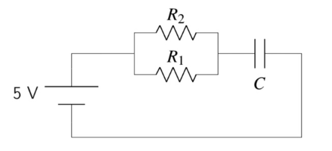
</div>
<br>
<div align="center">
<sub>Fonte: Material produzido pelo grupo DesTremidos, 2025.</sub>
</div>
<br>

A introdução e a descrição do circuito estabelecem a base experimental e conceitual do estudo. Com o circuito montado, torna-se possível observar fenômenos transitórios típicos de sistemas de primeira ordem, como o carregamento gradual do capacitor e a consequente redução da corrente. Essa etapa inicial prepara o terreno para a compreensão teórica e quantitativa do comportamento do circuito, abordada na próxima seção.

### 5.1.1 Fundamentação teórica

O circuito RC série é um dos sistemas mais fundamentais da eletrônica e da física aplicada, pois representa um modelo clássico de resposta exponencial. Ao aplicar uma tensão $\varepsilon$ a um resistor e a um capacitor em série, o comportamento dinâmico do sistema pode ser descrito pela Lei das Malhas de Kirchhoff:

$$\mathcal{E} = V_R \cdot V_C = R \cdot I + \frac{Q}{C}$$

Sabendo que $I=\frac{dQ}{dt}$, obtém-se a equação diferencial característica do circuito RC:

$$R\cdot \frac{dQ}{dt}+\frac{Q}{C}=\mathcal{E}$$

A solução dessa equação descreve a evolução da carga (e, portanto, da tensão no capacitor) ao longo do tempo. Considerando o capacitor inicialmente descarregado, a tensão sobre o capacitor durante a carga é dada por:

$V_C (t) = V_f \cdot (1 - e^-\frac{1}{\tau})$

onde:

- $V_C (t)$ é a tensão no capacitor no instante $t$;
- $V_f$ é a tensão final (tensão na fonte);
- $e$ é a base do logaritmo natural;
- $\tau$ é a constante de tempo do circuito.

Essa expressão mostra que o capacitor não se carrega instantaneamente, mas segue uma curva exponencial crescente, aproximando-se gradualmente do valor final $V_f$. O comportamento inverso, o da descarga, é descrito por uma curva exponencial decrescente, de forma análoga.

**Constante de tempo ($\tau$)**

A constante de tempo $\tau$ é um parâmetro fundamental que caracteriza a rapidez com que o capacitor carrega ou descarrega. Ela é definida pelo produto entre a resistência elétrica e a capacitância do circuito:

$$\tau = R \cdot C$$

Fisicamente, representa o tempo necessário para que a tensão no capacitor alcance cerca de 63,2% de seu valor final durante o processo de carga (ou decaia para 36,8% durante a descarga).
Quanto maior o valor de R ou C, mais lenta será a resposta do circuito, pois a corrente inicial será menor ou o capacitor armazenará mais carga. Assim, a constante de tempo define a escala temporal do fenômeno transitório e é essencial para aplicações que dependem do controle de resposta elétrica, como temporizadores, filtros e circuitos de atraso.

A fundamentação teórica permite compreender o **comportamento exponencial característico dos circuitos RC**, explicando matematicamente a evolução da tensão no capacitor e o papel determinante da constante de tempo $\tau$. Essa base fornece os conceitos necessários para interpretar os resultados experimentais, permitindo comparar a teoria com os dados obtidos e avaliar a precisão do modelo físico no contexto prático.

### 5.1.2 Análise do Circuito Proposto

Oprincipal objetivo desta seção é determinar o valor do resistor $R_2$ para ser
associado em paralelo com $R_1$, de modo a obter uma constante de tempo (τ)
efetiva próxima do valor alvo de $60s$, com uma tolerância de $\pm 10 s$.

**Parâmetros Designados e Requisitos**

Os seguintes parâmetros foram fornecidos.

- **Capacitância $(C)$:** $C = 2200\mu F = 2,2 \cdot 10^-3 F$
- **Resistor Atribuído $(R_1)$:** $R_1 = 82K\Omega = 82 \cdot 10^3 \Omega$
- **Tensão da Fonte $(V_{\text{fonte}})$:** $V_{\text{fonte}} = 5 V$
- **Constante de Tempo Alvo $(\tau_{\text{alvo}})$:** $\tau_{\text{alvo}} = 60 s$

As fórmulas fundamentais do circuito RC em carga e resistores em paralelo
são:

1. $\tau = R_{\text{eq}}$
2. $V_C (t) = V_{\text{fonte}}(1 - e^-\frac{t}{\tau})$
3. $\frac{1}{R_{\text{eq}}} = \frac{1}{R_1} + \frac{1}{R_2}$

**Resistência Equivalente Alvo $(R_{\text{eq , alvo}})$**

A resistência equivalente necessária para atingir $\tau_\text{alvo} = 60 s$ é calculada a partir
da Equação (1):
$$R_\text{eq, alvo} = \frac{\tau_\text{alvo}}{C} = \frac{60 s} {2,2 \cdot 10^-3 F}$$

$$R_\text{eq, alvo} \approx 27272,73 \Omega (40,86)$$

**Cálculo do $R_2$ Necessário**

Utilizando a Equação (3) na forma rearranjada para resistores em paralelo, calculamos o valor de $R_2$:

$$\frac{1}{R_2} = \frac{1}{R_\text{eq, alvo}} - \frac{1}{R_1}$$

$$\frac{1}{R_2} = \frac{1}{27272,73 \Omega } - \frac{1}{82000 \Omega }$$

$$R_2 = \frac {1} {(\frac{1}{27272,73} - \frac {1}{82000})} \approx 40863,6 \Omega (40,86 \Omega) $$

**Seleção do $R_2$ Efetivo e $\tau$ Efetiva**

O valor de $R_2$ necessário $(40,86kΩ)$ foi comparado aos valores disponíveis $(33kΩ,
 39kΩ, 43kΩ, 47kΩ)$. Optou-se por utilizar **$R_2 = 43kΩ$**, por gerar uma
constante de tempo ligeiramente superior e bem próxima do valor alvo.

1. Cálculo da $R_\text{eq , efetivo}$:
   $$R_\text{eq , efetivo} = \frac {R_1R_2} {R_1 + R_2} = \frac {(82 K \Omega) \cdot (43 K \Omega)} {82 K \Omega + 43 K \Omega} \approx 28,208 K \Omega$$

2. Cálculo da $\tau_{\text{efetiva}}$:
   $$\tau_\text{efetiva} = R_\text{eq , efetivo} \cdot C = (28208 \Omega) \cdot (2,2 \cdot 10^-3 F) $$

$$\tau_\text{efetiva} \approx 62,06 s $$

**Função Teórica $V_C (t)$ e Pontos para o Gráfico**

A função que descreve a curva teórica de carga é obtida substituindo $V_\text{fonte} = 5 V $
 e $\tau_\text{efetiva} = 62,06 s$ na Equação (2):

$$V_C (t) = 5(1 - e^-\frac{\tau}{62,06}) Volts $$

**Tabela de Pontos Teóricos $V_C (t) \cdot t$**

Esta tabela mostra os pontos calculados da curva de carga teórica para o Grupo 3 ($\tau_{\text{efetiva}} \approx 62.06 \text{ s}$).

| Tempo (t) (s) | Múltiplo de $\tau$ | $V_C(t)$ (V) | Observação                     |
| :-----------: | :----------------: | :----------: | :----------------------------- |
|     0.00      |      $0\tau$       |     0.00     | Início                         |
|   **62.06**   |      $1\tau$       |   **3.16**   | $63.2\%$ da $V_{\text{fonte}}$ |
|    124.12     |      $2\tau$       |     4.32     |                                |
|    248.24     |      $4\tau$       |     4.91     |                                |
|  **300.00**   | $\approx 4.83\tau$ |     4.96     | Fim da coleta                  |

**Resumo dos Parâmetros Fornecidos**

Esta tabela resume os valores utilizados no projeto e o resultado da constante de tempo efetiva.

| Parâmetro                   | Valor Utilizado                   |
| :-------------------------- | :-------------------------------- |
| $R_1$ (Atribuído)           | 82 kΩ                             |
| $R_2$ (Selecionado/Efetivo) | **43 kΩ**                         |
| $\tau$ Efetiva              | **62.06 s**                       |
| Função $V_C(t)$ Teórica     | $5 \left(1 - e^{-t/62.06}\right)$ |

### 5.1.3 Montagem do Protótipo

Para a execução da próxima etapa experimental, foi realizada a montagem física do circuito RC série, conforme o esquema elétrico apresentado na Seção 5.2. O objetivo dessa etapa é reproduzir, de forma prática, o comportamento teórico analisado anteriormente, permitindo a coleta de dados reais de tensão no capacitor por meio do microcontrolador.

O circuito foi montado utilizando os seguintes componentes:

- 1 Arduino UNO, utilizado como fonte de energia e interface de leitura analógica;

- 3 jumpers macho–macho para conexões na protoboard;

- 1 resistor de 82 kΩ;

- 1 resistor de 43 kΩ;

- 1 capacitor eletrolítico de 2200 μF.

<br>
<div align="center">
<sub>Figura xx: Montagem Física do Circuito.</sub>
</div>
<br>
<div align="center">
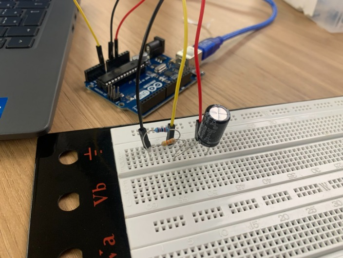
</div>
<br>
<div align="center">
<sub>Fonte: Material produzido pelo grupo DesTremidos, 2025.</sub>
</div>
<br>

Para a montagem, um jumper conecta a porta de 5V do Arduino UNO à protoboard, fornecendo alimentação ao circuito. Em seguida, os resistores de 82 kΩ e 43 kΩ são conectados em paralelo, formando uma resistência equivalente menor e ajustando a constante de tempo do circuito. O capacitor de 2200 μF é então conectado em série ao conjunto resistivo, completando o circuito. Por fim, outro jumper conecta o terminal negativo do capacitor ao pino GND do Arduino, fechando o caminho da corrente elétrica.

A porta analógica A0 do Arduino é conectada ao ponto entre o resistor e o capacitor, possibilitando a leitura da tensão $V_C (t)$ ao longo do tempo durante o processo de carga do capacitor. Essa leitura será essencial para a análise comparativa entre o modelo teórico exponencial e os dados experimentais obtidos.

A montagem física do circuito RC permitiu a implementação prática do sistema analisado teoricamente. O uso do Arduino UNO como fonte e dispositivo de aquisição de dados possibilita a medição precisa da variação de tensão no capacitor, etapa fundamental para verificar a validade do modelo teórico e determinar, de forma experimental, a constante de tempo $(\tau)$ do circuito.

### 5.1.4 Coleta de Dados Experimentais

Com o circuito RC devidamente montado conforme descrito na Seção 4, foi realizada a etapa de coleta dos dados experimentais referentes à variação da tensão no capacitor $(V_C(t))$ durante o processo de carga.

O Arduino UNO foi utilizado como fonte de tensão contínua (5 V) e como sistema de aquisição de dados, registrando a tensão no capacitor por meio da porta analógica A0. O microcontrolador foi programado para realizar medições em intervalos de tempo igualmente espaçados, possibilitando a construção da curva $V_C(t) \cdot t$ posteriormente.

Durante a coleta, o capacitor de 2200 μF foi carregado através da resistência equivalente formada pela associação em paralelo dos resistores de 82 kΩ e 43 kΩ, o que resultou em uma constante de tempo adequada à observação do fenômeno de carga.

Os valores de tensão medidos foram armazenados pelo Arduino e transferidos para análise posterior. Cada ponto registrado corresponde a um par $(t,VC​)$, representando o comportamento da tensão no capacitor em função do tempo.

A Tabela 1 apresenta os valores de tensão medidos no capacitor em diferentes instantes de tempo durante o processo de carga, obtidos experimentalmente com o Arduino UNO.

| Tempo (s) | Tensão (V) |
| :-------: | :--------: |
|   0.00    |   0.401    |
|   3.00    |   0.606    |
|   6.00    |   0.797    |
|   9.00    |   0.973    |
|   12.00   |   1.153    |
|   15.00   |   1.310    |
|   18.01   |   1.471    |
|   21.01   |   1.613    |
|   24.01   |   1.764    |
|   27.01   |   1.901    |
|   30.01   |   2.028    |
|   33.01   |   2.151    |
|   36.01   |   2.278    |
|   39.01   |   2.390    |
|   42.01   |   2.498    |
|   45.02   |   2.595    |
|   48.02   |   2.698    |
|   51.02   |   2.786    |
|   54.02   |   2.889    |
|   57.02   |   2.977    |
|   60.02   |   3.055    |
|   66.02   |   3.206    |
|   72.02   |   3.353    |
|   78.02   |   3.485    |
|   84.02   |   3.602    |
|   90.02   |   3.710    |
|   96.03   |   3.803    |
|  102.03   |   3.900    |
|  108.03   |   3.988    |
|  114.03   |   4.062    |
|  120.03   |   4.125    |
|  126.03   |   4.189    |
|  132.03   |   4.252    |
|  138.03   |   4.306    |
|  144.03   |   4.355    |
|  150.04   |   4.399    |
|  156.04   |   4.433    |
|  162.04   |   4.467    |
|  168.04   |   4.501    |
|  174.04   |   4.531    |
|  180.04   |   4.565    |
|  192.04   |   4.614    |
|  204.04   |   4.648    |
|  216.04   |   4.682    |
|  228.05   |   4.697    |
|  240.05   |   4.721    |
|  252.05   |   4.721    |
|  264.05   |   4.736    |
|  276.05   |   4.741    |
|  288.05   |   4.751    |

A etapa de coleta dos dados forneceu o conjunto de medições experimentais necessárias para o estudo do circuito RC. A metodologia adotada, utilizando o Arduino como fonte e instrumento de aquisição, garante precisão e controle no registro das tensões, permitindo obter uma base de dados confiável para a análise quantitativa a ser desenvolvida na próxima etapa do relatório.

**Gráfico Experimental**

Com base nos valores apresentados na Tabela 1, foi construído o gráfico experimental da tensão no capacitor em função do tempo $(V_C(t) \cdot t))$, representando o processo de carga do capacitor no circuito RC.

Para gerar o gráfico, foi utilizado um script desenvolvido em Python, fazendo uso de bibliotecas apropriadas para análise e visualização de dados. Esse código permitiu organizar os valores medidos, realizar a leitura dos vetores de tempo e tensão e, em seguida, produzir o gráfico correspondente.

A curva obtida apresenta o comportamento exponencial crescente esperado, indicando que a tensão no capacitor aumenta rapidamente no início e se aproxima gradualmente do valor final da fonte.

<br>
<div align="center">
<sub>Figura xx: Gráfico dos Valores Experimentais Extraídos.</sub>
</div>
<br>
<div align="center">
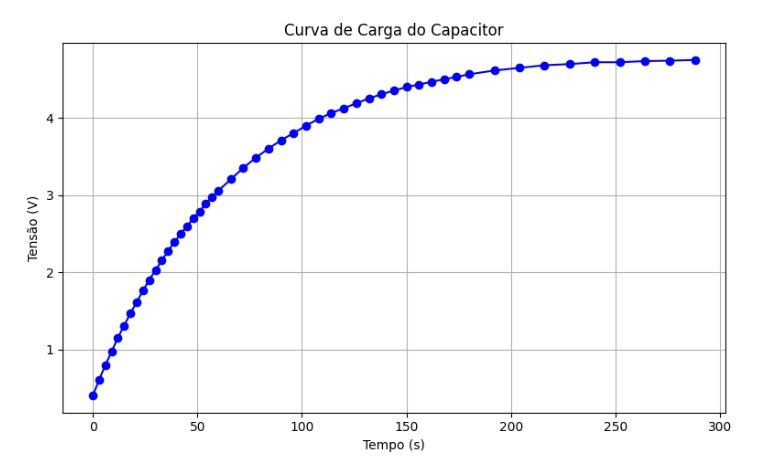
</div>
<br>
<div align="center">
<sub>Fonte: Material produzido pelo grupo DesTremidos, 2025.</sub>
</div>
<br>

A curva obtida apresenta o comportamento exponencial crescente esperado, indicando que a tensão no capacitor aumenta rapidamente no início e se aproxima gradualmente do valor final da fonte.

Para criar o gráfico, foi utilizado o seguinte código, usando os dados obtidos pelo experimento armazenados em “`dados.txt`”:

```jsx
import pandas as pd
import matplotlib.pyplot as plt


# Lê o arquivo
dados = pd.read_csv("dados.txt", sep=r'\s+', header=None, names=["Tempo", "Tensao"])


print(dados.head())


plt.figure(figsize=(8, 5))
plt.plot(dados["Tempo"], dados["Tensao"], marker='o', linestyle='-', color='b')
plt.title("Curva de Carga do Capacitor")
plt.xlabel("Tempo (s)")
plt.ylabel("Tensão (V)")
plt.grid(True)
plt.tight_layout()
plt.show()
```

O gráfico experimental gerado a partir dos dados do arquivo “`dados.txt`” permite visualizar de forma clara o comportamento exponencial da carga do capacitor. Essa representação servirá como base para as análises e comparações quantitativas apresentadas na próxima seção do relatório.

### 5.1.5 Análise Comparativa dos Resultados

Nesta etapa, os dados experimentais obtidos na Seção 5.1.3 foram comparados com a curva teórica prevista para o circuito RC. Para essa comparação, retomou-se a função teórica determinada a partir dos cálculos apresentados na Seção 3, dada por:

$$V_C (t) = 5(1 - e^-\frac{\tau}{62,06}) Volts $$

A partir dessa função, foi gerada a curva teórica e sobreposta aos pontos experimentais obtidos pelo Arduino. Essa visualização permite analisar a proximidade entre o comportamento real do circuito e o modelo matemático ideal.

<br>
<div align="center">
<sub>Figura xx: Comparação entre os pontos experimentais e a curva teórica de carga do capacitor.</sub>
</div>
<br>
<div align="center">
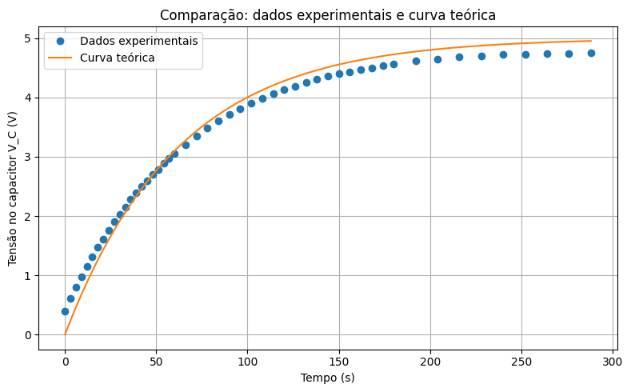
</div>
<br>
<div align="center">
<sub>Fonte: Material produzido pelo grupo DesTremidos, 2025.</sub>
</div>
<br>

A análise do gráfico mostra que os pontos experimentais acompanham de forma satisfatória o formato exponencial previsto. O capacitor apresenta uma subida rápida inicial seguida de aproximação gradual à tensão final de 5 V, característica esperada de circuitos RC.

Com base no gráfico, foi possível estimar a constante de tempo experimental, observando o instante no qual a tensão atingiu aproximadamente 63,2% do valor final. Esse valor ficou próximo da constante de tempo teórica de 62,06 s, reforçando a coerência entre o modelo matemático e o comportamento do circuito real.

As pequenas diferenças observadas podem ser justificadas por tolerâncias dos resistores e do capacitor, ruído elétrico nas medições, resistências parasitas da protoboard e atrasos na rotina de leitura do Arduino.

Para fazer essa comparação, foi utilizado o seguinte código em python

```
import numpy as np
import matplotlib.pyplot as plt

# Carregamento dos dados
data = np.loadtxt('dados.txt')
t = data[:,0]
V = data[:,1]

# Parâmetros teóricos
Vf = 5.0
tau_teo = 62.06  # segundos (valor fornecido)
def V_teo(t, tau=tau_teo):
    return Vf * (1 - np.exp(-t / tau))

# Vetor de tempo
t_fino = np.linspace(np.min(t), np.max(t), 500)
V_c_theo = V_teo(t_fino)

# Plotagem do gráfico
plt.figure(figsize=(8,5))
plt.plot(t, V, 'o', label='Dados experimentais')
plt.plot(t_fino, V_c_theo, '-', label=f'Curva teórica')
plt.xlabel('Tempo (s)')
plt.ylabel('Tensão no capacitor V_C (V)')
plt.title('Comparação: dados experimentais e curva teórica')
plt.legend()
plt.grid(True)
plt.tight_layout()
plt.show()
```

A comparação entre os dados experimentais e a curva teórica confirmou que o circuito RC montado apresenta o comportamento esperado, seguindo a tendência exponencial característica do processo de carga do capacitor. A proximidade entre a constante de tempo experimental e o valor teórico de 62,06 s reforça a coerência entre o modelo matemático e os resultados obtidos. As pequenas discrepâncias observadas podem ser atribuídas a limitações práticas do experimento, mas não comprometem a validade geral da análise. Assim, a etapa de comparação confirma que o sistema se comporta de acordo com a teoria e valida tanto os cálculos quanto os procedimentos de medição realizados.

### 5.1.6 Conclusão geral

O experimento permitiu analisar de forma completa o comportamento de um circuito RC, desde o planejamento teórico até a coleta e interpretação dos dados reais. A partir do modelo matemático e da constante de tempo calculada previamente, foi possível prever o comportamento esperado da tensão no capacitor durante o processo de carga. Os valores experimentais coletados pelo Arduino mostraram-se compatíveis com a curva teórica, seguindo a tendência exponencial característica desse tipo de circuito.

A comparação entre o modelo ideal e os resultados experimentais mostrou que, embora exista uma pequena distância entre as curvas em alguns trechos, especialmente no início e nos instantes finais da carga, a resposta geral do sistema confirma o funcionamento adequado do circuito. A constante de tempo experimental obtida a partir do gráfico aproximou-se da constante de tempo teórica de 62,06 s, validando tanto os cálculos realizados quanto a montagem prática.

As discrepâncias observadas podem ser atribuídas principalmente às tolerâncias dos componentes, ao comportamento real do capacitor eletrolítico, às limitações do conversor analógico-digital do Arduino e a pequenos atrasos na leitura durante a coleta dos dados. Ainda assim, essas diferenças não comprometem os resultados, sendo esperadas em experimentos desse tipo.

De forma geral, o estudo confirma a robustez do modelo teórico para descrever o fenômeno de carga em circuitos RC, evidenciando a importância da constante de tempo na caracterização do comportamento transitório. O experimento demonstra, portanto, a coerência entre teoria e prática e reforça o entendimento dos princípios fundamentais envolvidos na análise de sistemas elétricos dinâmicos.

## 5.2 Banco de dados relacional

Para gerir o acesso às salas técnicas com eficiência e rastreabilidade, foi estruturado um banco de dados que organiza todas as entidades essenciais ao funcionamento do sistema. O esquema foi projetado para suportar autenticação, autorização e auditoria, oferecendo suporte à operação de cartões, grupos de serviço, fechaduras inteligentes, registros de acesso e comunicação via brokers MQTT. A seguir, cada tabela é apresentada e detalhada para demonstrar seu papel dentro da arquitetura.

### 5.2.1 Tabela Users

A tabela users centraliza as informações pessoais e credenciais de todos os indivíduos cadastrados no sistema, incluindo usuários comuns, administradores e profissionais terceirizados. Ela atua como a base estrutural para autenticação, autorização e associação com outros módulos, servindo como o ponto inicial para identificação e gerenciamento das permissões de acesso.

**Colunas**

- id_user - Identificador único do usuário, gerado automaticamente.

- name - Nome completo do usuário.
- email - Endereço de e-mail, utilizado como credencial única.
- password_hash - Hash gerado pela ESP.
- user_type - Tipo de usuário: regular, master ou outsourced.
- created_at - Data e hora de criação do registro.

Com essa estrutura, torna-se possível garantir que cada usuário esteja devidamente identificado, categorizado e associado às permissões adequadas, assegurando um controle eficiente de autenticação e rastreamento das ações realizadas no sistema.

### 5.2.2 Tabela service_groups

A tabela service_groups organiza equipes de manutenção ou grupos técnicos responsáveis por atividades operacionais. Cada grupo possui um líder identificado e uma senha própria para autenticação, permitindo uma gestão estruturada de equipes internas ou externas.

**Colunas**

- id_group – Identificador único do grupo.

- group_name – Nome do grupo de serviço.

- leader_user_id – Líder do grupo, vinculado à tabela users.

- group_password_hash – Hash da senha do grupo, usada por cartões associados.

Dessa forma, a existência dessa tabela torna o gerenciamento das equipes muito mais organizado, permitindo que acessos e funções sejam distribuídos de maneira padronizada, segura e alinhada às operações de manutenção.

### 5.2.3 Tabela outsourced_group_members

A tabela outsourced_group_members registra a vinculação entre profissionais terceirizados e os grupos de serviço aos quais pertencem. Ao mapear essas relações, ela possibilita um controle claro da participação e função de cada membro dentro das equipes técnicas cadastradas no sistema.

**Colunas**

- id_group – Grupo ao qual o profissional terceirizado pertence.

- user_id – Identificador do usuário terceirizado.

Assim, a tabela possibilita o monitoramento preciso de profissionais terceirizados e de seus vínculos com os grupos de serviço, garantindo visibilidade, rastreabilidade e controle efetivo sobre equipes externas.

### 5.2.4 Tabela cards

A tabela cards representa os cartões físicos ou virtuais utilizados para autenticação nas fechaduras eletrônicas do sistema. Cada cartão é associado a um usuário individual, permitindo que o sistema controle quem pode acessar quais áreas e em quais condições. Ela funciona como a ponte entre identidade e credencial, vinculando o portador à permissão de acesso correspondente.

**Colunas**

- id_card – Identificador único do cartão.

- card_type – Tipo de cartão: regular, master, group_leader ou group_member.

- user_id – Usuário vinculado (se aplicável).

- card_password_hash – Hash da senha do cartão (utilizada pelo cartão mestre).

- group_id – Grupo de serviço associado.

Com a definição clara dos cartões utilizados no sistema, a tabela cards assegura que cada credencial possa ser autenticada de maneira confiável e vinculada a um responsável específico. Essa estrutura permite controlar diferentes perfis de acesso, distinguir cartões individuais de cartões destinados a grupos e manter a rastreabilidade necessária para auditorias e segurança operacional. Dessa forma, a tabela cumpre papel essencial na integridade do processo de autenticação e na organização das permissões aplicadas às fechaduras do sistema.

### 5.2.5 Tabela stations

A tabela stations representa os locais físicos onde estão instalados os dispositivos de controle de acesso. Cada estação é identificada de forma única e recebe um nome que facilita sua referência no sistema, permitindo que diferentes pontos de acesso sejam devidamente organizados, catalogados e vinculados às estruturas de autenticação e monitoramento.

**Colunas**

- id_station – Identificador único da estação.

- name – Nome da estação.

- broker_id - Broker vinculado

A presença da tabela stations garante que todos os pontos de acesso sejam corretamente mapeados e administrados dentro do sistema. Essa organização permite rastrear eventos de autenticação, relacionar ações a locais específicos e manter um controle consistente sobre onde cada dispositivo opera, fortalecendo a confiabilidade e a eficiência da gestão de acesso.

### 5.2.6 Tabela brokers

A tabela brokers registra os servidores MQTT responsáveis por intermediar a comunicação entre os dispositivos instalados nas estações e o servidor central do sistema. Ela centraliza informações essenciais para o roteamento das mensagens MQTT, garantindo que cada dispositivo saiba para qual broker enviar seus dados e de qual servidor deve receber comandos.

**Colunas**

- id_broker – Identificador único do broker.

- ip_address – Endereço IP do broker.

A existência da tabela brokers garante que o sistema mantenha controle preciso sobre os servidores de comunicação utilizados na rede IoT. Com isso, torna-se possível monitorar, configurar e substituir brokers de forma estruturada, preservando a confiabilidade e a estabilidade do fluxo de mensagens entre dispositivos e servidor.

### 5.2.7 Tabela locks

A tabela locks registra todas as fechaduras eletrônicas integradas ao sistema, associando cada dispositivo às estações físicas e aos brokers MQTT responsáveis pela comunicação. Ela centraliza informações essenciais para o controle de acesso, incluindo identificação da tranca, localização, tipo de operação (entrada ou saída) e o módulo ESP32 encarregado de realizar a troca de dados com o servidor. Dessa forma, a tabela permite mapear de maneira estruturada cada ponto de acesso monitorado pela plataforma.

**Colunas**

- id_lock – Identificador único da tranca.

- name – Nome da sala em que a tranca está

- station_id – Estação onde a tranca está instalada.

- esp_id – Identificador da ESP32 responsável pela comunicação.

- locks_type – Tipo da fechadura (entrada ou saída).

- broker_id – Identificador do broker responsável pela comunicação MQTT.

A existência da tabela locks garante um gerenciamento preciso e confiável das fechaduras eletrônicas distribuídas pelo ambiente. Ao relacionar cada tranca às estações e brokers correspondentes, ela possibilita monitoramento contínuo, rastreamento de eventos e configuração individualizada dos dispositivos. Assim, a tabela desempenha papel fundamental no funcionamento do sistema de controle de acesso, assegurando organização e integridade nas operações realizadas.

### 5.2.8 Tabela permissions

A tabela permissions é responsável por definir as regras de acesso dentro do sistema, especificando quais cartões estão autorizados a destrancar determinadas fechaduras e dentro de quais intervalos de tempo. Ela atua como o principal mecanismo de controle de autorização, relacionando cartões, fechaduras e restrições temporais, permitindo que o sistema implemente políticas de segurança precisas e baseadas em horários e dias da semana.

**Colunas**

- id_permission – Identificador da permissão.

- id_card – Cartão autorizado.

- lock_id – Fechadura autorizada.

- allowed_from – Hora inicial do período permitido.

- allowed_until – Hora final do período permitido.

- days_of_week – Dias permitidos (0 a 6).

A existência dessa tabela garante um controle de acesso robusto e flexível, permitindo configurar permissões individualizadas para cada cartão ou grupo de usuários. Ao centralizar as regras de autorização, a tabela permissions assegura que o sistema valide acessos de forma consistente, respeitando horários e dias definidos, além de possibilitar auditoria precisa sobre como e quando cada acesso é permitido.

### 5.2.9 Tabela acess_logs

A tabela access_logs registra todas as tentativas de acesso associando cada evento ao cartão, tranca, horário e usuário envolvido. Ela desempenha papel fundamental na auditoria do sistema, permitindo investigar ocorrências, detectar comportamentos suspeitos e manter histórico confiável das operações.

**Colunas**

- id_log – Identificador do log.

- id_card – Cartão utilizado.

- id_lock – Tranca envolvida.

- access_time – Momento da tentativa.

- access_result – Resultado (aceito ou negado).

- user_id – Usuário responsável

- group_id – Grupo relacionado (se aplicável).

- pin_validated – Indica se o PIN foi corretamente validado.

A tabela access_logs assegura o registro completo de todas as atividades do sistema, fortalecendo a transparência, a rastreabilidade e a capacidade de auditoria dos processos de acesso.

### 5.2.10 Conclusão

O banco de dados estabelecido oferece uma estrutura robusta, modular e escalável para o controle de acesso físico, integrando de forma consistente entidades como usuários, cartões, grupos de serviço, estações, fechaduras, permissões e registros de acesso. Sua organização permite gestão precisa de credenciais, definição granular de regras de autorização e monitoramento completo das atividades do sistema, garantindo rastreabilidade, segurança operacional e suporte a diferentes tipos de usuários e dispositivos IoT. Ao reunir essas informações de maneira coesa, o modelo assegura a confiabilidade da autenticação, facilita o gerenciamento de equipes internas e terceirizadas e sustenta a comunicação distribuída entre dispositivos e servidor, consolidando a base necessária para um sistema de controle de acesso eficiente e seguro.

## 5.3 Funcionalidades do Dashboard

O **dashboard** é a principal interface de visualização e acompanhamento do sistema, concentrando em um único ponto as informações necessárias para o controle operacional e a análise dos dados de acesso. Seu papel é fornecer **visibilidade clara, organizada e acessível** sobre usuários, credenciais, permissões e eventos registrados, sem expor a complexidade interna do sistema.

Ao centralizar essas informações, o dashboard se torna um **ativo estratégico do projeto**, pois:

- Facilita a compreensão do estado atual do sistema
- Reduz a dependência de análises diretas no banco de dados
- Apoia a tomada de decisão operacional e administrativa
- Padroniza a forma como os dados são consultados

Além disso, o dashboard contribui para a **qualidade do projeto**, ao separar claramente a camada de visualização das camadas de lógica e persistência, promovendo melhor organização, manutenção e evolução futura da solução.

Esta seção descreve exclusivamente as **funcionalidades disponíveis no dashboard**, limitando-se às ações de visualização e consulta permitidas ao usuário.

---

### 5.3.1 Usuários

Permite **visualizar os usuários cadastrados no sistema**, exibindo informações básicas associadas a cada identidade.

Funcionalidades disponíveis:

- Listar usuários registrados
- Consultar dados individuais de cada usuário

---

### 5.3.2 Cartões

Permite **visualizar os cartões cadastrados no banco de dados**, incluindo sua associação com usuários.

Funcionalidades disponíveis:

- Listar cartões existentes
- Visualizar o vínculo entre cartão e usuário

---

### 5.3.3 Permissões

Permite **visualizar as permissões configuradas no sistema**, indicando quais acessos estão associados a usuários ou cartões.

Funcionalidades disponíveis:

- Listar permissões cadastradas
- Consultar permissões atribuídas

---

### 5.3.4 Acessos de Grupo

Permite **visualizar os acessos configurados por grupo**, facilitando a análise de permissões aplicadas de forma coletiva.

Funcionalidades disponíveis:

- Listar grupos de acesso
- Visualizar permissões associadas a cada grupo

---

### 5.3.5 Estações

Permite **visualizar as estações cadastradas no sistema**. Cada estação pode ser selecionada para consulta detalhada.

Funcionalidades disponíveis:

- Listar estações existentes
- Selecionar uma estação para visualizar seus detalhes

#### Detalhes da Estação

Ao clicar em uma estação, o dashboard permite visualizar:

- As **trancas operacionais** associadas à estação
- Os **logs das trancas** pertencentes àquela estação
- Os **acessos registrados na última semana** relacionados à estação

---

### 5.3.6 Trancas

Permite **visualizar as trancas cadastradas no banco de dados**, independentemente da estação.

Funcionalidades disponíveis:

- Listar todas as trancas registradas
- Consultar informações básicas de cada tranca

---

### 5.3.7. Conclusão

O dashboard consolida as principais informações do sistema de forma estruturada e intuitiva, permitindo o acompanhamento eficiente de usuários, cartões, permissões, acessos e estações.

Ao oferecer uma visão centralizada e organizada dos dados, ele reduz a complexidade operacional, melhora a rastreabilidade das informações e fortalece a governança do sistema. Dessa forma, o dashboard não é apenas um componente visual, mas um **elemento fundamental para a usabilidade, confiabilidade e maturidade do projeto como um todo**.

## 5.4 Case prototipado

Para assegurar a confiabilidade e a correta integração dos componentes do sistema, foi desenvolvido um protótipo físico com estrutura modelada em 3D. Esse case tem como finalidade organizar e acomodar os elementos utilizados no projeto, proporcionando uma base adequada para a operação, testes e demonstração da solução desenvolvida.

Com o objetivo de garantir a segurança e a organização do sistema, o protótipo foi dividido em dois módulos físicos distintos: o case de entrada e o case de saída. Ambos são interligados por meio de fiação externa, permitindo a separação funcional dos componentes e facilitando a análise individual de cada etapa do controle de acesso. A seguir, é apresentada a descrição do case de entrada e de seus principais elementos.

## 5.4.1 Case de entrada

O case de entrada deve ser instalado na parte externa da área controlada pelo sistema, sendo o primeiro ponto de interação do usuário com a solução desenvolvida. Seu projeto prioriza a segurança física do sistema, uma vez que componentes críticos para o funcionamento, como a ESP32 e as fontes de alimentação, não estão presentes nesse módulo. Dessa forma, mesmo em caso de danos físicos ou tentativas de violação do case, não é possível comprometer diretamente o controle de acesso, aumentando a robustez da solução.

Esse módulo concentra exclusivamente os dispositivos responsáveis pela interface com o usuário e pela coleta das informações de autenticação, sendo conectado ao case de saída por meio de fiação externa. 

O case de entrada é composto pelos seguintes componentes:

- Display LCD, utilizado para exibir mensagens informativas e instruções ao usuário durante o processo de autenticação;

- Sensor RFID, responsável pela leitura e identificação dos cartões de acesso;

- Teclado matricial, que permite ao usuário inserir sua senha para validação adicional;

- Buzzer, empregado para fornecer feedback sonoro conforme o resultado das ações realizadas;

- Três LEDs, responsáveis por indicar visualmente o estado do sistema, como acesso autorizado, negado ou em processamento;

- Fios de conexão, utilizados para a comunicação elétrica entre o case de entrada e o case de saída.

**Tampa**

A seguir, é apresentada a imagem da tampa do case de entrada, evidenciando o posicionamento e a disposição dos componentes responsáveis pela interface com o usuário.

<br>
<div align="center">
<sub>Figura xx: Tampa do case de entrada</sub>
</div>
<br>
<div align="center">
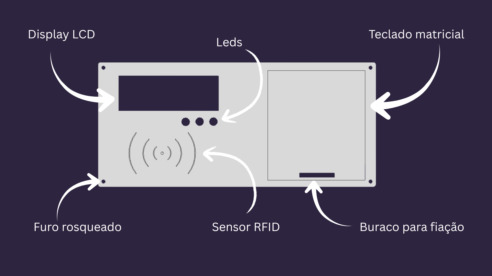
</div>
<br>
<div align="center">
<sub>Fonte: Material produzido pelo grupo DesTremidos, 2025.</sub>
</div>
<br>

Embora os componentes internos não estejam visíveis na imagem, é possível compreender a posição destinada a cada elemento e sua forma de fixação no sistema. O design do case foi desenvolvido para garantir que o usuário consiga interagir com o módulo sem obstruir qualquer componente durante o uso, assegurando total visibilidade e acessibilidade. A disposição dos elementos segue uma lógica de interação intuitiva: inicialmente, o usuário é direcionado aos dispositivos visuais, como o display LCD e os LEDs; em seguida, aproxima o cartão do sensor RFID, recebe os feedbacks sonoros e visuais correspondentes e, por fim, insere sua senha por meio do teclado matricial. Esse fluxo de interação contribui para uma experiência prática e clara, permitindo o acesso à área controlada de forma eficiente.

**Superior**

A parte superior do case possui um furo rosqueado dimensionado para o encaixe de um eletroduto de PVC rígido, padrão amplamente utilizado no mercado. Essa abertura permite a passagem e a proteção dos fios que conectam o case de entrada ao case interno, viabilizando a comunicação e a integração entre os módulos do sistema. A figura a seguir ilustra esse elemento do design.

<br>
<div align="center">
<sub>Figura xx: Superior do case de entrada</sub>
</div>
<br>
<div align="center">

</div>
<br>
<div align="center">
<sub>Fonte: Material produzido pelo grupo DesTremidos, 2025.</sub>
</div>
<br>

**Lateral esquerda**

Na lateral esquerda do case, posicionada próxima ao display LCD, encontra-se o buzzer, responsável por fornecer feedbacks sonoros ao usuário durante a interação com o sistema. Para garantir a adequada propagação do som, foram projetados pequenos orifícios na parede lateral do case, permitindo que os alertas sonoros sejam percebidos de forma clara sem comprometer a estrutura do módulo.

<br>
<div align="center">
<sub>Figura xx: Lateral do case de entrada</sub>
</div>
<br>
<div align="center">

</div>
<br>
<div align="center">
<sub>Fonte: Material produzido pelo grupo DesTremidos, 2025.</sub>
</div>
<br>

As demais faces do case seguem um padrão dimensional compatível com o case de saída, garantindo a padronização das medidas e facilitando a integração entre os dois módulos do sistema.

<br>
<div align="center">
<sub>Figura xx: Case de entrada</sub>
</div>
<br>
<div align="center">
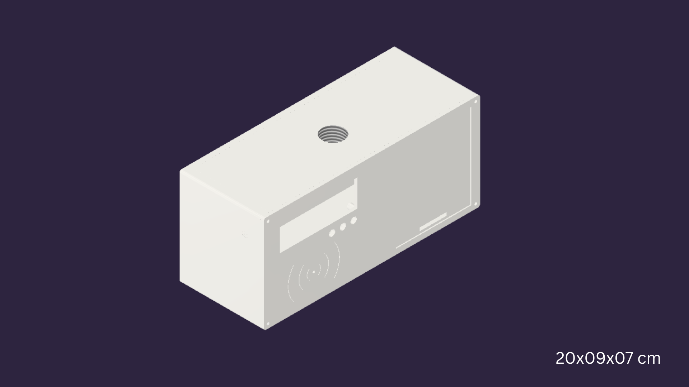
</div>
<br>
<div align="center">
<sub>Fonte: Material produzido pelo grupo DesTremidos, 2025.</sub>
</div>
<br>

Em síntese, o case de entrada foi projetado para atuar como a principal interface entre o usuário e o sistema de controle de acesso, concentrando os elementos de interação e validação sem expor componentes críticos. Sua concepção prioriza a segurança, a usabilidade e a padronização estrutural, garantindo uma experiência intuitiva ao usuário e contribuindo para a integridade e confiabilidade da solução como um todo.

### 5.4.2 Case de saída

O case de saída é o módulo responsável por concentrar os componentes críticos do sistema de controle de acesso, sendo instalado na parte interna da área controlada. Diferentemente do case de entrada, este módulo abriga os dispositivos encarregados do processamento das informações, da comunicação com o servidor e do acionamento da fechadura eletrônica, desempenhando um papel central no funcionamento da solução.

Além de acomodar elementos essenciais, como a ESP32, as conexões com a rede elétrica, as fontes de alimentação, as pilhas e o conjunto de relé responsável pela interface com a tranca, o case de saída também foi projetado para viabilizar o registro da saída dos usuários. Esse registro é realizado por meio de um fluxo de autenticação semelhante ao utilizado na entrada, com a exceção do teclado matricial, que não é necessário nesse contexto.

O case de saída é composto pelos seguintes componentes:

- Display LCD, utilizado para exibir mensagens informativas e instruções ao usuário durante o processo de autenticação;

- Sensor RFID, responsável pela leitura e identificação dos cartões de acesso;

- Buzzer, empregado para fornecer feedback sonoro conforme o resultado das ações realizadas;

- Três LEDs, responsáveis por indicar visualmente o estado do sistema, como acesso autorizado, negado ou em processamento;

- Duas ESP32, responsáveis por executar a lógica do sistema, realizar a comunicação com o servidor e gerenciar o acionamento dos dispositivos conectados;

- Quatro suportes de pilhas, destinados ao alojamento das pilhas que fornecem alimentação alternativa ao sistema;

- Relé, utilizado para liberar ou interromper a alimentação elétrica da tranca, permitindo seu acionamento controlado;

- Fios de conexão, utilizados para a comunicação elétrica entre o case de entrada e o case de saída.

**Tampa**

A principal diferença entre o case de saída e o case de entrada está relacionada à configuração da tampa. Enquanto o case de entrada possui um teclado matricial, utilizado para reforçar a segurança por meio de um processo de autenticação em dois fatores, o case de saída não requer o mesmo nível de validação, uma vez que sua função se limita ao registro de saída do usuário e à liberação da tranca.

Dessa forma, o teclado matricial não está presente neste módulo. No local onde esse componente seria instalado, a tampa do case apresenta um recorte destinado a um compartimento específico para as pilhas. Esse compartimento é fechado por uma tampa removível, permitindo a substituição das pilhas de forma prática e segura. As pilhas são responsáveis por fornecer alimentação alternativa ao sistema em caso de falha no fornecimento de energia elétrica no local de instalação, garantindo a continuidade do funcionamento da solução.

<br>
<div align="center">
<sub>Figura xx: Tampa case de saída</sub>
</div>
<br>
<div align="center">
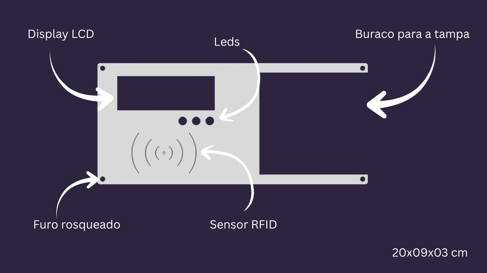
</div>
<br>
<div align="center">
<sub>Fonte: Material produzido pelo grupo DesTremidos, 2025.</sub>
</div>
<br>

<br>
<div align="center">
<sub>Figura xx: Tampa das pilhas</sub>
</div>
<br>
<div align="center">

</div>
<br>
<div align="center">
<sub>Fonte: Material produzido pelo grupo DesTremidos, 2025.</sub>
</div>
<br>

Devido à presença de diversos componentes de dimensões consideráveis, como as ESP32 e os suportes de pilhas, as paredes do case possuem altura de 7 centímetros. Essa dimensão foi definida para garantir a alocação organizada de todos os elementos internos, mantendo margem para pequenos ajustes e desvios durante a montagem. Como resultado, o projeto proporciona maior acessibilidade aos componentes em casos de falha ou necessidade de manutenção, permitindo que técnicos realizem intervenções de forma mais eficiente e segura.

Em síntese, o case de saída foi projetado para concentrar os componentes críticos do sistema de controle de acesso, sendo responsável pelo processamento das informações, pela comunicação com o servidor e pelo acionamento da fechadura eletrônica. Sua concepção prioriza a segurança física, a organização interna e a facilidade de manutenção, garantindo a operação contínua do sistema e contribuindo de forma decisiva para a confiabilidade e a robustez da solução como um todo.

### 5.4.3 Conclusão

De forma geral, o desenvolvimento do case físico foi essencial para viabilizar a implementação prática do sistema de controle de acesso proposto. A separação do protótipo em dois módulos distintos, case de entrada e case de saída, permitiu distribuir funções de maneira segura e organizada, protegendo os componentes críticos e, ao mesmo tempo, oferecendo uma interface intuitiva para o usuário.

O projeto do case priorizou aspectos como segurança física, usabilidade, padronização estrutural e facilidade de manutenção, garantindo que o sistema pudesse ser operado e testado de forma confiável. Além disso, a modelagem em 3D possibilitou a adequada acomodação dos componentes eletrônicos, contribuindo para a robustez do protótipo e para a integração eficiente entre hardware e software. Dessa forma, o case desempenha papel fundamental na confiabilidade, na escalabilidade e na viabilidade do sistema como um todo, consolidando-se como um elemento indispensável para o sucesso do projeto.


## <a name="c6"></a>6. Referências

_Incluir as principais referências de seu projeto, para que seu parceiro possa consultar caso ele se interessar em aprofundar. Um exemplo de referência de livro e de site: <br>
LUCK, Heloisa. Liderança em gestão escolar. 4. ed. Petrópolis: Vozes, 2010. <br>
SOBRENOME, Nome. Título do livro: subtítulo do livro. Edição. Cidade de publicação: Nome da editora, Ano de publicação. <br>
Disponível em: https://adalove.inteli.edu.br/feed. Acesso em: 1 out. 2023 <br>
Disponível em: LINK DO SITE. Acesso em: Dia Mês Ano_

ABIFER – Associação Brasileira da Indústria Ferroviária. Expectativas da indústria ferroviária e mercado 2025. São Paulo: ABIFER, 2024. Disponível em: https://abifer.org.br/expectativa-industria-ferroviaria-mercado-2025/. Acesso em: 19 out. 2025.

AGÊNCIA GOV. Novo PAC garante recursos para fortalecer transporte ferroviário no Brasil. Brasília: Ministério dos Transportes, 4 jan. 2024. Disponível em: https://agenciagov.ebc.com.br/noticias/202401/novo-pac-garante-recursos-para-o-transporte-ferroviario-e-acelera-retomada-do-setor-no-brasil. Acesso em: 21 out. 2025.

ALSTOM. Alstom lidera consórcio que fornecerá à Trensurb 15 trens para a Linha 1 do metrô de Porto Alegre. São Paulo, 3 dez. 2012. Disponível em: https://www.alstom.com/pt/press-releases-news/2012/12/alstom-lidera-consorcio-que-fornecera-a-trensurb-15-trens-para-a-linha-1-do-metro-de-porto-alegre. Acesso em: 19 out. 2025.

ASSOCIAÇÃO BRASILEIRA DA INDÚSTRIA FERROVIÁRIA (ABIFER). A expectativa da indústria ferroviária brasileira é de uma retomada em 2025. São Paulo: ABIFER, 6 dez. 2024. Disponível em: https://abifer.org.br/expectativa-industria-ferroviaria-mercado-2025/. Acesso em: 21 out. 2025.

BANCO MUNDIAL. Project Information Document – São Paulo Urban Mobility Improvement Project (P181767). Washington, D.C.: World Bank, 2024. Disponível em: https://ewsdata.rightsindevelopment.org/files/documents/67/WB-P181767.pdf. Acesso em: 19 out. 2025.

BRASIL. Ministério dos Transportes. Brasil impulsiona política ferroviária para passageiros com metas de integração e sustentabilidade. Brasília: Governo Federal, 5 maio 2025. Disponível em: https://www.gov.br/transportes/pt-br/assuntos/noticias/2025/05/brasil-impulsiona-politica-ferroviaria-para-passageiros-com-metas-de-integracao-e-sustentabilidade. Acesso em: 19 out. 2025.

BRASIL. Trensurb – Empresa de Trens Urbanos de Porto Alegre S.A. Trensurb recebe eletrocentro com tecnologia internacional para modernizar sistema de energia. Porto Alegre: Governo Federal, 26 set. 2025. Disponível em: https://www.gov.br/trensurb/pt-br/assuntos/noticias/trensurb-recebe-eletrocentro-com-tecnologia-internacional-para-modernizar-sistema-de-energia. Acesso em: 19 out. 2025.

CCR MOBILIDADE. Inovação e operações ferroviárias. São Paulo: CCR Mobilidade, 2023. Disponível em: https://www.ccr.com.br/mobilidade/. Acesso em: 19 out. 2025.

CCR S.A. Relatório de Sustentabilidade e Operações 2024. São Paulo: Grupo CCR, 2024. Disponível em: https://arquivos.grupoccr.com.br/relatorios/ri2024/. Acesso em: 19 out. 2025.

DNV. Rail 2025: perspectivas e inovações no setor ferroviário brasileiro. Rio de Janeiro: DNV, 2025. Disponível em: https://www.dnv.com.br/news/2025/rail2025/. Acesso em: 19 out. 2025.
ESTADÃO MOBILIDADE. CCR vai investir R$ 3,9 bilhões na modernização das Linhas 8 e 9 da CPTM. São Paulo: Estadão, 2024. Disponível em: https://mobilidade.estadao.com.br/noticias/ccr-vai-investir-39-bilhoes-em-modernizacao-das-linhas-8-e-9/. Acesso em: 19 out. 2025.

Iniciativas de Transformação Digital da CPTM. São Paulo: Governo do Estado de São Paulo, 2024. Disponível em: https://www.saopaulo.sp.gov.br/noticias/. Acesso em: 19 out. 2025.

GOVERNO FEDERAL. Brasil impulsiona política ferroviária para passageiros com metas de integração e sustentabilidade. Brasília: Ministério dos Transportes, 5 maio 2025. Disponível em: https://www.gov.br/transportes/pt-br/assuntos/noticias/2025/05/brasil-impulsiona-politica-ferroviaria-para-passageiros-com-metas-de-integracao-e-sustentabilidade. Acesso em: 21 out. 2025.

GUIA DA TELEMETRIA. Conectividade IoT ferroviária: a revolução digital nos trilhos. São Paulo: Guia da Telemetria, 2025. Disponível em: https://guiadatelemetria.com.br/conectividade-iot-ferroviaria/. Acesso em: 19 out. 2025.

INEWS BR. CCR Mobilidade faz investimento de mais de R$ 960 milhões nos sistemas metroferroviários. iNews BR, 2024. Disponível em: https://www.inewsbr.com/2024/12/ccr-mobilidade-faz-investimento-de-mais-de-r960-milhoes-nos-sistemas-metroferroviarios/. Acesso em: 19 out. 2025.

JORNAL O TEMPO. Acordo do governo para renovar concessão da ferrovia FCA prevê investimentos de R$ 28 bilhões. Belo Horizonte, 20 ago. 2025. Disponível em: https://www.otempo.com.br/economia/acordo-do-governo-para-renovar-concessao-da-ferrovia-fca-preve-investimentos-de-r-28-bilhoes-1.3260795. Acesso em: 19 out. 2025.

MOBILIDADE 360. MetrôRio terá concessão prorrogada até 2048 e amplia obras na Estação Gávea. Rio de Janeiro: Mobilidade 360, 17 out. 2025. Disponível em: https://mobilidade360.com.br/2025/10/17/metrorio-obras-estacao-gavea-recursos-conclusao/. Acesso em: 19 out. 2025.

MODAL CONNECTION. A nova era das ferrovias: perspectivas e oportunidades em 2025. São Paulo: Modal Connection, 2025. Disponível em: https://modalconnection.com.br/modais/a-nova-era-das-ferrovias-perspectivas-e-oportunidades-em-2025/. Acesso em: 19 out. 2025.

MODAL CONNECTION. Ferrovias 4.0: o uso de IoT e Big Data na operação ferroviária. São Paulo: Modal Connection, 2025. Disponível em: https://modalconnection.com.br/artigos/ferrovias-40-o-uso-de-iot-e-big-data/. Acesso em: 19 out. 2025.

MOTIVA. Eletrificação pode reduzir em 35% as emissões no transporte no Brasil até 2050. São Paulo, 27 jun. 2025. Disponível em: https://www.motiva.com.br/en/news/eletrificacao-pode-reduzir-em-35-as-emissoes-no-transporte-no-brasil-ate-2050. Acesso em: 19 out. 2025.

O TEMPO. Acordo do governo para renovar concessão da ferrovia FCA prevê investimentos de R$ 28 bilhões. Belo Horizonte, 20 ago. 2025. Disponível em: https://www.otempo.com.br/economia/2025/8/20/acordo-do-governo-para-renovar-concessao-da-ferrovia-fca-preve-investimentos-de-r-28-bilhoes. Acesso em: 19 out. 2025.

ORITI SOLUTIONS. Cenário otimista para a indústria ferroviária brasileira em 2024. São Paulo: Oriti Solutions, 2024. Disponível em: https://oritisolutions.com.br/cenario-otimista-para-a-industria-ferroviari/. Acesso em: 19 out. 2025.

TECHNIBUS. TIC Trens protocola cronograma e avança na operação assistida da Linha 7-Rubi. São Paulo: Technibus, 14 out. 2025. Disponível em: https://technibus.com.br/2025/10/14/tic-trens-protocola-cronograma-e-avanca-na-operacao-assistida-da-linha-7-rubi/. Acesso em: 19 out. 2025.

TIC TRENS. Página institucional. São Paulo: TIC Trens, 2025. Disponível em: https://www.tictrens.com.br/. Acesso em: 19 out. 2025.

BRASIL. Ministério dos Transportes. Ministério dos Transportes projeta avanço histórico das ferrovias brasileiras durante evento em Brasília. Brasília: Governo Federal, 17 out. 2025. Disponível em: https://www.gov.br/transportes/pt-br/assuntos/noticias/2025/10/ministerio-dos-transportes-projeta-avanco-historico-das-ferrovias-brasileiras-durante-evento-em-brasilia. Acesso em: 19 out. 2025.

AGÊNCIA ESTADUAL DE TRANSPORTES DE SÃO PAULO (ARTESP). TIC Trens – Concessões metroferroviárias. Disponível em: https://www.artesp.sp.gov.br/artesp/concessoes/metroferroviario/tic-trens. Acesso em: 21 out. 2025.

BANCO INTERAMERICANO DE DESENVOLVIMENTO (BID). Edital para construção do Eixo Norte do Trem Intercidades. Disponível em: https://www.iadb.org/pt-br/noticias/edital-para-construcao-do-eixo-norte-do-trem-intercidades-recebe-propostas. Acesso em: 21 out. 2025.

BRASIL. Ministério dos Transportes. Ministério dos Transportes projeta avanço histórico das ferrovias brasileiras durante evento em Brasília. Disponível em: https://www.gov.br/transportes/pt-br/assuntos/noticias/2025/10/ministerio-dos-transportes-projeta-avanco-historico-das-ferrovias-brasileiras-durante-evento-em-brasilia. Acesso em: 21 out. 2025.

CNA BRASIL. CNA e entidades discutem entraves e soluções para transporte ferroviário. Disponível em: https://www.cnabrasil.org.br/noticias/cna-e-entidades-discutem-entraves-e-solucoes-para-transporte-ferroviario. Acesso em: 21 out. 2025.

G1 CAMPINAS. Trem Intercidades: SP avança em desapropriações de áreas da região de Campinas. Disponível em: https://g1.globo.com/sp/campinas-regiao/noticia/2025/10/20/trem-intercidades-sp-avanca-em-desapropriacoes-de-areas-da-regiao-de-campinas.ghtml. Acesso em: 21 out. 2025.

GLOBAL GROWTH INSIGHTS. Train Control Systems Market Report 2024: Global Trends and Forecast. Disponível em: https://www.globalgrowthinsights.com. Acesso em: 21 out. 2025.

LYRAM2M. Como a IoT ajuda na manutenção preditiva em trens e linhas ferroviárias. Disponível em: https://blog.lyram2m.com.br/como-a-iot-ajuda-na-manutencao-preditiva-em-trens-e-linhas-ferroviarias/. Acesso em: 21 out. 2025.

MINISTÉRIO DOS TRANSPORTES. Brasil estrutura nova política ferroviária com foco em segurança jurídica, expansão e integração modal. Disponível em: https://www.gov.br/transportes/pt-br/assuntos/noticias/2025/06/brasil-estrutura-nova-politica-ferroviaria-com-foco-em-projetos-qualificados-seguranca-juridica-avalia-secretario-de-transporte-ferroviario. Acesso em: 21 out. 2025.

MODAL CONNECTION. Ferrovias em 2025: Oportunidades e Perspectivas. Disponível em: https://modalconnection.com.br/modais/a-nova-era-das-ferrovias-perspectivas-e-oportunidades-em-2025. Acesso em: 21 out. 2025.

MODAL CONNECTION. IoT e análise de dados na inspeção ferroviária. Disponível em: https://modalconnection.com.br/artigos/iot-e-analise-de-dados-na-inspecao-ferroviaria/. Acesso em: 21 out. 2025.

MORDOR INTELLIGENCE. Rail Transportation Market: Global Market Share, Size, and Trends (2024–2029). Disponível em: https://www.mordorintelligence.com. Acesso em: 21 out. 2025.
NT EXPO 2025. Expansão ferroviária reduz custos logísticos e impulsiona economia na NT Expo 2025. Disponível em: https://www.ntexpo.com.br/nossos-canais/assessoria-de-imprensa/releases-2025/expansao-ferroviaria-reduz-custos-logisticos-e-impulsiona-economia-na-nt-expo. Acesso em: 21 out. 2025.

REVISTA FERROVIÁRIA. ViaMobilidade investe R$ 77 milhões em tecnologia ETCS. Disponível em: https://revistaferroviaria.com.br/2025/02/perspectivas-do-transporte-de-passageiros-sobre-trilhos-no-brasil-em-2025. Acesso em: 21 out. 2025.
SPHERICAL INSIGHTS. Global Rail Market Report 2024. Disponível em: https://www.sphericalinsights.com. Acesso em: 21 out. 2025.

TECHNIBUS. TIC Trens protocola cronograma e avança na operação assistida da Linha 7-Rubi. Disponível em: https://technibus.com.br/2025/10/14/tic-trens-protocola-cronograma-e-avanca-na-operacao-assistida-da-linha-7-rubi. Acesso em: 21 out. 2025.

TIC TRENS. Site institucional. Disponível em: https://www.tictrens.com.br. Acesso em: 21 out. 2025.

Embarcados. Circuito RC: Carga e descarga de capacitores. Disponível em: https://embarcados.com.br/circuito-rc-carga-e-descarga-de-capacitores. Acesso em: 12 out. 2025

OSTERWALDER, Alexander; PIGNEUR, Yves. Value Proposition Design: How to Create Products and Services Customers Want. Hoboken: Wiley, 2014. Acesso em: 23 out. 2025.
